## Scenario
> Upon completing the server recovery process, the IR team uncovered a labyrinth of persistent traffic, surreptitious communications, and resilient processes that eluded our termination efforts. It's evident that the incident's scope surpasses the initial breach of our servers and clients. As a forensic investigation expert, can you illuminate the shadows concealing these clandestine activities?


## Setup
For this Sherlock challenge we’ll use:  
- Volatility2  
- IDA  

We’ll also rely on this cheatsheet:  
- https://downloads.volatilityfoundation.org/releases/2.4/CheatSheet_v2.4.pdf

### Volatility profile
First, we need to install Python 2, Volatility2, and add the required profile.

A Volatility profile is a file containing structural information about the target OS. Think of it as a "map" that lets Volatility interpret how data is structured in a specific system’s memory.

This profile mainly contains two types of information:  
- Definitions of kernel data structures  
- Kernel symbols (addresses of functions and variables)

Installation:
```bash
sudo apt install -y python2 python2-dev build-essential libdistorm3-dev libssl-dev libffi-dev zlib1g-dev

curl -sS https://bootstrap.pypa.io/pip/2.7/get-pip.py -o get-pip.py

sudo python2 get-pip.py

sudo python2 -m pip install --upgrade pip setuptools wheel

sudo python2 -m pip install distorm3 pycrypto openpyxl pillow yara-python

git clone https://github.com/volatilityfoundation/volatility.git

cd volatility

python2 vol.py -h
```

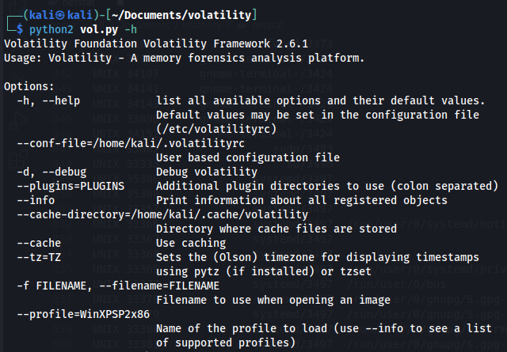


Profile setup:
```bash
cp Ubuntu_5.3.0-70-generic_profile.zip ~/Documents/volatility/volatility/plugins/overlays/linux/

python2 vol.py --info | grep Linux
```

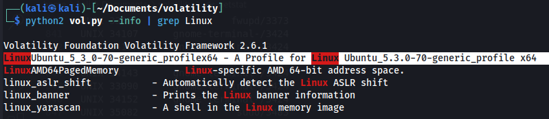


## Question 1
> What is the IP and port the attacker used for the reverse shell?

We’ll use the **linux_netstat** plugin to dump all network connections present at the time of the memory capture. We'll redirect the output to a file for easier searching.

```bash
python2 vol.py -f ~/Downloads/APTNightmare-2/dump.mem --profile=LinuxUbuntu_5_3_0-70-generic_profilex64 linux_netstat > netstat.txt
```

On Linux, it’s most likely a messy Bash reverse shell and indeed:

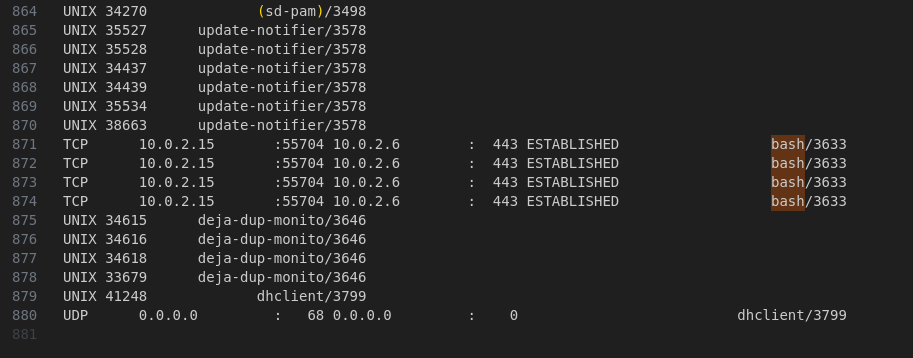

**Answer**: ``10.0.2.6:443``


## Question 2
> What was the PPID of the malicious reverse shell connection?

First we'll try ``linux_pstree` : 

```bash
python2 vol.py -f ~/Downloads/APTNightmare-2/dump.mem --profile=LinuxUbuntu_5_3_0-70-generic_profilex64 linux_pstree | grep -C 5 3633
```

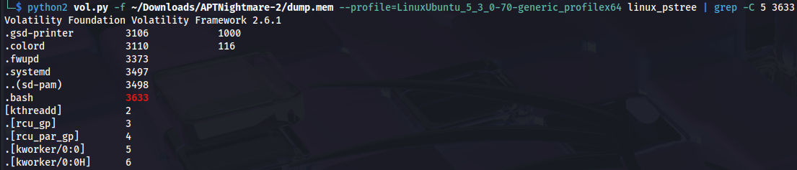

No PPID. Why? The ``linux_pstree`` plugin reconstructs the process tree based on a single source of truth: the system’s active task list (``task_struct``).

  
https://makelinux.github.io/kernel/map/

Instead, we’ll use the ``linux_psxview`` plugin, specifically designed to uncover hidden processes by aggregating multiple artifacts:
- **task_struct list**: the same active task list used by `linux_pstree`  
- **pid hash table**: the kernel’s hash table for fast PID lookups  
- **pslist**: a process list derived from alternate memory structures  
- **kmem_cache**: the kernel object cache, which may still reference hidden tasks  
- **d_path**: filesystem paths from procfs, revealing exposed process directories  
- **thread_info**: thread metadata that can surface otherwise unlinked tasks  

``linux_psxview`` cross‑compares these sources and flags discrepancies—for example, when a PID appears in one structure but is missing from another.

```bash
python2 vol.py -f ~/Downloads/APTNightmare-2/dump.mem --profile=LinuxUbuntu_5_3_0-70-generic_profilex64 linux_psxview > psxview.txt
```

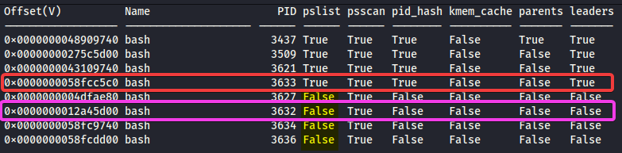

As expected, the parent is simply the PID immediately preceding it.

But why hide it? Given the scenario, we know we’re dealing with a rootkit. What likely happened is that the rootkit modified the task list (*task_struct list*) by "unlinking" its reverse‑shell process from the linked list. In practice, it manipulated the ``next`` and ``prev`` pointers so that its process would be ignored during list traversal.

However, the rootkit failed to erase all traces of its existence. It neglected to modify one or more of the other structures monitored by ``linux_psxview``.

As a result, ``linux_pstree``, which relies solely on the task list, doesn’t see the malicious process, whereas ``linux_psxview``, which checks multiple sources, detects it via the structures the rootkit overlooked.

**Answer** : ``3632``


## Question 3
> Provide the name of the malicious kernel module.

For this we’ll use the ``linux_check_modules`` plugin. But first, let’s clarify: what exactly is a kernel module, and how does it relate to rootkits?

A kernel module is a piece of code that can be dynamically loaded and unloaded into a running OS kernel. This lets you extend functionality (like support for new hardware or file systems) without rebooting or fully rebuilding the kernel.

Rootkits operate at the Linux kernel level by injecting their own Loadable Kernel Modules (LKMs). These malicious modules can:  
- intercept system calls to hide files, processes, or network connections  
- establish persistent backdoors in the system  
- disable certain kernel security features  
- conceal their presence from standard system tools  
… and more.

Now, the Volatility ``linux_check_modules`` plugin is designed to detect hidden LKMs by correlating multiple kernel data sources:

**1. Official modules list**  
First, it inspects the kernel’s official modules list (``modules.list``). This circularly linked list—maintained by the kernel—contains every legitimately loaded module. You’d see the same list via ``lsmod``.

**2. Kernel symbol table**  
Next, it parses the kernel symbol table (``/proc/kallsyms``), which holds addresses for all kernel functions and variables, including those introduced by modules.

**3. ``.ko`` memory sections**  
It also scans the memory regions where ``.ko`` modules are typically loaded, hunting for the characteristic signatures of module code even if they’re not linked elsewhere.

**4. Hidden-module detection techniques**  
- The primary check compares modules in the official list against those found in symbol or memory scans. Anything showing up in one source but missing from the official list is highly suspect.  
- It examines the syscall table to see if original kernel functions have been hooked or replaced—a classic rootkit trick for intercepting kernel interactions.  
- It verifies whether module function addresses point into non-standard or suspicious memory regions, which could indicate injected code.  
- It analyzes module metadata (timestamp, name, author) for anomalies or inconsistencies.

> **Okay, that’s cool—but how do rootkits actually hide in the first place?**

There are several techniques, but the most common include:  
- **DKOM (Direct Kernel Object Manipulation):**  
  They tweak in-memory kernel data structures to unlink their module from ``modules.list``, yet keep it operational.  
- **Syscall hooks:**  
  They swap out legitimate kernel functions for their own versions that filter or falsify results (e.g., a patched ``read`` that never shows certain files).  
- **Nameless modules:**  
  Some rootkits load modules with empty or special-character names to make discovery harder.

Anyway, back to the question.  

```bash
python2 vol.py -f ~/Downloads/APTNightmare-2/dump.mem --profile=LinuxUbuntu_5_3_0-70-generic_profilex64 linux_check_modules 
```

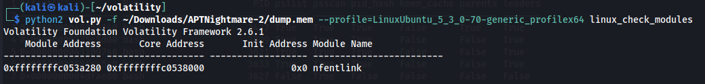

The name **"nfentlink"** is an attempt to disguise a malicious module by impersonating **"nfnetlink"**, which is a legitimate Linux kernel module used for communication between kernel space and user space for networking and firewall functionality.

**Answer**: ``nfentlink``


## Question 4
> What time was the module loaded?

Initially, my approach was flawed. I tried to:  
- take the module load timestamp from ``dmesg`` via ``linux_dmesg``  
- take the boot timestamp from ``linux_pslist``  
- calculate the delta and voilà  

This would have worked if it were the first time the module was loaded. However, it had already been loaded previously. My method is inherently flawed—in an incident response scenario, it could lead you astray.

In the end, I cleared everything and asked myself, "Where can I find timestamps tied to past actions across multiple reboots?"

The system logs, of course. Specifically ``/var/log/kern.log`` or ``/var/log/syslog.log``.

To grab those files, we’ll first enumerate them in the memory capture:  


```bash
python2 vol.py -f ~/Downloads/APTNightmare-2/dump.mem --profile=LinuxUbuntu_5_3_0-70-generic_profilex64 linux_enumerate_files > files.txt
```

In fact we find:
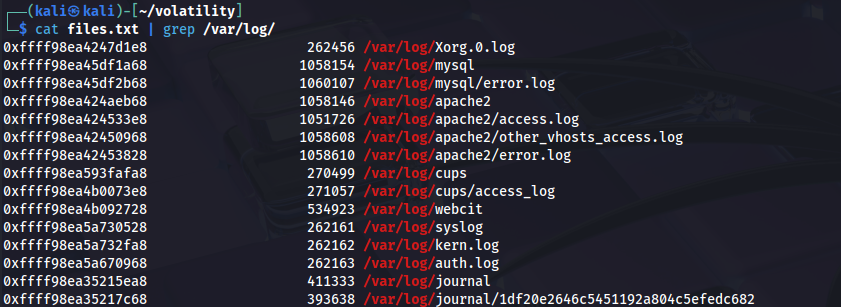

Next, to extract ``/var/log/kern.log`` we'll : 

```bash
python2 vol.py -f ~/Downloads/APTNightmare-2/dump.mem --profile=LinuxUbuntu_5_3_0-70-generic_profilex64 linux_find_file -i 0xffff98ea5a732fa8 -O kern.log
```
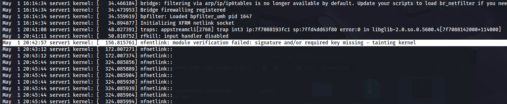

**Answer** : ``2024-05-01 20:42:57``


## Question 5
> What is the full path and name of the malicious kernel module file?

Similarly, we’ll check the enumerated files. First, we search for the module we identified, "nfentlink".

```bash
cat files.txt |grep nfentlink
```

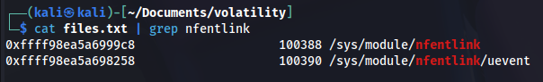

That doesn’t yield anything interesting.

So we’ll look for the module by its real name:

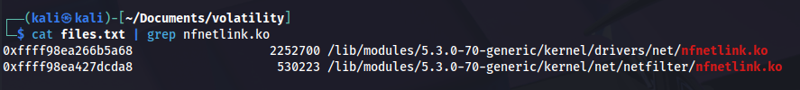

We’ll revisit the second file later.

**Answer**: ``/lib/modules/5.3.0-70-generic/kernel/drivers/net/nfnetlink.ko``


## Question 6
> Whats the MD5 hash of the malicious kernel module file?

Just extract the file and compute its hash:
```bash
python2 vol.py -f ~/Downloads/APTNightmare-2/dump.mem --profile=LinuxUbuntu_5_3_0-70-generic_profilex64 linux_find_file -i 0xffff98ea266b5a68 -O nfnetlink.ko

md5sum nfnetlink.ko
```

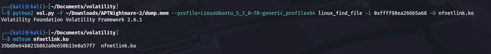

**Answer** : ``35bd8e64b021b862a0e650b13e0a57f7``


## Question 7
> What is the full path and name of the legitimate kernel module file?

Let’s return to the screenshot from question 5.

**Answer** : ``/lib/modules/5.3.0-70-generic/kernel/net/netfilter/nfnetlink.ko``


## Question 8
> What is the single character difference in the author value between the legitimate and malicious modules?

First, we’ll check the legitimate module using **modinfo**, which displays detailed information about a specific kernel module.

```bash
modinfo /lib/modules/6.11.2-amd64/kernel/net/netfilter/nfnetlink.ko.xz
```

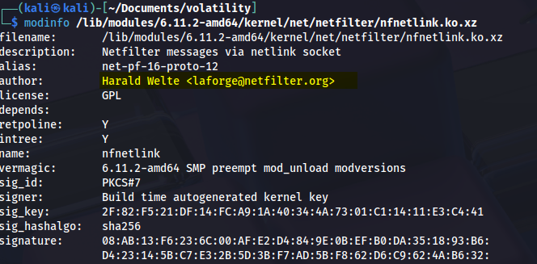

Next, we inspect the kernel module we extracted from the memory capture:
```bash
modinfo malicious-nfnetlink.ko
```

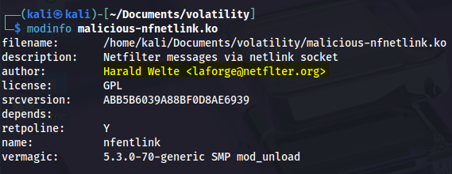

Clearly, the malicious module's author field lacks the character "i".

**Answer** : ``i``


## Question 9
> What is the name of initialization function of the malicious kernel module?

To answer this question I’ll use **IDA**. It’s definitely overkill—you could stick to gdb (gef>gdb), radare2, etc.

So let’s examine the functions:  
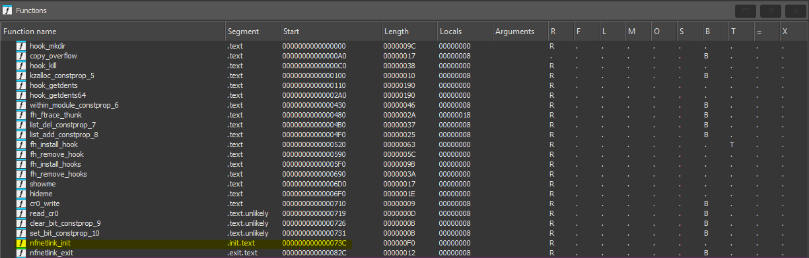

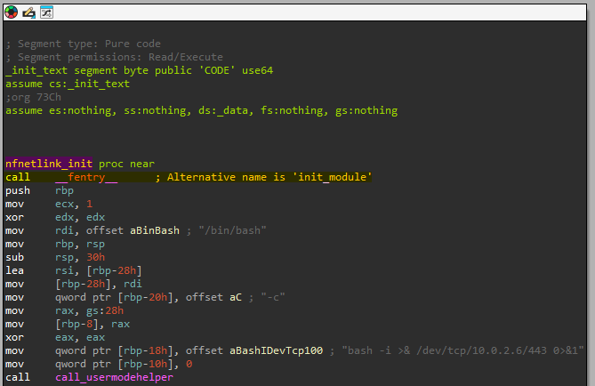

We can clearly see that the initialization function is ``nfnetlink_init`` but also ``init_module``. It becomes even more obvious with gef:

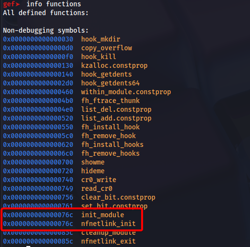

Gef shows both symbols at the exact same memory address. This reveals a deliberate camouflage technique used by the rootkit at the kernel level.

The malicious module leverages the standard ``init_module`` function (the **mandatory** entry point for any Linux kernel module) but has intentionally renamed it to ``nfnetlink_init`` to mimic the legitimate kernel module.

Export symbols like ``init_module`` are essential for the Linux kernel to load a module, yet the attacker used compile-time tricks so that the same function carries two different names—one for module loading by the kernel and another for visual disguise.

**Answer**: ``nfnetlink_init``

## Question 10
> There is a function for hooking syscalls. What is the last syscall from the table?

In the ``nfnetlink_init`` function we see ``_sys_call_table = kallsyms_lookup_name("sys_call_table");``:

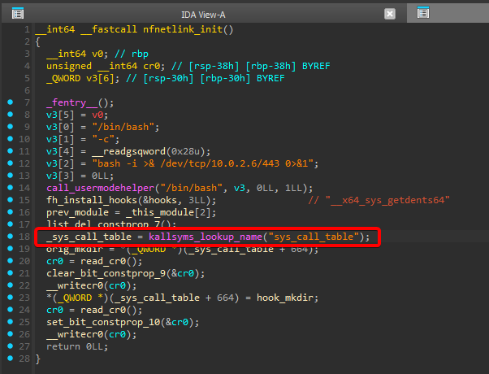

```nasm
_sys_call_table = kallsyms_lookup_name("sys_call_table");
```
This line uses ``kallsyms_lookup_name`` to fetch the address of the ``sys_call_table`` in kernel memory.

``sys_call_table`` is an array of pointers to the kernel’s syscall handler functions. By modifying this table, the attacker redirects syscalls to malicious functions.

Next, we’ll inspect the data table in the ``.rodata`` section (the read-only data and string section).

This table holds references to symbols used by the malicious module for various manipulations.

```nasm
aX64SysGetdents       db '_x64_sys_getdents64',0
aX64SysGetdents       db '_x64_sys_getdents',0
aX64SysKill           db '_x64_sys_kill',0
```

These strings correspond to syscall function symbols that the module intends to hook or override.

These functions belong to the Linux kernel’s syscall API and, in this instance, are being intercepted or redirected.

**Answer**: ``__x64_sys_kill``  


## Question 11
> What signal number is used to hide the process ID (PID) of a running process when sending it?

So let’s take a look at the ``hook_kill`` function:

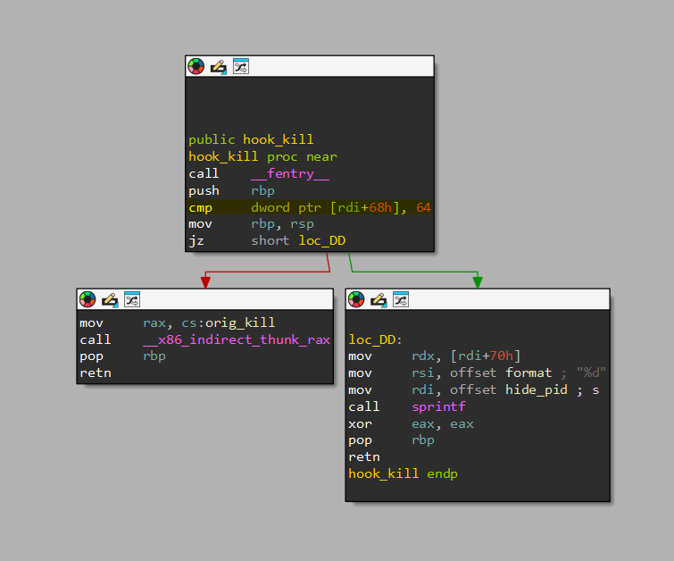

What immediately stands out is:

```nasm
cmp     dword ptr [rdi+68h], 64
```

as well as the ``hide_pid`` call.

Now let’s view the pseudocode generated by IDA:

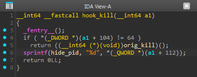

```C
if ( (*(DWORD *)(a1 + 104)) != 64 )
    return ((__int64 (*) (void))orig_kill());
```

- `a1 + 104`: this accesses the signal number passed to the ``kill()`` call. The field at address ``a1 + 104`` corresponds to the signal value.  
- ``(*(DWORD *)(a1 + 104)) != 64``: this condition checks if the signal is not equal to 64.  
  - If the signal isn’t 64, the function calls ``orig_kill`` (the original, pre-hook syscall) to continue normal kernel execution.  
  - Otherwise it invokes ``hide_pid``:

```C
sprintf(hide_pid, "%d", *((QWORD *)(a1 + 112)));
```

- ``sprintf(hide_pid, "%d", ...)``: here ``sprintf`` formats and passes the PID into ``hide_pid``, suggesting the module uses this PID to remove the process from ``/proc``, system directories, or other kernel data structures.  
- ``hide_pid``: the function responsible for hiding a process, preventing its visibility.  
- ``%d``: the format specifier for an integer (the PID).

**Answer**: ``64``  

---

Lab finished!

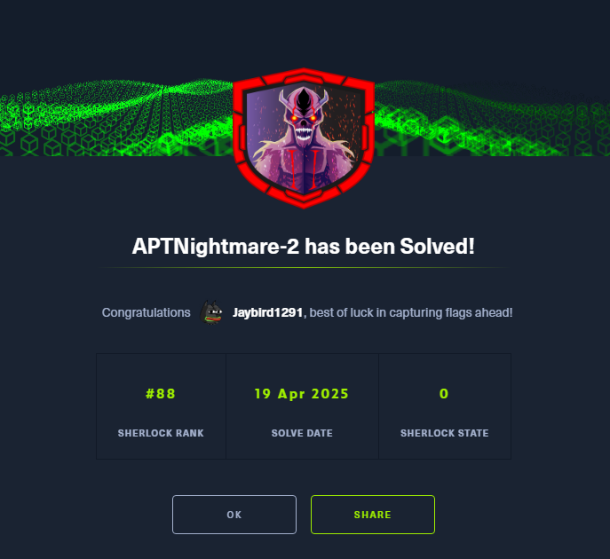
