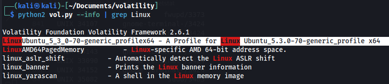
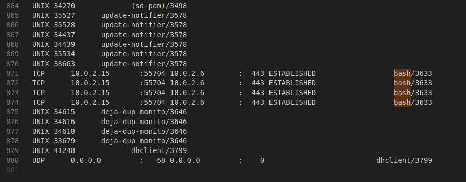
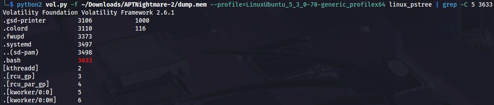
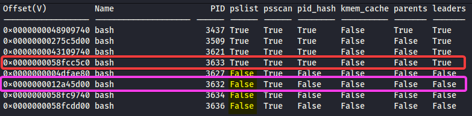
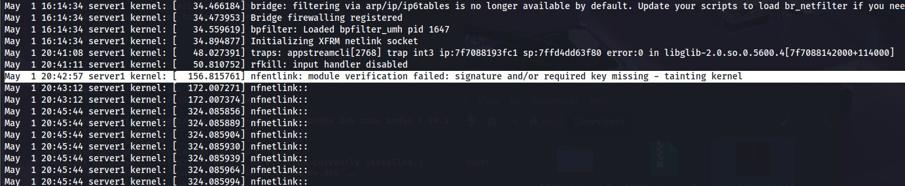
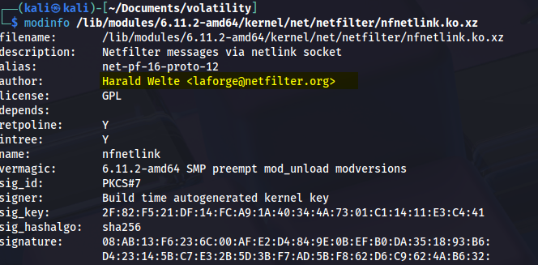
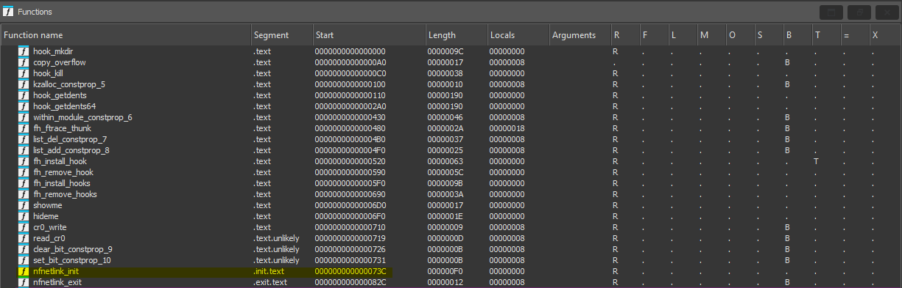
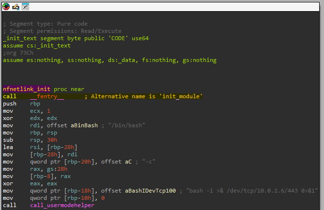
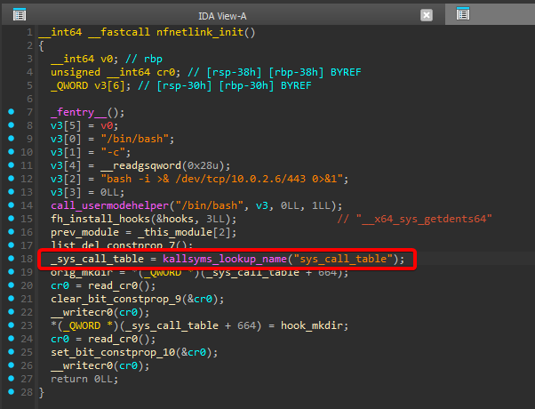
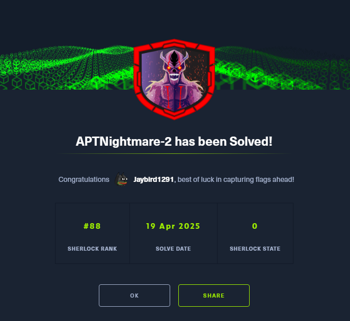

## シナリオ
> サーバー復旧後、IRチームは継続するトラフィック、隠された通信、および終了措置を回避する執拗なプロセスの迷宮を発見しました。ンシデントの範囲はサーバーとクライアントへの最初の侵害を超えていることが明らかです。フォレンジック調査の専門家として、これらの秘密裏の活動を隠す影を照らし出すことはできますか？

## セットアップ
このSherlockチャレンジでは以下を使用します：  
- Volatility2  
- IDA  

さらにこのチートシートを参照します：  
- https://downloads.volatilityfoundation.org/releases/2.4/CheatSheet_v2.4.pdf

### Volatilityプロファイル
まずPython 2とVolatility2をインストールし、必要なプロファイルを追加します。

Volatilityプロファイルは、ターゲットOSの構造情報を含むファイルです。特定のシステムのメモリ内でデータがどのように構成されているかをVolatilityが理解するための「地図」のようなものです。

このプロファイルは主に次の2種類の情報を含みます：  
- カーネルデータ構造の定義  
- カーネルシンボル（関数や変数のアドレス）

インストール：  
```bash
sudo apt install -y python2 python2-dev build-essential libdistorm3-dev libssl-dev libffi-dev zlib1g-dev

curl -sS https://bootstrap.pypa.io/pip/2.7/get-pip.py -o get-pip.py

sudo python2 get-pip.py

sudo python2 -m pip install --upgrade pip setuptools wheel

sudo python2 -m pip install distorm3 pycrypto openpyxl pillow yara-python

git clone https://github.com/volatilityfoundation/volatility.git

cd volatility

python2 vol.py -h
```


プロファイル設定：  
```bash
cp Ubuntu_5.3.0-70-generic_profile.zip ~/Documents/volatility/volatility/plugins/overlays/linux/

python2 vol.py --info | grep Linux
```




## 質問1
> 攻撃者がリバースシェルに使用したIPとポートは何ですか？

メモリキャプチャ時点のすべてのネットワーク接続をダンプするために**linux_netstat**プラグインを使用します。出力をファイルにリダイレクトし、検索を容易にします。

```bash
python2 vol.py -f ~/Downloads/APTNightmare-2/dump.mem --profile=LinuxUbuntu_5_3_0-70-generic_profilex64 linux_netstat > netstat.txt
```

Linuxでは、乱雑なBashリバースシェルである可能性が高く、実際に：



**回答**：``10.0.2.6:443``


## 質問2
> 悪意あるリバースシェル接続のPPIDは何ですか？

まずは ``linux_pstree`` を試してみます：

```bash
python2 vol.py -f ~/Downloads/APTNightmare-2/dump.mem --profile=LinuxUbuntu_5_3_0-70-generic_profilex64 linux_pstree | grep -C 5 3633
```



PPIDがありません。なぜでしょう？  
``linux_pstree`` プラグインは、単一の情報源――システムのアクティブタスクリスト（``task_struct``）――に基づいてプロセスツリーを再構築します。

  
https://makelinux.github.io/kernel/map/

そこで、隠れプロセス検出に特化した ``linux_psxview`` プラグインを使用します。複数のアーティファクトを集約してプロセスを識別します：  
- **task_struct リスト**: `linux_pstree` と同じアクティブタスクリスト  
- **pid ハッシュテーブル**: カーネルのPID高速検索用ハッシュテーブル  
- **pslist**: 別のメモリ構造から抽出したプロセスリスト  
- **kmem_cache**: 隠れタスクを参照している可能性があるカーネルオブジェクトキャッシュ  
- **d_path**: procfsからのファイルシステムパスでプロセスディレクトリを露出検出  
- **thread_info**: 非リンクプロセスを浮かび上がらせるスレッドメタデータ  

``linux_psxview`` はこれらの情報源を相互比較し、不整合を検出します。例えば、あるソースには存在するが別のソースにはないPIDなどです。

```bash
python2 vol.py -f ~/Downloads/APTNightmare-2/dump.mem --profile=LinuxUbuntu_5_3_0-70-generic_profilex64 linux_psxview > psxview.txt
```



期待どおり、親プロセスは直前のPIDです。

では、なぜ隠されていたのでしょうか？ 
シナリオの内容から、ルートキットによる操作であることが明らかです。おそらく、ルートキットはタスクリスト（*task_struct リスト*）を改ざんし、自身のリバースシェルプロセスをリンクリストから“unlink”しました。具体的には、`next` と `prev` ポインタを操作し、リスト走査時にプロセスが無視されるようにしています。

しかし、ルートキットは存在の痕跡を完全には消し切れていません。他の構造体のうち複数のいずれかを `linux_psxview` が監視する中で、変更を怠っている箇所が残っていました。

結果として、`linux_pstree` はタスクリストだけを参照するため悪意あるプロセスを見逃しますが、`linux_psxview` は複数の情報源をチェックすることで、ルートキットが見落とした構造体経由で検出できる、というわけです。

**回答** : ``3632``


## 質問3
> 悪意あるカーネルモジュールの名前を答えよ。

このために `linux_check_modules` プラグインを使用します。ただ、その前にコンテキストを整理しましょう。そもそもカーネルモジュールとは何か、またそれはルートキットとどのように関係するのでしょうか？

カーネルモジュールとは、実行中のOSカーネルに動的にロード／アンロードできるコードの断片です。これにより、再起動やカーネルの再コンパイルなしで新しいハードウェアサポートやファイルシステム機能を追加できます。

ルートキットは独自のLoadable Kernel Modules（LKM）を使ってLinuxカーネルレベルで動作します。これらの悪意あるモジュールは：  
- システムコールをフックしてファイル、プロセス、ネットワーク接続を隠蔽  
- システムに永続的なバックドアを確立  
- カーネルのセキュリティ機能を無効化  
- 標準ツールから自身の存在を隠蔽  
…などを行います。

Volatilityの `linux_check_modules` プラグインは、複数のカーネル情報ソースを突き合わせることで隠れたLKMを検出します。

**1. 公式モジュールリスト**  
まず、カーネルが管理する公式モジュールリスト（`modules.list`）を調査します。この循環連結リストには正規にロードされたすべてのモジュールが含まれ、`lsmod` コマンドで同じ情報が得られます。

**2. カーネルシンボルテーブル**  
次に、`/proc/kallsyms` を解析し、モジュールが追加したものも含めたすべての関数・変数のアドレスを取得します。

**3. `.ko` メモリセクション**  
さらに、`.ko` モジュールがロードされる典型的なメモリ領域をスキャンし、他の場所で参照されていなくてもモジュールコードの特徴的なシグネチャを探索します。

**4. 隠しモジュール検出テクニック**  
- 公式リストとシンボル／メモリスキャン結果を比較し、一方に存在して他方にないモジュールを疑います。  
- syscallテーブルをチェックし、オリジナルのカーネル関数がフックまたは置換されていないかを確認します。  
- モジュール関数のアドレスが通常とは異なるメモリ領域を指していないか検証し、コードインジェクションの可能性を探ります。  
- モジュールのメタデータ（タイムスタンプ、名前、作者など）に矛盾や異常がないか分析します。

> **なるほど、でもルートキットはどのように隠れるの？**

主な手法には以下があります：  
- **DKOM (Direct Kernel Object Manipulation)**  
  メモリ上のカーネルデータ構造を直接操作し、`modules.list` から自モジュールをunlinkしつつ機能を維持。  
- **システムコールフック**  
  正規のカーネル関数を置き換え、自作のバージョンで結果をフィルタリングまたは偽装（例：特定ファイルを表示しないreadのパッチ）。  
- **無名モジュール**  
  空文字列や特殊文字名でモジュールをロードし、発見を困難にします。

さて、本題に戻ります。

```bash
python2 vol.py -f ~/Downloads/APTNightmare-2/dump.mem --profile=LinuxUbuntu_5_3_0-70-generic_profilex64 linux_check_modules 
```


モジュール名 **"nfentlink"** は、正規の **"nfnetlink"** モジュールを装うことで悪意あるLKMをカモフラージュしようとしたものです。`nfnetlink` はネットワークおよびファイアウォール機能のためにカーネル空間とユーザー空間間の通信を行う正規モジュールです。

**回答**: `nfentlink`

## 質問4
> モジュールがロードされたのは何時ですか？

当初、私が試したアプローチには誤りがありました。その思考過程を示します： 
- `linux_dmesg` で `dmesg` からモジュールのロードタイムスタンプを取得  
- `linux_pslist` でシステム起動のタイムスタンプを取得  
- それらの差分を計算  

もしモジュールが初回ロードであればこの方法で問題ありませんでした。しかし、既に過去にロードされていたため、この方法は根本的に誤っており、インシデントレスポンスの現場では誤誘導を招きかねません。

最終的に私は考えをリセットし、「複数回の再起動にまたがる過去のアクションに紐づくタイムスタンプはどこにあるか？」と自問しました。

もちろん、システムログです。特に `/var/log/kern.log` や `/var/log/syslog.log` が該当します。

これらのファイルを抽出するため、まずメモリキャプチャ内でファイルを列挙します：

```bash
python2 vol.py -f ~/Downloads/APTNightmare-2/dump.mem --profile=LinuxUbuntu_5_3_0-70-generic_profilex64 linux_enumerate_files > files.txt
```

実際には次のように見つかりました：  


次に `/var/log/kern.log` を抽出します：  

```bash
python2 vol.py -f ~/Downloads/APTNightmare-2/dump.mem --profile=LinuxUbuntu_5_3_0-70-generic_profilex64 linux_find_file -i 0xffff98ea5a732fa8 -O kern.log
```
  


**回答**：`2024-05-01 20:42:57`

## 質問5
> 悪意あるカーネルモジュールファイルのフルパスと名前は何ですか？

同様に、列挙したファイルを確認します。まず、特定したモジュール “nfentlink” を検索します。

```bash
cat files.txt |grep nfentlink
```


特に有益な情報は見つかりませんでした。

そこで、実際の名前でモジュールを探します：


2つ目のファイルについては後ほど戻ります。

**回答**：`/lib/modules/5.3.0-70-generic/kernel/drivers/net/nfnetlink.ko`

## 質問6
> 悪意あるカーネルモジュールファイルのMD5ハッシュは何ですか？

ファイルを抽出してハッシュを計算します：

```bash
python2 vol.py -f ~/Downloads/APTNightmare-2/dump.mem --profile=LinuxUbuntu_5_3_0-70-generic_profilex64 linux_find_file -i 0xffff98ea266b5a68 -O nfnetlink.ko

md5sum nfnetlink.ko
```


**回答**：`35bd8e64b021b862a0e650b13e0a57f7`

## 質問7
> 正規のカーネルモジュールファイルのフルパスと名前は何ですか？

質問5のスクリーンショットに戻りましょう。

**回答**：`/lib/modules/5.3.0-70-generic/kernel/net/netfilter/nfnetlink.ko`

## 質問8
> 正規モジュールと悪意あるモジュールの author 値の一文字の違いは何ですか？

まず、特定のカーネルモジュールに関する詳細情報を表示する **modinfo** で正規モジュールを確認します。

```bash
modinfo /lib/modules/6.11.2-amd64/kernel/net/netfilter/nfnetlink.ko.xz
```



次に、メモリキャプチャから抽出したモジュールを調査します。

```bash
modinfo malicious-nfnetlink.ko
```


はっきりと “i” が欠落しているのが分かります。

**回答**：`i`


## 質問9
> 悪意あるカーネルモジュールの初期化関数の名前は何ですか？

この質問に答えるために**IDA**を使います。オーバーキルかもしれませんが、gdb（gef>gdb）やradare2などでも十分です。

では、関数を見てみましょう：  




初期化関数が `nfnetlink_init` であると同時に `init_module` でもあることがはっきり分かります。gefで見るとさらに明確です：


gef は両方のシンボルがまったく同じメモリアドレスを指していることを示しています。これは、ルートキットがカーネルレベルで自身を偽装するための意図的な手法です。

悪意あるモジュールは、Linux カーネルモジュールの **必須** エントリポイントである標準の `init_module` 関数を利用しつつ、正規モジュールを模倣するために意図的に関数名を `nfnetlink_init` に変更しています。

`init_module` のようなエクスポートシンボルはカーネルがモジュールをロードするのに不可欠ですが、攻撃者はコンパイル時のトリックを使い、同一関数に二つの異なる名前（ロード用とカモフラージュ用）を持たせています。

**回答**: `nfnetlink_init`


## 質問10
> システムコールをフックする関数があります。テーブルの最後のシステムコールは何ですか？

`nfnetlink_init` 関数内で `_sys_call_table = kallsyms_lookup_name("sys_call_table");` が確認できます:



```nasm
_sys_call_table = kallsyms_lookup_name("sys_call_table");
```

この行は `kallsyms_lookup_name` を使用して、カーネルメモリ上の `sys_call_table` のアドレスを取得しています。

`sys_call_table` はカーネルのシステムコールハンドラ関数へのポインタを格納した配列です。このテーブルを書き換えることで、攻撃者はシステムコールをマルウェアルーチンへリダイレクトできます。

次に、`.rodata` セクション（読み取り専用データおよび文字列が配置される領域）のデータテーブルを調査します。

このテーブルには、悪意あるモジュールが各種操作のために使用またはフックしようとするシンボルへの参照が含まれています。

```nasm
aX64SysGetdents       db '_x64_sys_getdents64',0
aX64SysGetdents       db '_x64_sys_getdents',0
aX64SysKill           db '_x64_sys_kill',0
```

これらの文字列は、モジュールがフックまたはオーバーライドしようとしているシステムコール関数シンボルに対応しています。

これらの関数は Linux カーネルのシステムコール API の一部であり、この場合はインターセプトまたはリダイレクトされています。

**回答**: `__x64_sys_kill`


## 質問11
> 実行中のプロセスID (PID) を隠すために、プロセスに送信する際に使用されるシグナル番号は何ですか？

では、``hook_kill`` 関数を見てみましょう:


まず目を引くのは:

```nasm
cmp     dword ptr [rdi+68h], 64
```

および ``hide_pid`` の呼び出しです。

続いて、IDAで生成された擬似コードを見てみます:


```C
if ( (*(DWORD *)(a1 + 104)) != 64 )
    return ((__int64 (*) (void))orig_kill());
```

- `a1 + 104`: これは `kill()` 呼び出しで送信されたシグナルを参照します。アドレス `a1 + 104` のフィールドがシグナルの値に対応します。  
- `(*(DWORD *)(a1 + 104)) != 64`: この条件はシグナルが 64 でないかをチェックしています。  
  - シグナルが 64 でない場合、元のシステムコール `orig_kill` を呼び出して通常通りカーネル実行を継続します。  
  - シグナルが 64 の場合は `hide_pid` を呼び出します:

```C
sprintf(hide_pid, "%d", *((QWORD *)(a1 + 112)));
```

- ``sprintf(hide_pid, "%d", ...)``: ここで ``sprintf`` を使用して PID を文字列に変換し、``hide_pid`` に渡しています。これは、モジュールがこのPIDを元に、``/proc`` やシステムディレクトリ、その他のカーネルデータ構造からプロセスを隠蔽していることを示しています。
- ``hide_pid``: プロセスを隠蔽し、可視性を阻止する関数です。  
- `%d`: 整数（PID）を出力するためのフォーマット指定子です。

**回答**: `64`  

---

ラボ完了！


