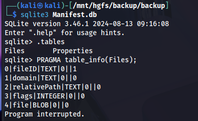
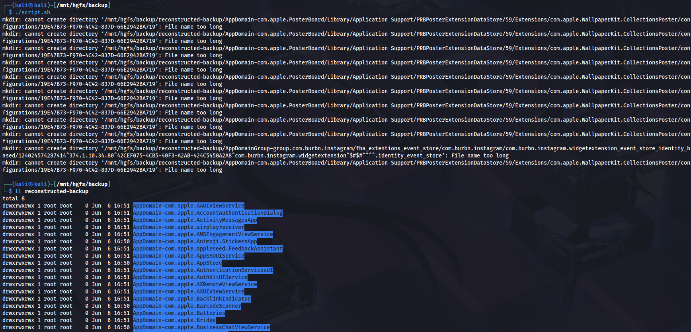
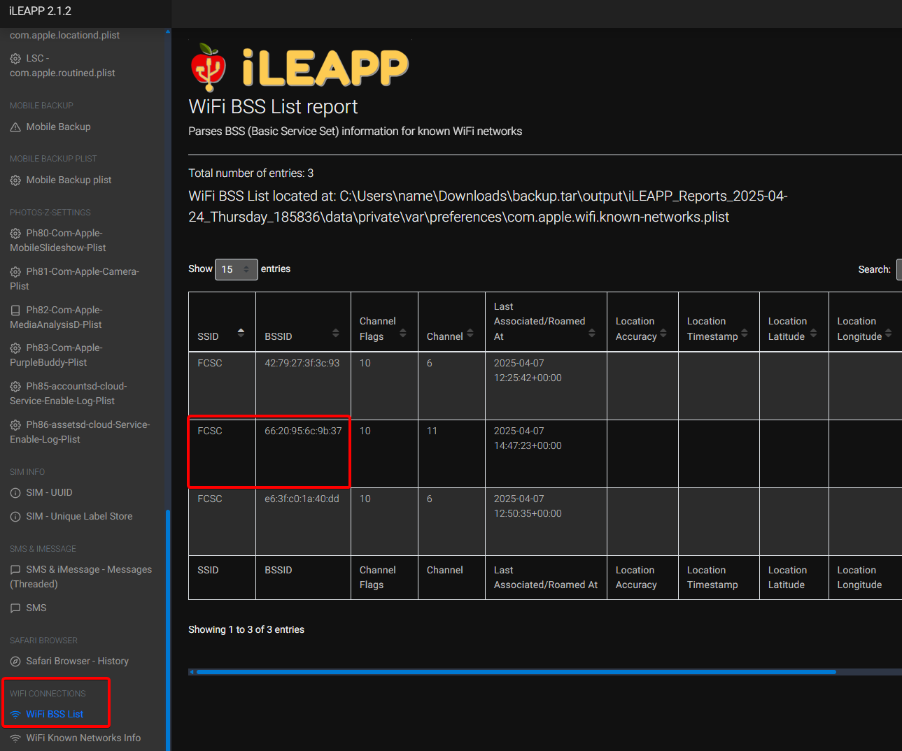
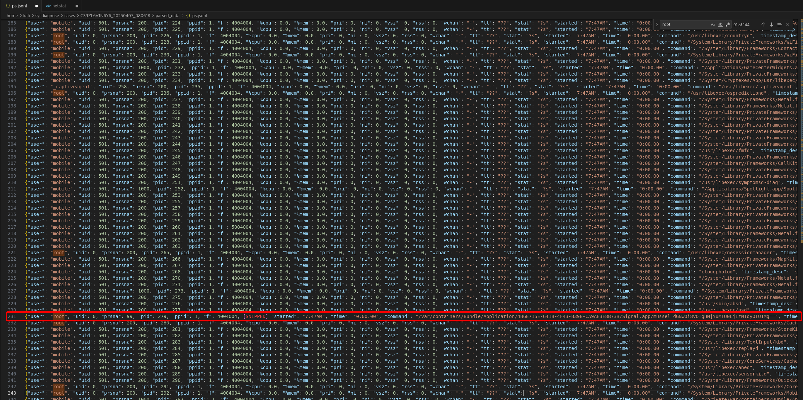
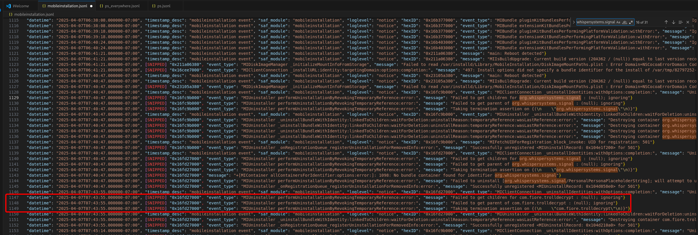
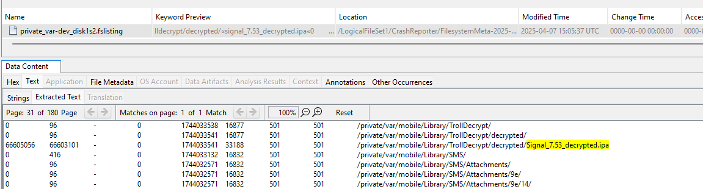

## Scenario 
> As you pass through customs, the customs officer asks you to hand over your phone and its unlock code. The phone is returned to you a few hours later…
> 
> Suspicious, you send your phone to ANSSI's CERT-FR for analysis. CERT-FR analysts carry out a collection on the phone, consisting of a sysdiagnose and a backup.
> 
> iForensics - iDevice
> iForensics - iWiFi
> iForensics - iTreasure
> iForensics - iNvisible
> iForensics - iBackdoor 1/2
> iForensics - iBackdoor 2/2
> iForensics - iC2
> iForensics - iCompromise

We have a logical `backup.tar.xz` (logical) **plus** a set of _sysdiagnose_ and crash files!  

## Setup
For the whole series I relied on:
- DB Browser for SQLite
- EC-DIGIT-CSIRC/sysdiagnose
- iLEAPP
- Autopsy

Handy reference material:
- 
- 

Sure, you could bring in heavier artillery (Plaso etc.), but I was solving the CTF late and opted for the fast route. 🤠

## Intro - iForensics - iCrash
> It seems that a flag has hidden itself in the place where crashes are stored on the phone…

Super-easy one. We know the crashes live in `sysdiagnose_and_crashes.tar.xz`, so:
```
tar -xf sysdiagnose_and_crashes.tar.xz 
```

From here you can ``grep -r "FCSC{"`` or simply browse the crash folders by hand.

If we go inside ``sysdiagnose_and_crashes/private/var/mobile/Library/Logs/CrashReporter/`` we'll spot **fcsc_intro.txt** — and the flag.

**Flag** : ``FCSC{7a1ca2d4f17d4e1aa8936f2e906f0be8}``


## ⭐ - iForensics - iDevice
> To start with, find some information of interest about the phone: iOS version and phone model identifier.
> The flag is in the format FCSC{<model identifier>|<build number>}. For example, for an iPhone 14 Pro Max running iOS 18.4 (22E240): FCSC{iPhone15,3|22E240}.

To answer this question, you need to know what an iOS backup consists of. I spoke earlier of a "logical" backup. This is important because if you look inside the backup, all you see are weird folders:


To make sense of it we must rebuild the real paths using **Manifest.db** (introduced with iOS 10). That DB maps each fileID to its original RelativePath.

Luckily, some human-readable files survive at the root, including **Info.plist**. Apple stores key device metadata there:
- product Type (model identifier, e.g. iPhone12,3)
- product Version (iOS version, e.g. 16.0)
- build Version (e.g. 20A362)
- IMEI, serial, GUID, last-backup date, installed apps etc.

Everything we need for the flag!


**Flag** : ``FCSC{iPhone12,3|20A362}``

If you're interested in rebuilding the arbo, here's a demonstration:

First, let's take a look at what **Manifest.db** is made of: 



Pretty straightforward, so a tiny script can recreate the tree:
```bash
#!/bin/bash
BACKUP="/mnt/hgfs/backup/backup"
OUT="/mnt/hgfs/backup/reconstructed-backup"

mkdir -p "$OUT"

sqlite3 -separator '|' "$BACKUP/Manifest.db" \
"SELECT fileID, domain, COALESCE(relativePath,'') FROM Files;" \
| while IFS="|" read -r FILEID DOMAIN RELPATH; do

  [[ -z "$RELPATH" ]] && continue

  DEST_DIR="$OUT/$DOMAIN/$(dirname "$RELPATH")"
  DEST_PATH="$OUT/$DOMAIN/$RELPATH"

  mkdir -p "$DEST_DIR"
  ln -s "$BACKUP/$FILEID" "$DEST_PATH" 2>/dev/null || true
done
```

And voilà !




## ⭐ - iForensics - iWiFi
> To continue, find some information of interest about the phone: SSID and BSSID of the WiFi network the phone is connected to, as well as the iCloud account associated with the phone.
>
> The flag is in the format FCSC{<SSID>|<BSSID>|<iCloud account>}. For example, if the phone is connected to the example WiFi network, which has the BSSID 00:11:22:33:44:55 and the associated iCloud account is example@example.com: FCSC{example|00:11:22:33:44:55|example@example.com}.

To speed up the extraction of Wi-Fi and iCloud information, we can use iLEAPP (iOS Logs, Events, and Protobuf Parser): it will automatically collect and organize lots of artifacts for us and make a report.

After running iLEAPP you can read SSID & BSSID straight from the Wi-Fi section:



For the iCloud account there are many angles possible; one of the easiest is to check which Apple ID installed the apps.


**Flag** : ``FCSC{FCSC|66:20:95:6c:9b:37|robertswigert@icloud.com}``


## ⭐⭐ - iForensics - iTreasure
> Before the phone was handed over to customs, its owner had time to send a treasure. Find this treasure.

There are several quick avenues here. The wording hints at something **sent**, so my first stop was plain old SMS / iMessage.

Because iLEAPP parses the `sms.db` for us, we can open the report and jump straight to the message table:  


It can also be fed to Autopsy via the "Logical File Analysis" module. Autopsy scans all the files and, based on their headers (magic bytes), groups some of the media (JPEG, PNG, etc.) under the "User Content Suspected" tab, since the **Access Path** is located in ``HomeDomain/Media/DCIM/...``. It therefore considers it to be user content (photo taken or imported).

**Flag** : ``FCSC{511773550dca}``


## ⭐⭐ - iForensics - iNvisible
> It seems that a message could not be sent… Find the recipient of this message.
> The flag is in the format FCSC{<recipient>}. For example, if the recipient is example@example.com: FCSC{example@example.com}.

In this case, it's very quick: you can go straight to the DB **sms.db**. This is the database containing all conversations (iMessage and SMS), with the main tables message (headers, status, text, etc.) and handle (list of correspondents, numbers/addresses).

Don't fall into the trap of querying `message` only, for plain SMS you actually need the **chat** table.


**Flag** : ``FCSC{kristy.friedman@outlook.com}``

## ⭐⭐ - iForensics - iBackdoor 1/2
> You continue your analysis to find the backdoor on the phone. Eventually, you realize that an application has been compromised and that the phone was infected at the time of collection… Find the identifier of the compromised application and the process identifier (PID) of the malware.
> 
> The flag is in the format FCSC{<application identifier>|<PID>}. For example, if the compromised application is Example (com.example) and the PID is 1337: FCSC{com.example|1337}.

Here we'll have to use sysdiagnose (``/sysdiagnose_and_crashes/private/var/mobile/Library/Logs/CrashReporter/DiagnosticLogs/sysdiagnose/sysdiagnose_2025.04.07_08-06-18-0700_iPhone-OS_iPhone_20A362``).

But first, what is sysdiagnose? It's an archive generated by iOS that automatically gathers system logs, crash reports, network status and configuration information at the time of capture. It's mainly used to diagnose performance or stability problems by providing a complete snapshot of the device. But it is also very useful from a forensic point of view after a compromise. 

To stay efficient I used the excellent **EC-DIGIT-CSIRC/sysdiagnose** toolkit <https://github.com/EC-DIGIT-CSIRC/sysdiagnose>.

```bash
┌──(venv)─(kali㉿kali)-[~/sysdiagnose]
└─$ sysdiag create /mnt/hgfs/backup/sysdiagnose_and_crashes/private/var/mobile/Library/Logs/CrashReporter/DiagnosticLogs/sysdiagnose/sysdiagnose_2025.04.07_08-06-18-0700_iPhone-OS_iPhone_20A362.tar.gz 

Sysdiagnose file has been processed: /mnt/hgfs/backup/sysdiagnose_and_crashes/private/var/mobile/Library/Logs/CrashReporter/DiagnosticLogs/sysdiagnose/sysdiagnose_2025.04.07_08-06-18-0700_iPhone-OS_iPhone_20A362.tar.gz
Case 'C39ZL6V1N6Y6_20250407_080618' created successfully from '/mnt/hgfs/backup/sysdiagnose_and_crashes/private/var/mobile/Library/Logs/CrashReporter/DiagnosticLogs/sysdiagnose/sysdiagnose_2025.04.07_08-06-18-0700_iPhone-OS_iPhone_20A362.tar.gz'
```

Case successfully created:


We'll directly use the "ps" parser. Running the ps parser gives us the full process list at capture time. That dump is invaluable:
- **Global visibility**: 

The ps.txt provides a snapshot of everything running on the iPhone (including executables hidden or launched by system services). Without this listing, malware hiding behind a misleading name or in a non-standard directory could go undetected.

- **Privilege anomalies**:

By looking at the user/uid and ppid columns, you can quickly spot when a third-party process (e.g. extracted from a third-party app) is running as root (UID 0). However, a normal app should never be granted this level of privileges without going through an official mechanism.

- **Suspicious commands / args**:

The command field shows the executable and its arguments. Any unknown binary (as we'll see later) or coded URL (Base64 or other) is immediately visible and can be decoded/inspected.

- **Temporal context**:

With date/time (started, datetime) and performance fields (%cpu, %mem), we know if a process has started abnormally early (at boot) or if it is consuming resources to exfiltrate data, even if it remains at 0% to mask its activity.

- **Correlation**:

The ps.txt is integrated with all other dumps (network, open files, configurations). You can cross-reference: “X root process to IP Y” + “network connection to Y” + “files created in Z” to build an attack thread.




What stands out?
```bash
root     …   279     1  … /var/containers/Bundle/Application/…/Signal.app/mussel dGNwOi8vOTguNjYuMTU0LjIzNToyOTU1Mg==
root     …   330     1  … /var/containers/Bundle/Application/…/Signal.app/mussel dGNwOi8vOTguNjYuMTU0LjIzNToyOTU1Mg==
root     …   345   344  … /var/containers/Bundle/Application/…/Signal.app/mussel dGNwOi8vOTguNjYuMTU0LjIzNToyOTU1Mg==
```

**1. "mussel" binary**
– Bundled inside Signal; not an iOS stock daemon.

**2. Running as root**
– Running with UID 0 (root) is highly suspicious for a third-party component.

**3. Base64 argument**
– ``dGNwOi8vOTguNjYuMTU0LjIzNToyOTU1Mg==`` is Base64 which, decoded, gives **tcp://98.66.154.235:29552**, TCP going to an external IP (C2)

**4. Classic spyware behaviour**
– Unknown root daemon + outbound C2 traffic = red flag lol


**Answer** : ``FCSC{org.whispersystems.signal|345}``


## ⭐⭐ - iForensics - iBackdoor 2/2
> Now that you know which application has been compromised, find out how the attacker retrieved the legitimate application prior to infection. You'll need to find :
> - The identifier of the application used to retrieve the legitimate application;
> - The path used to store the legitimate application;
> - The date on which the legitimate application was uninstalled (in local time).
>
> The flag is in the format FCSC{<application identifier>|<path>|<date>}. For example, if the application used is Example (com.example), the path is /private/var/tmp/test.xyz and the uninstall date is 2025-01-01 01:00:00: FCSC{com.example|/private/var/tmp/test.xyz|2025-01-01 01:00:00}.

Let's set the record straight: 
- we know that Signal is the app in question
- we know it was launched around 7:47AM
- we need to find the path to the app, what "retrieved" / installed the legitimate app and when it was uninstalled

For this I went straight to **mobileinstallation** logs.

In fact, `mobileinstallation` is the iOS subsystem in charge of every install / update / uninstall.  

In the JSON-formatted unified logs we get:
- precise timestamps (timestamp + datetime)
- bundle IDs
- verbose uninstall events
- the occasional error detailing *why* something was removed.

Bingo : 


```json
// at 07:40:47-07:00, first uinstall of Signal
{
  "datetime": "2025-04-07T07:40:47.000000-07:00",
  "event_type": "MIClientConnection _uninstallIdentities",
  "message": "Uninstall requested by installcoordinationd ... for identity [org.whispersystems.signal]"
}
// at the same second, destruction of its containers:
"message": "Destroying container org.whispersystems.signal ... at /private/var/containers/Bundle/Application/1EC20F02-..."

// at 07:43:55, uninstall of com.fiore.trolldecrypt
{
  "datetime": "2025-04-07T07:43:55.000000-07:00",
  "message": "Uninstalling identifier com.fiore.trolldecrypt"
  // then destroy the corresponding bundle container
}
```

We now know that the attacker used TrollDecrypt, an opensource utility designed for iOS devices equipped with **TrollStore**. It enables on-the-fly decryption of installed applications (IPAs protected by FairPlay DRM) directly on the device, without the need for jailbreak. Specifically, it :
- scans the list of apps installed on the iDevice via TrollStore
- decrypts the FairPlay binary of the targeted app
- packages the results in an exploitable .ipa file (for analysis, reinstallation, sideloading, etc.).

TrollStore exploits a **CoreTrust** flaw to sign any IPA for life. TrollDecrypt uses this to launch the targeted app, dumps its memory and outputs a FairPlay free IPA. Hence the folder ``/Library/TrollDecrypt/decrypted/``.

I admit there would be a thousand clever ways to rotate, analyze and find the legitimate app's storage path, but there are faster ways. In a CTF context, it counts! 

Simply look for a **.ipa**.



This gives a very brief timeline: 

1. 07h40m47s: Signal uninstalled (MI log)
2. 07h40-42m: dump → Signal_7.53_decrypted.ipa (fslisting)
3. 07h43m55s: uninstall TrollDecrypt (log MI)
4. 07h47mxxs: launch of repackaged IPA (unified log)

We now have everything we need to create the flag.

**Flag** : ``FCSC{com.fiore.trolldecrypt|/private/var/mobile/Library/TrollDecrypt/decrypted/Signal_7.53_decrypted.ipa|2025-04-07 07:40:47}``

## ⭐⭐⭐ - iForensics - iC2
> Find the name of the malicious tool deployed on the phone, as well as the protocol, IP address and communication port to the C2 server.
>
> The flag is in the format FCSC{<tool>|<protocol>|<IP address>|<port>}. For example, if the tool is Cobalt Strike, the protocol TCP, the IP address 127.0.0.1 and the port 1337: FCSC{Cobalt Strike|TCP|127.0.0.1|1337}.

So I did some more research into TrollStore and related interesting news. I came across this article:  https://idevicecentral.com/news/ios-malware-makes-trollstore-users-vulnerable-to-monitoring-file-extraction-remote-control-on-ios-14-ios-17/


We've already retrieved the protocol, IP and port earlier, so it's simple: 

**Flag** : ``FCSC{SeaShell|TCP|98.66.154.235|29552}``

---
