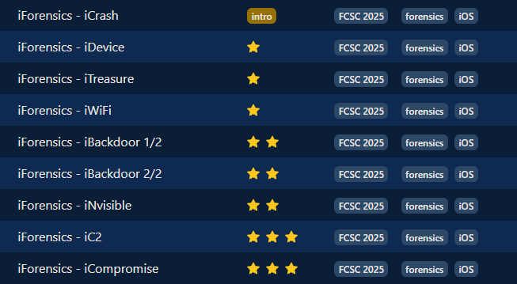

## Scénario 
> Lors d’un passage de douane, le douanier vous demande de lui remettre votre téléphone ainsi que son code de déverrouillage. Le téléphone vous est rendu quelques heures plus tard …
> Suspicieux, vous envoyez votre téléphone pour analyse au CERT-FR de l’ANSSI. Les analystes du CERT-FR effectuent une collecte sur le téléphone, composée d’un sysdiagnose et d’un backup.
> Ces épreuves font partie d’une série. Les épreuves sont indépendantes sauf iBackdoor 2/2 qui dépend de iBackdoor 1/2 :
> iForensics - iCrash
> iForensics - iDevice
> iForensics - iWiFi
> iForensics - iTreasure
> iForensics - iNvisible
> iForensics - iBackdoor 1/2
> iForensics - iBackdoor 2/2
> iForensics - iC2
> iForensics - iCompromise

On a donc une backup.tar.xz (logique) et des sysdiagnose et crashes ! 

## Setup
Pour ces challenges nous allons utiliser : 
- DB Browser for SQLite
- EC-DIGIT-CSIRC/sysdiagnose
- iLEAPP
- Autopsy

On peut aussi s'aider de cheatsheets telles que : 
- [FOR585.pdf](pictures/FOR585.pdf)

On pourrait aussi utiliser des tools et méthodologies plus "pro" (via Plaso etc.) mais dans le contexte du CTF (fait en retard) je n'ai pas pris le temps de le faire. 


## Intro - iForensics - iCrash
> Il semblerait qu’un flag se soit caché à l’endroit où sont stockés les crashes sur le téléphone …

Ici très simple. On sait que les crashs se trouvent dans l'archive ``sysdiagnose_and_crashes.tar.xz``. On l'extrait donc :
```
tar -xf sysdiagnose_and_crashes.tar.xz 
```

Ici on peut trouver de plusieurs manières, un simple grep ``grep -r "FCSC{"``, se balader dans les logs de crash etc.

Si on se rend dans ``sysdiagnose_and_crashes/private/var/mobile/Library/Logs/CrashReporter/`` on trouve le fichier **fcsc_intro.txt** avec le flag. 

**Flag** : ``FCSC{7a1ca2d4f17d4e1aa8936f2e906f0be8}``


## ⭐ - iForensics - iDevice
> Pour commencer, trouvez quelques informations d’intérêt sur le téléphone : version d’iOS et identifiant du modèle de téléphone. 
> Le flag est au format FCSC{<identifiant du modèle>|<numéro de build>}. Par exemple, pour un iPhone 14 Pro Max en iOS 18.4 (22E240) : FCSC{iPhone15,3|22E240}.

Pour répondre à cette question il faut savoir de quoi est constitué une backup iOS. J'ai parlé plus haut de backup "logique". Cela a une importance car si on regarde à l'intérieur de la backup on ne voit que des dossiers bizarres :

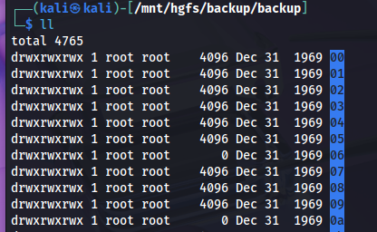

En fait il faut reconstruire la structure et noms de dossiers / fichiers. Pour cela il faut utiliser la **Manifest.db** (iOS 10+) en faisant la correspondance entre les RelativePath et les FileID. 

Néanmoins on voit aussi des fichiers avec des noms normaux dont **Info.plist**. C'est ici qu'Apple conserve les metadata clés concernant l’appareil :
- Product Type (identifiant du modèle, ex. iPhone12,3),
- Product Version (version d’iOS, ex. 16.0),
- Build Version (numéro de build, ex. 20A362),
- Divers identifiants (IMEI, MEID, Serial Number, GUID…),
- Date du dernier backup, applications installées, etc.

On a donc tout ce qu'il nous faut pour faire le flag : 

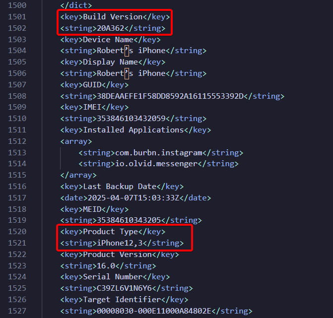

**Flag** : ``FCSC{iPhone12,3|20A362}``

Si reconstruire l'arbo vous intéresse voici pour la démonstration :

Premièrement regardons de quoi est constitué **Manifest.db** : 

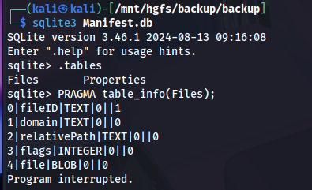

Très direct, on peut donc scripter facilement la reconstruction comme cela : 
```bash
#!/bin/bash
BACKUP="/mnt/hgfs/backup/backup"
OUT="/mnt/hgfs/backup/reconstructed-backup"

mkdir -p "$OUT"

# on utilise -separator '|' pour que SQLite nous renvoie directement fileID|domain|relativePath
sqlite3 -separator '|' "$BACKUP/Manifest.db" \
"SELECT fileID, domain, COALESCE(relativePath,'') FROM Files;" \
| while IFS="|" read -r FILEID DOMAIN RELPATH; do

  # Si relativePath est vide, on saute (ce sont souvent des entrées de dossier sans chemin)
  [[ -z "$RELPATH" ]] && continue

  # Chemins de sortie pour recréer l’arborescence
  DEST_DIR="$OUT/$DOMAIN/$(dirname "$RELPATH")"
  DEST_PATH="$OUT/$DOMAIN/$RELPATH"

  mkdir -p "$DEST_DIR"
  ln -s "$BACKUP/$FILEID" "$DEST_PATH" 2>/dev/null || true
done
```

Et voilà : 

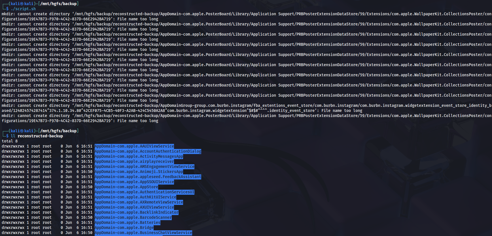


## ⭐ - iForensics - iWiFi
> Pour continuer, trouvez quelques informations d’intérêt sur le téléphone : SSID et BSSID du réseau WiFi sur lequel le téléphone est connecté ainsi que le compte iCloud associé au téléphone.
> Le flag est au format FCSC{<SSID>|<BSSID>|<compte iCloud>}. Par exemple, si le téléphone est connecté sur le réseau WiFi example, qui a pour BSSID 00:11:22:33:44:55 et que le compte iCloud associé est example@example.com : FCSC{example|00:11:22:33:44:55|example@example.com}.

Afin d'accélérer l'extraction des informations Wi-Fi et iCloud, on peut utiliser iLEAPP (iOS Logs, Events, and Protobuf Parser) : il va collecter et organiser automatiquement pour nous pleins d'artefacts et faire un rapport.

Bref après avoir fait passé l'ILEAPP on trouve le SSID & BSSID ici :  

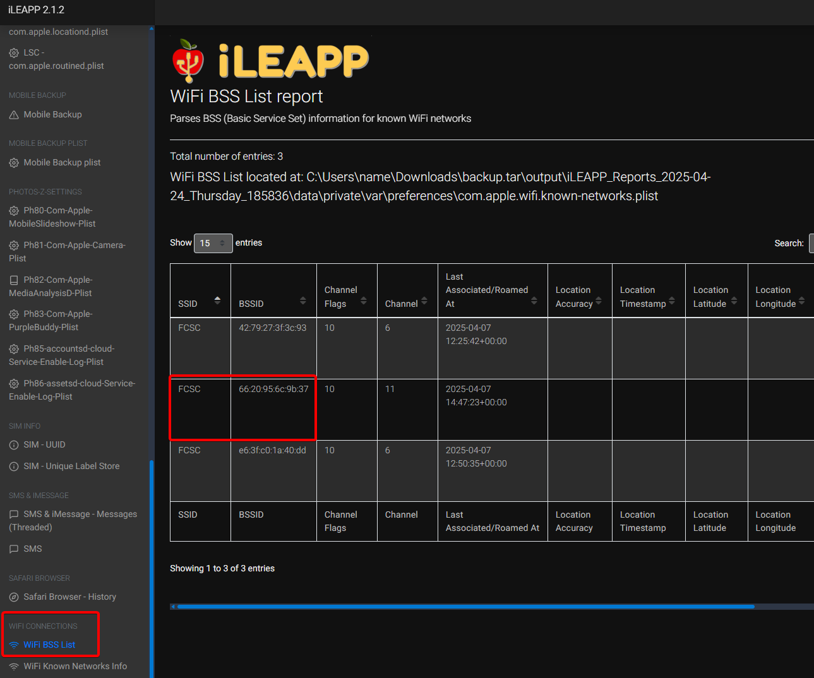

Pour le compte iCloud plusieurs manières mais une façon assez direct avec iLEAPP et de regarder par quel compte les apps ont-elles été installé : 

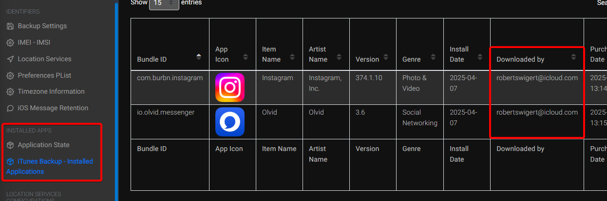

**Flag** : ``FCSC{FCSC|66:20:95:6c:9b:37|robertswigert@icloud.com}``


## ⭐⭐ - iForensics - iTreasure
> Avant la remise du téléphone à la douane, le propriétaire du téléphone a eu le temps d’envoyer un trésor. Retrouvez ce trésor.

Ici plusieurs manières rapide de le trouver. En effet le scénario parle d'un envoi. On pense directement au SMS. 

iLEAPP parse cela donc on peut aller checker directement : 

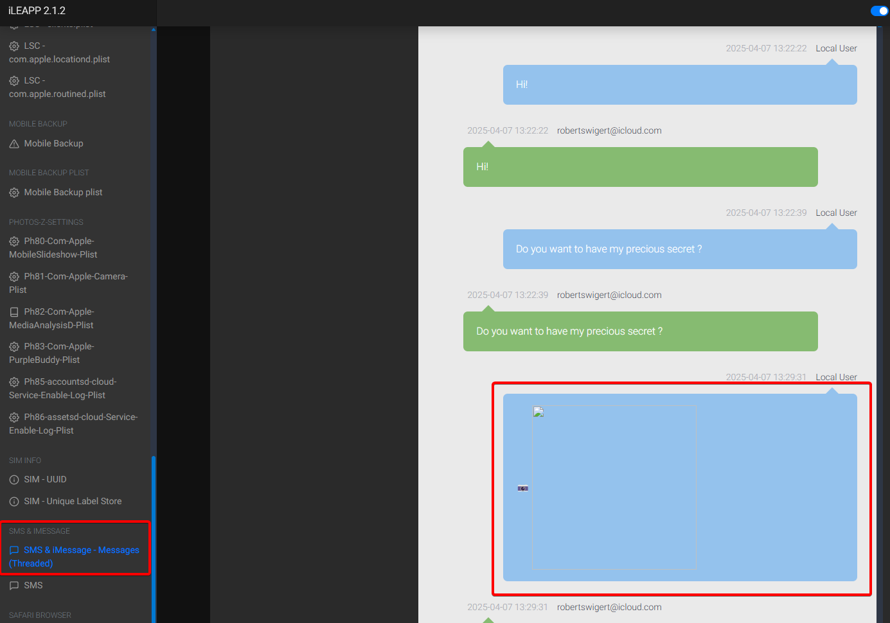

On peut aussi le faire ingérer à Autopsy avec le module "Logical File Analysis". Grâce à cela, Autopsy va scanner tous les fichiers et, d’après leurs en-têtes (magic bytes), il va regrouper certains des médias (JPEG, PNG, etc.) sous l’onglet "User Content Suspected" car le **Chemin d’accès** est localisé dans ``HomeDomain/Media/DCIM/…``. Il considère donc qu’il s’agit d’un contenu utilisateur (photo prise ou importée)

**Flag** : ``FCSC{511773550dca}``


## ⭐⭐ - iForensics - iNvisible
> Il semblerait qu’un message n’ait pas pu s’envoyer … Retrouvez le destinataire de ce message.
> Le flag est au format FCSC{<destinataire>}. Par exemple, si le destinataire est example@example.com : FCSC{example@example.com}.

Ici très rapide, on peut directement aller chercher dans la DB **sms.db**. C’est cette base qui contient toutes les conversations (iMessage et SMS), avec les tables principales message (headers, état, texte, etc.) et handle (liste des correspondants, numéros / adresses).

Ne faites pas l'erreur d'aller chercher dans la table "message". En effet, on ne retrouve que les iMessage ici. Pour les SMS il faut aller dans la table "chat".

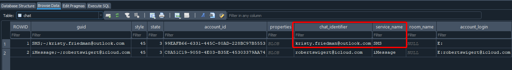

**Flag** : ``FCSC{kristy.friedman@outlook.com}``

## ⭐⭐ - iForensics - iBackdoor 1/2
> Vous continuez vos analyses afin de trouver la backdoor sur le téléphone. Vous finissez par vous rendre compte qu’une application est compromise et que le téléphone était infecté au moment de la collecte … Trouvez l’identifiant de l’application compromise ainsi que l’identifiant de processus (PID) du malware.
> 
> Le flag est au format FCSC{<identifiant application>|<PID>}. Par exemple, si l’application compromise est Example (com.example) et que le PID est 1337 : FCSC{com.example|1337}.

Ici on va devoir s'appuyer sur les sysdiagnose (``/sysdiagnose_and_crashes/private/var/mobile/Library/Logs/CrashReporter/DiagnosticLogs/sysdiagnose/sysdiagnose_2025.04.07_08-06-18-0700_iPhone-OS_iPhone_20A362``).

Mais avant c'est quoi les sysdiagnose ? C'est une archive générée par iOS qui regroupe automatiquement les logs système, rapports de crash, états réseau et informations de configuration au moment de la capture. Il sert principalement à diagnostiquer des problèmes de performance ou de stabilité en fournissant un instantané complet de l’appareil. Mais il est aussi très utile d'un point de vu forensic après une compromission. 

Pour être un minimum pro et gagner du temps je vais utiliser le superbe tool de l'EC-DIGIT-CSIRC (https://github.com/EC-DIGIT-CSIRC/sysdiagnose/). 

```bash
┌──(venv)─(kali㉿kali)-[~/sysdiagnose]
└─$ sysdiag create /mnt/hgfs/backup/sysdiagnose_and_crashes/private/var/mobile/Library/Logs/CrashReporter/DiagnosticLogs/sysdiagnose/sysdiagnose_2025.04.07_08-06-18-0700_iPhone-OS_iPhone_20A362.tar.gz 

Sysdiagnose file has been processed: /mnt/hgfs/backup/sysdiagnose_and_crashes/private/var/mobile/Library/Logs/CrashReporter/DiagnosticLogs/sysdiagnose/sysdiagnose_2025.04.07_08-06-18-0700_iPhone-OS_iPhone_20A362.tar.gz
Case 'C39ZL6V1N6Y6_20250407_080618' created successfully from '/mnt/hgfs/backup/sysdiagnose_and_crashes/private/var/mobile/Library/Logs/CrashReporter/DiagnosticLogs/sysdiagnose/sysdiagnose_2025.04.07_08-06-18-0700_iPhone-OS_iPhone_20A362.tar.gz'
```

On voit bien que la case a été créé : 

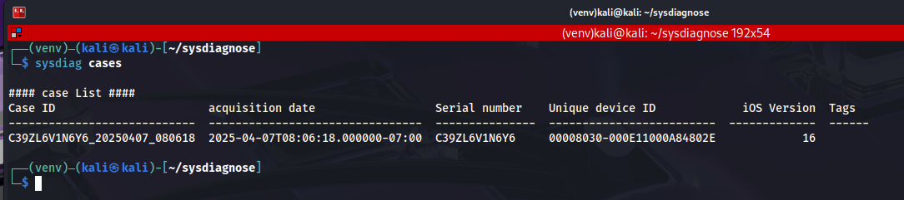

On fait passer le parser "ps" car très utile dans ce contexte. En effet analyser le contenu de ps.txt (le listing des processus) permet : 
- **D'avoir une visibilité sur tous les processus en cours :**

Le ps.txt fournit un instantané de tout ce qui tourne sur l'iPhone (y compris les exécutables cachés ou lancés par des services système). Sans ce listing, un malware qui se dissimule derrière un nom trompeur ou dans un répertoire non standard pourrait passer inaperçu.

- **Détection d’anomalies dans les privilèges**

En regardant les colonnes user/uid et ppid, on repère rapidement quand un processus tiers (par exemple extrait d’une app tierce) s'exécute sous l’utilisateur root (UID 0). Or, une app normale ne devrait jamais obtenir un tel niveau de privilèges sans passer par un mécanisme officiel.

- **Identification de commandes et arguments suspects**

Le champ command montre l'exécutable et ses arguments. Tout binaire inconnu (comme ce qu'on verra par la suite) ou toute URL codée (Base64 ou autre) est immédiatement visible et peut être décodé/inspecté.

- **Tracking temporel et contexte**

Avec la date/heure (started, datetime) et les champs de performance (%cpu, %mem), on sait si un processus a démarré anormalement tôt (au boot) ou s’il consomme des ressources pour exfiltrer des données, même si ça reste à 0 % pour masquer son activité.

- **Corroboration avec d’autres modules de sysdiagnose**

Le ps.txt s’intègre à l’ensemble des autres dumps (réseau, fichiers ouverts, configurations). On peut croiser : "X processus root vers IP Y" + "connexion réseau vers Y" + "fichiers créés dans Z" pour construire un fil d’attaque.

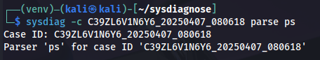

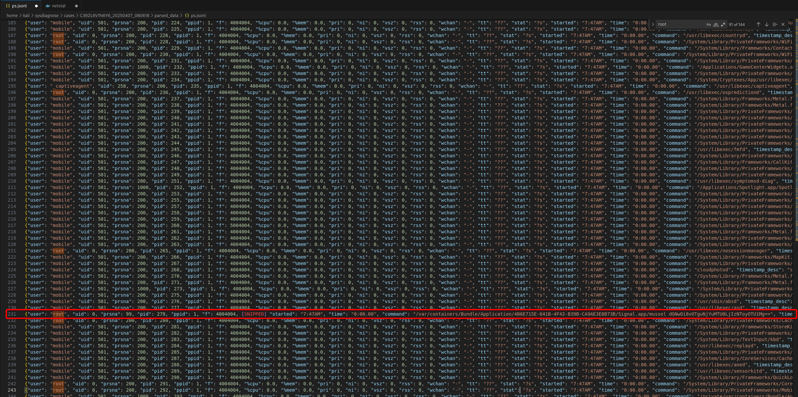

On voit donc ceci : 
```bash
root     …   279     1  … /var/containers/Bundle/Application/…/Signal.app/mussel dGNwOi8vOTguNjYuMTU0LjIzNToyOTU1Mg==
root     …   330     1  … /var/containers/Bundle/Application/…/Signal.app/mussel dGNwOi8vOTguNjYuMTU0LjIzNToyOTU1Mg==
root     …   345   344  … /var/containers/Bundle/Application/…/Signal.app/mussel dGNwOi8vOTguNjYuMTU0LjIzNToyOTU1Mg==
```

**1. Binaire "mussel"**
– Un fichier mussel embarqué dans l’app Signal est inhabituel : ce n’est pas un démon standard d’iOS.

**2. Exécution en root**
– Il tourne avec l’UID 0 (root), ce qui est extrêmement suspect pour un composant d’application tierce.

**3. Argument codé en Base64**
– ``dGNwOi8vOTguNjYuMTU0LjIzNToyOTU1Mg==`` est une chaîne Base64 qui, décodée, donne **tcp://98.66.154.235:29552** — un canal TCP vers une IP externe, sans doute un C2.

**4. Comportement typique d’un spyware**
– Un démon inconnu qui s’exécute en root et ouvre une connexion vers un hôte externe ressemble fortement à un implant malveillant ou spyware.

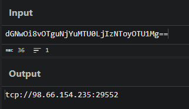

**Answer** : ``FCSC{org.whispersystems.signal|345}``


## ⭐⭐ - iForensics - iBackdoor 2/2
> Maintenant que vous savez quelle application a été compromise, retrouvez comment est-ce que l’attaquant a récupéré l’application légitime, préalablement à l’infection. Il vous faudra retrouver :
> - L’identifiant de l’application utilisée pour récupérer l’application légitime;
> - Le chemin utilisé pour stocker l’application légitime;
> - La date de désinstallation de l’application légitime (en heure locale).
>
> Le flag est au format FCSC{<identifiant application>|<chemin>|<date>}. Par exemple, si l’application utilisée est Example (com.example), que le chemin est /private/var/tmp/test.xyz et que la date de désinstallation est 2025-01-01 01:00:00 : FCSC{com.example|/private/var/tmp/test.xyz|2025-01-01 01:00:00}.

Remettons les choses à plat : 
- on sait que c'est Signal l'app en question
- on sait qu'elle a été lancé vers 7:47AM
- on doit trouver le chemin de l'app, ce qui a "récupéré" / installé l'app légitime et la date de désinstallation

Pour cela je me suis directement dirigé vers les **mobileinstallation**.

En effet, c'est la couche d'iOS responsable de l'installation, la mise à jour et désinstallation des apps. 

On pourra y retrouver :
- les timestamps précis (timestamp + datetime)
- les bundle id
- les détails du process d'uninstall
- les erreurs et leur contexte

Bingo : 
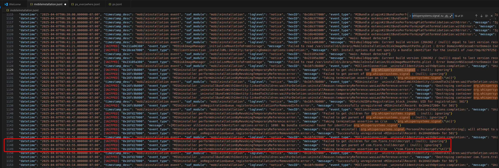

```json
// à 07:40:47-07:00, première désinstallation de Signal
{
  "datetime": "2025-04-07T07:40:47.000000-07:00",
  "event_type": "MIClientConnection _uninstallIdentities",
  "message": "Uninstall requested by installcoordinationd ... for identity [org.whispersystems.signal]"
}
// à la même seconde, on détruit ses containers :
"message": "Destroying container org.whispersystems.signal ... at /private/var/containers/Bundle/Application/1EC20F02-..."

// à 07:43:55, désinstallation de l’outil com.fiore.trolldecrypt
{
  "datetime": "2025-04-07T07:43:55.000000-07:00",
  "message": "Uninstalling identifier com.fiore.trolldecrypt"
  // puis destruction du bundle container correspondant
}
```

On sait donc maintenant que l'attaquant a utilisé TrollDecrypt qui est utilitaire opensource destiné aux appareils iOS équipés de **TrollStore**. Il permet de déchiffrer à la volée les applications installées (IPA protégées par FairPlay DRM) directement sur l’appareil, sans nécessiter de jailbreak. Concrètement, il :
- scanne la liste des apps installées sur l’iDevice via TrollStore
- déchiffre le binaire FairPlay de l’application ciblée
- emballe le résultat dans un fichier .ipa exploitable (pour analyses, réinstallations, sideloading, etc.)

TrollStore exploite une faille **CoreTrust** pour signer à vie n’importe quelle IPA. TrollDecrypt s’appuie dessus pour lancer l’app ciblée, dumper sa mémoire et sortir un IPA FairPlay free. D’où la présence du dossier ``/Library/TrollDecrypt/decrypted/``.

J'avoue qu'il y aurait mille façons intelligentes de pivoter, analyser et trouver le path de stockage de l'app légitime mais il y a plus rapide. Dans un contexte de CTF ça compte. 

Chercher un **.ipa** tout simplement.

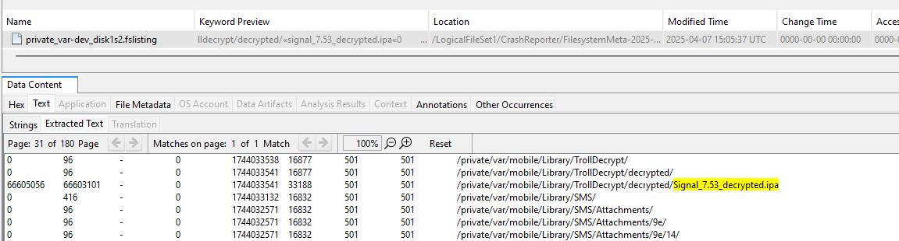

Ce qui donne pour une timeline très succincte : 
1. 07 h 40 m 47 s : désinstallation de Signal (log MI)
2. 07 h 40–42 m : dump → Signal_7.53_decrypted.ipa (fslisting)
3. 07 h 43 m 55 s : désinstallation de TrollDecrypt (log MI)
4. 07 h 47 m xx s : lancement de l’IPA repackée (unified log)

On a désormais tout pour créer le flag.

**Flag** : ``FCSC{com.fiore.trolldecrypt|/private/var/mobile/Library/TrollDecrypt/decrypted/Signal_7.53_decrypted.ipa|2025-04-07 07:40:47}``

## ⭐⭐⭐ - iForensics - iC2
> Retrouvez le nom de l’outil malveillant déployé sur le téléphone, ainsi que le protocole, l’adresse IP et le port de communication vers le serveur C2.
>
> Le flag est au format FCSC{<outil>|<protocole>|<adresse IP>|<port>}. Par exemple, si l’outil est Cobalt Strike, le protocole TCP, l’adresse IP 127.0.0.1 et le port 1337 : FCSC{Cobalt Strike|TCP|127.0.0.1|1337}.

Je me suis donc renseigné davantage sur TrollStore et les actualités intéressantes liées. Je suis tombé sur cette article : https://idevicecentral.com/news/ios-malware-makes-trollstore-users-vulnerable-to-monitoring-file-extraction-remote-control-on-ios-14-ios-17/

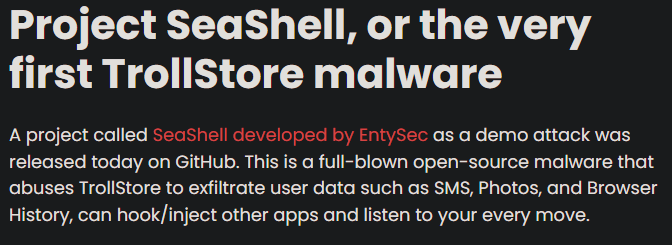

On a déjà récupéré le protocol, l'IP et le port plus tôt donc c'est simple : 

**Flag** : ``FCSC{SeaShell|TCP|98.66.154.235|29552}``

---
