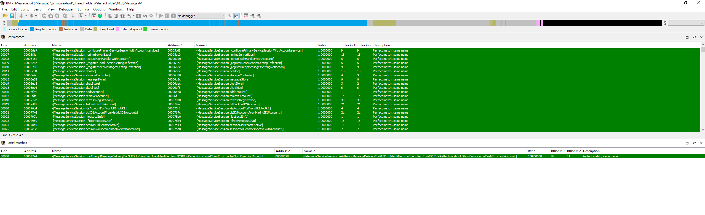
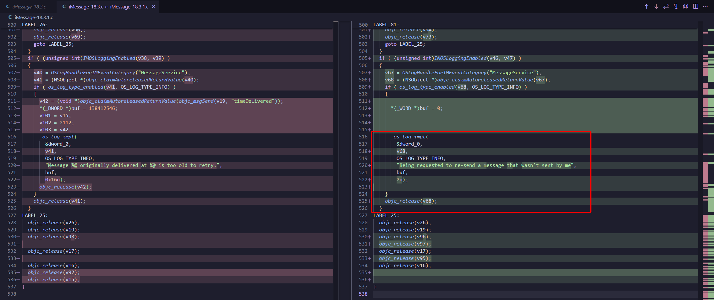
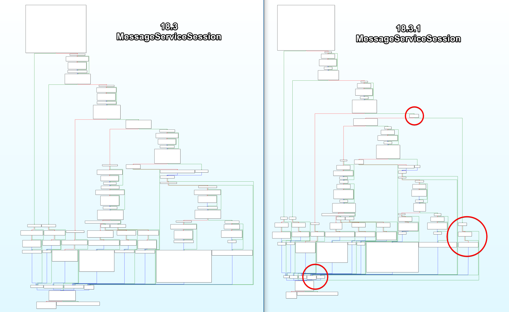
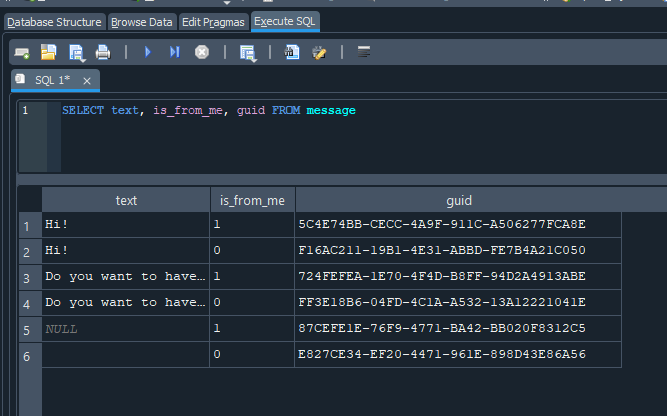

 
## 1. Citizen Lab breaks the story

On 12 June 2025, Citizen Lab published **“[First Forensic Confirmation of Paragon’s iOS Mercenary Spyware](https://citizenlab.ca/2025/06/first-forensic-confirmation-of-paragons-ios-mercenary-spyware-finds-journalists-targeted/)”**.  

Their report links Paragon’s *Graphite* spyware to a **zero-click iMessage payload** observed on several European journalists’ and NGO phones.  

Core facts:
- Infection hit fully-patched iPhones in April 2025.
- Delivery vector: a **malicious photo / video sent via an iCloud Link** in Messages.
- On success, _Graphite_ gained file-system access and exfiltrated iMessage, Signal and WhatsApp data. 

Citizen Lab’s timeline ends on 11 June 2025 UTC, when Apple ships **iOS 18.3.1** and credits **[CVE-2025-43200](https://nvd.nist.gov/vuln/detail/CVE-2025-43200)** as the fix.

---

## 2. CVE-2025-43200 & Apple’s one-liner advisory

In [Apple’s security note](https://support.apple.com/en-us/122174) for iOS 18.3.1 we can read:

> _Impact:_ A logic issue existed when processing a maliciously crafted photo or video shared via an iCloud Link.  Apple is aware of a report that this issue may have been exploited in an extremely sophisticated attack against specific targeted individuals.
> _Description:_ This issue was addressed with improved checks.  
> _CVE-2025-43200_ – Apple.

No file paths, no clue which binary changed. That’s where patch diffing comes in!

---

## 3. Checking **blacktop/ipsw-diffs** on 18.3 (22D63) vs 18.3.1 (22D72)

[Blacktop’s automated diff](https://github.com/blacktop/ipsw-diffs/tree/main/18_3_22D63__vs_18_3_1_22D72) shows **10 Mach-Os** rebuilt in the hot-fix, but only three are in the Messages stack highlighted below:
- iMessage (``System/Library/Messages/PlugIns/iMessage.imservice/iMessage``)
- SafetyMonitor (``System/Library/Messages/iMessageApps/SafetyMonitorMessages.bundle/SafetyMonitorMessages``)
- identityservicesd (``System/Library/PrivateFrameworks/IDS.framework/identityservicesd.app/identityservicesd``)


| Binary                    | Why we picked it                                                                      | High-level diff result                                   |
| ------------------------- | ------------------------------------------------------------------------------------- | -------------------------------------------------------- |
| **iMessage.imservice**    | Core plug-in that implements iMessage logic, network deserialization & resend helpers | **Significant:** new log string + new early-return guard |
| **SafetyMonitorMessages** | Swift bundle that shows Communication-Safety pop-ups                                  | no functional delta seen with diffing tool               |
| **identityservicesd**     | IDS/Push daemon that hands traffic to Messages                                        | no functional delta seen with diffing tool               |

---

## 4. Getting inside 18.3 (22D63) and 18.3.1 (22D72)

As iOS 18, Apple added **dmg.aea** which make the diffing different than before, if like me you were used to basic dmg! That's why I will provide a micro-guide for this. If you're only interested in the technical analysis you can skip to: *write*

1. **Download the two iOS versions**
```shell
ipsw download ipsw --device iPhone17,1 --build 22D63
ipsw download ipsw --device iPhone17,1 --build 22D72
```


2. **Extract filesystem**
```bash
ipsw extract --dmg fs  iPhone17,1_18.3_22D63_Restore.ipsw
ipsw extract --dmg fs  iPhone17,1_18.3.1_22D72_Restore.ipsw
```

3. **Extract fcs-key and the dmg**
```bash
ipsw extract --fcs-key iPhone17,1_18.3_22D63_Restore.ipsw

ipsw fw aea --pem '044-59182-075.dmg.aea.pem' '044-59515-074.dmg.aea' --output extracted/
# do this for the other one too
```

4. **Mount**
```shell 
ipsw mount fs --pem-db extracted/fcs-keys.json ../iPhone17,1_18.3_22D63_Restore.ipsw
```

If like me this doesn't work for any reasons: 
```shell
sudo apfs-fuse -o allow_other,uid=1001,gid=1001 extracted/044-59515-074.dmg /mnt/ios_old
```

5. **Copy needed files**
```shell
cp System/Library/PrivateFrameworks/IDS.framework/identityservicesd.app/identityservicesd ~/Documents/CVE-2025-43200/18.3.1/

cp System/Library/Messages/PlugIns/iMessage.imservice/iMessage ~/Documents/CVE-2025-43200/18.3.1/

cp System/Library/Messages/iMessageApps/SafetyMonitorMessages.bundle/SafetyMonitorMessages ~/Documents/CVE-2025-43200/18.3.1/
```


---

## 5. Diffs inside iMessage.imservice 18.3 (22D63) and 18.3.1 (22D72)

First of all here's the similarity: 
```shell
radiff2 -s 18.3/iMessage 18.3.1/iMessage 
similarity: 0.977
distance: 49654
```

Then we can dig deeper in the diff with IDA Pro and [Diaphora script](https://github.com/joxeankoret/diaphora):



We can see a partial match for ``-[MessageServiceSession _reAttemptMessageDeliveryForGUID: …]``

With a notable new log ``"Being requested to re-send a message that wasn't sent by me"``



Using Graph view we can clearly see the new checking:



Here's the 2 important changes:

1. New authorship gate that stops the reflection primitive:
```objc
//  AFTER 18.3.1 - NEW blocks resend of foreign messages
if (![message isFromMe]) {                       // message authored by someone else
    os_log_info(MessageServiceLog,
                "Being requested to re-send a message that wasn’t sent by me");
    return;                                      // bail = exploit dies
}
```

_Why?_ - Paragon’s zero-click chain forged a **"resend"** control frame that pointed to a GUID in the victim’s chat DB (where `is_from_me == 0`).  The single guard above rejects that request, cutting the data-exfil path.

You can see this here in the **SMS.db**: 



2. Age-limit test pulled forward, no retries for stale messages
```objc
// BEFORE 18.3 - only skipped retries if the msg was still fresh (logic inverted)
if (timeSinceDelivered <= [self _messageRetryTimeout]) {   // !v37
    … proceed toward retry …
}

// AFTER 18.3.1 – bail out immediately when message is too old
if (timeSinceDelivered > [self _messageRetryTimeout]) {    // v37
    os_log_info(MessageServiceLog,
                "Message %@ originally delivered at %@ is too old to retry.",
                guid, deliveredDate);
    return;                                                // no resend
}
```

_Why?_ - Apple tightened the resend window so attackers can’t keep hammering the same GUID months later.

**Putting the pieces together**: 
1. **Author check** closes the core logic bug exploited by CVE-2025-43200.
2. **Tighter age check** reduces the replay window (defence-in-depth).

**CVE-2025-43200 is a one-line logic patch**:  
_“Only retry messages you actually wrote.”_  
The exploit succeeded because that obvious invariant was never enforced in the resend helper. Apple’s fix consists of:
1. `if (!msg.isFromMe) return;`
2. An `os_log` statement for triage.

```s
18.3 (vulnerable)          18.3.1 (patched)
┌───────────────────┐      ┌────────────────────────────────┐
│ … look-ups …      │      │ … same …                       │ 
│ age-limit check   │      │ age-limit check (unchanged)    │ 
│ ──────────────────│      │────────────────────────────────│
│ NO author check   │      │ if (!message.isFromMe) {       │ ◄─ NEW
│ retry logic       │      │     log "...not sent by me..." |
└───────────────────┘      │     return;                    │
                           │ }                              │
                           │ retry logic (unchanged)        │
                           └────────────────────────────────┘
```

---

## 6. How this maps to CVE-2025-43200

Citizen Lab reports that PARAGON’s zero-click chain used **iCloud-link messages** to coerce the target device into _reflecting_ or auto-forwarding content it had previously received, part of the spyware’s exfiltration stage.  

The attacker:
1. Injected or replayed a specially-crafted iMessage “resend” request that points to an existing GUID in the victim’s local SQLite chat DB.
2. Because 18.3 lacked the `isFromMe` test, the helper method `_reAttemptMessageDeliveryForGUID:…` happily burned a retry credit and **re-sent the foreign message** (or its attachment) to the attacker-controlled handle.

Patch 18.3.1 closes that hole by insisting the GUID’s `isFromMe` bit is **true**. The message must originate from the local user. Any forged request that references someone-else’s message now trips the new log entry and **bails early**.


---

## 7. Attack vector - a plausible reconstruction
_Everything below is the **most-likely chain** inferred from the patch diff, Citizen Lab’s field evidence, and what we know of iMessage internals; steps; marked **(hyp.)** remain hypotheses until a packet capture or Apple’s root-cause write-up appears._

**Reconnaissance & GUID discovery (hyp.)**:
1. Victim receives an ordinary iMessage that carries an iCloud-link preview (photo/video) - no click required. [Citizen Lab](https://citizenlab.ca/2025/06/first-forensic-confirmation-of-paragons-ios-mercenary-spyware-finds-journalists-targeted/) shows such links as the first artefact on both compromised iPhones.

2. The inbound row is written to `sms.db` with `is_from_me = 0` and a unique `guid`, visible in every iOS chat database. _Attackers only need that 36-byte GUID._

3. Paragon’s spyware foothold on the sender side (or passive CloudKit metadata leaks) lets them learn that GUID without device access. 

**Forged "resend" request over IDS (hyp.)**:
1. iMessage’s private protocol contains a `resendRequest` control-frame used when a sender asks a recipient to retry a failed delivery

2. _Graphite_ forges such a frame, swapping roles:
    - toIdentifier = attacker’s Apple ID
    - guid = victim-side GUID from step 1
    - other JSON fields mimic genuine traffic (timestamp, service = “iMessage”)

Because iOS 18.3’s helper lacked an `isFromMe` guard, the plug-in treats the request as authorised.

**Helper execution on the device (observed)**:
1. Control-frame reaches `handleResendRequest:` in `iMessage.imservice`; it calls `-[MessageServiceSession _reAttemptMessageDeliveryForGUID:…]`.

2. Pre-patch path (18.3):
```objc
// NO author validation
lookup_msg(guid);
if (retryQuotaOK && notStale)
    sendMessage:attachment:toChat:       // ← reflection
```

The device uploads the attachment (encrypted with its own keys) and delivers it straight to the attacker’s chat (hyp.).

**Payload retrieval & spyware staging (fact)**:
1. Attacker receives the reflected blob, extracts the same iCloud-link token or plaintext file, and feeds it to the next exploit stage (Citizen Lab shows _Graphite_ pulling Signal & WhatsApp DBs after landing)

2. With _Graphite_ fully installed, exfiltration of chats, photos and microphone recordings proceeds as documented by CL

**Why the attack worked**:

| Missing invariant in 18.3                               | Consequence                                    |
| ------------------------------------------------------- | ---------------------------------------------- |
| ❌ No `isFromMe` check                                   | Any _foreign_ message could be re-sent.        |
| ❌ Retry-timeout only checked “too fresh”, not “too old” | Attackers could spam the same GUID for months. |
| ❌ No extra entitlement required                         | No kernel, PAC or sandbox bypass needed.       |

**Reality check**:
- Citizen Lab never published the forged IDS frame; the exact JSON remains unknown, hence steps 1–5 are labelled (hyp.).
- What is confirmed: the patched guard, the new OS Log string, and that `iMessage.imservice` changed
- Even if the adversary used a different internal API (e.g. a mis-scoped XPC service), the absence of the `isFromMe` validation is the fundamental bug.

