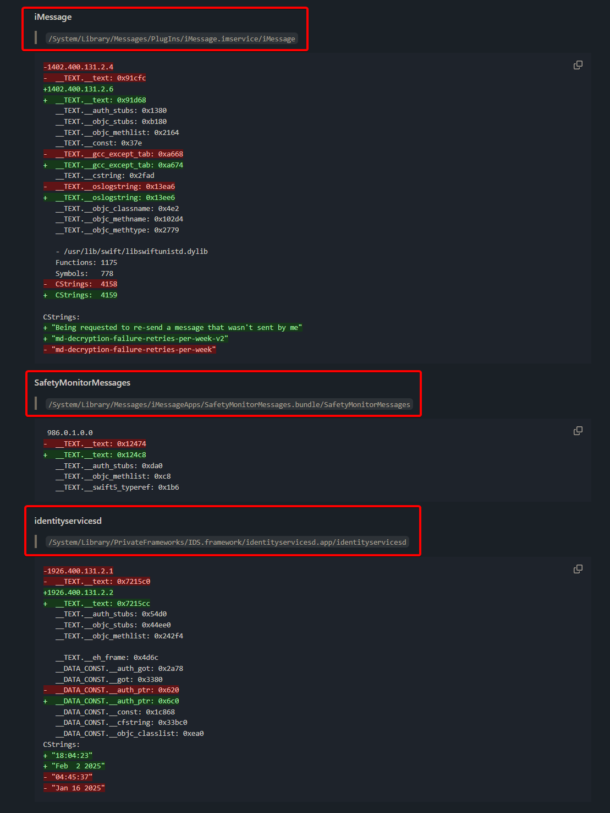
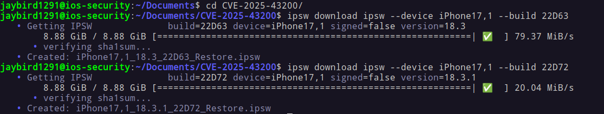
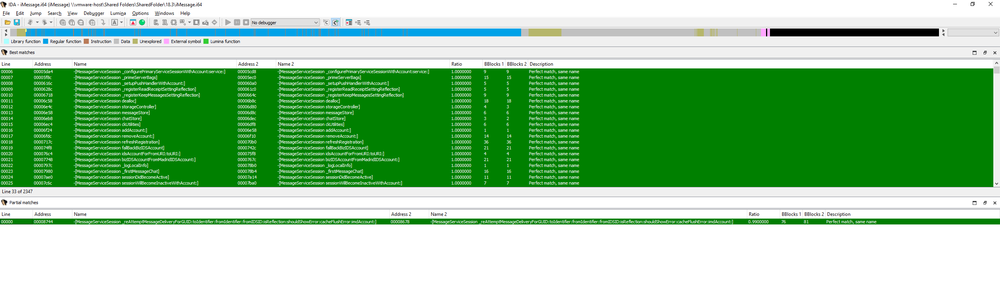
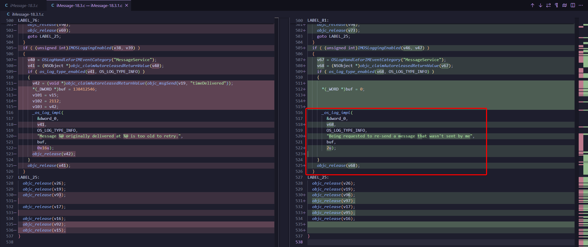
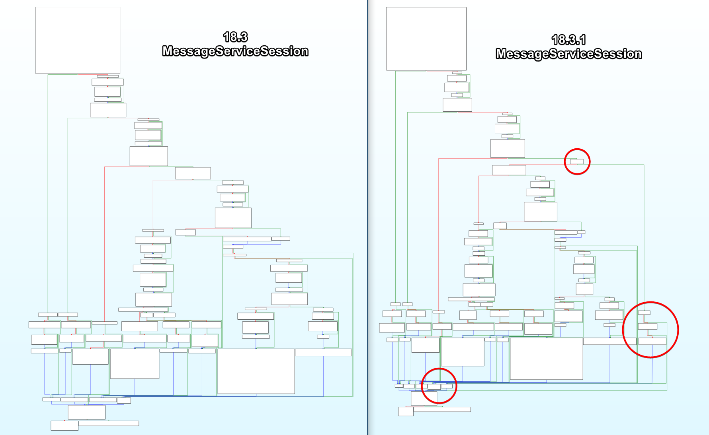
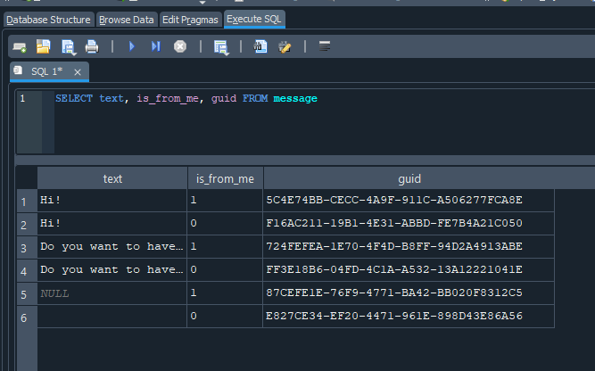

> ⚠️ **Disclaimer:**  
> I'm a cybersecurity student, this is a non-professional, personal blog post. My analysis may contain errors or oversights I'm still learning. If you spot any mistakes or have suggestions, please don't hesitate to reach out!

 
## 1. Citizen Lab breaks the story

On 12 June 2025, Citizen Lab published **"[First Forensic Confirmation of Paragon's iOS Mercenary Spyware](https://citizenlab.ca/2025/06/first-forensic-confirmation-of-paragons-ios-mercenary-spyware-finds-journalists-targeted/)"**.  

Their report links Paragon's *Graphite* spyware to a **zero-click iMessage payload** observed on several European journalists' and NGO phones.  

Core facts:
- Victims received an Apple notification in April 2025.
- Delivery vector: Paragon's Graphite spyware used a sophisticated iMessage zero-click attack

Citizen Lab's timeline ends on 11 June 2025 UTC, when Apple ships **iOS 18.3.1** and credits **[CVE-2025-43200](https://nvd.nist.gov/vuln/detail/CVE-2025-43200)** as the fix.

---

## 2. CVE-2025-43200 & Apple's one-liner advisory

In [Apple's security note](https://support.apple.com/en-us/122174) for iOS 18.3.1 we can read:

> _Impact:_ A logic issue existed when processing a maliciously crafted photo or video shared via an iCloud Link.  Apple is aware of a report that this issue may have been exploited in an extremely sophisticated attack against specific targeted individuals.
> _Description:_ This issue was addressed with improved checks.  
> _CVE-2025-43200_ - Apple.

No file paths, no clue which binary changed. That's where patch diffing comes in!

---

## 3. Checking **blacktop/ipsw-diffs** on 18.3 (22D63) vs 18.3.1 (22D72)

[Blacktop's automated diff](https://github.com/blacktop/ipsw-diffs/tree/main/18_3_22D63__vs_18_3_1_22D72) shows **10 Mach-Os** rebuilt in the hot-fix, but only three are in the Messages stack highlighted below:
- iMessage (``System/Library/Messages/PlugIns/iMessage.imservice/iMessage``)
- SafetyMonitor (``System/Library/Messages/iMessageApps/SafetyMonitorMessages.bundle/SafetyMonitorMessages``)
- identityservicesd (``System/Library/PrivateFrameworks/IDS.framework/identityservicesd.app/identityservicesd``)




| Binary                    | Why we picked it                                                                      | High-level diff preview result                           |
| ------------------------- | ------------------------------------------------------------------------------------- | -------------------------------------------------------- |
| **iMessage.imservice**    | Core plug-in that implements iMessage logic, network deserialization & resend helpers | **Significant:** new log string + new early-return guard |
| **SafetyMonitorMessages** | Swift bundle that shows Communication-Safety pop-ups                                  | no functional delta seen with diffing tool               |
| **identityservicesd**     | IDS/Push daemon that hands traffic to Messages                                        | no functional delta seen with diffing tool               |

---

## 4. Getting inside 18.3 (22D63) and 18.3.1 (22D72)

As iOS 18, Apple added **dmg.aea** which make the diffing different than before, if like me you were used to basic dmg! That's why I will provide a micro-guide for this. If you're only interested in the technical analysis you can skip to: *write*

1. **Download the two iOS versions**
```shell
ipsw download ipsw --device iPhone17,1 --build 22D63
ipsw download ipsw --device iPhone17,1 --build 22D72
```



2. **Extract filesystem**
```bash
ipsw extract --dmg fs  iPhone17,1_18.3_22D63_Restore.ipsw
ipsw extract --dmg fs  iPhone17,1_18.3.1_22D72_Restore.ipsw
```

3. **Extract fcs-key and the dmg**
```bash
ipsw extract --fcs-key iPhone17,1_18.3_22D63_Restore.ipsw

ipsw fw aea --pem '044-59182-075.dmg.aea.pem' '044-59515-074.dmg.aea' --output extracted/
# do this for the other one too
```

4. **Mount**
```shell 
ipsw mount fs --pem-db extracted/fcs-keys.json ../iPhone17,1_18.3_22D63_Restore.ipsw
```

If like me this doesn't work for any reasons: 
```shell
sudo apfs-fuse -o allow_other,uid=1001,gid=1001 extracted/044-59515-074.dmg /mnt/ios_old
```

5. **Copy needed files**
```shell
cp System/Library/PrivateFrameworks/IDS.framework/identityservicesd.app/identityservicesd ~/Documents/CVE-2025-43200/18.3.1/

cp System/Library/Messages/PlugIns/iMessage.imservice/iMessage ~/Documents/CVE-2025-43200/18.3.1/

cp System/Library/Messages/iMessageApps/SafetyMonitorMessages.bundle/SafetyMonitorMessages ~/Documents/CVE-2025-43200/18.3.1/
```


---

## 5. Diffs inside iMessage.imservice 18.3 (22D63) and 18.3.1 (22D72)

First of all here's the similarity: 
```shell
radiff2 -s 18.3/iMessage 18.3.1/iMessage 
similarity: 0.977
distance: 49654
```

Then we can dig deeper in the diff with IDA Pro and [Diaphora script](https://github.com/joxeankoret/diaphora):



We can see a partial match for ``-[MessageServiceSession _reAttemptMessageDeliveryForGUID: …]``

With a notable new log ``"Being requested to re-send a message that wasn't sent by me"``



Using Graph view we can clearly see the new checking:



Here's the 2 important changes:

1. New authorship gate that stops the reflection primitive:
```objc
//  AFTER 18.3.1 - NEW blocks resend of foreign messages
if (![message isFromMe]) {                       // message authored by someone else
    os_log_info(MessageServiceLog,
                "Being requested to re-send a message that wasn't sent by me");
    return;                                      // bail = exploit dies
}
```

_Why?_ - Paragon's zero-click chain forged a **"resend"** control frame that pointed to a GUID in the victim's chat DB (where `is_from_me == 0`).  The single guard above rejects that request, cutting the data-exfil path.

You can see this here in the **SMS.db**: 



2. Age-limit test pulled forward, no retries for stale messages
```objc
// BEFORE 18.3 - only skipped retries if the msg was still fresh (logic inverted)
if (timeSinceDelivered <= [self _messageRetryTimeout]) {   // !v37
    … proceed toward retry …
}

// AFTER 18.3.1 – bail out immediately when message is too old
if (timeSinceDelivered > [self _messageRetryTimeout]) {    // v37
    os_log_info(MessageServiceLog,
                "Message %@ originally delivered at %@ is too old to retry.",
                guid, deliveredDate);
    return;                                                // no resend
}
```

_Why?_ - Apple tightened the resend window so attackers can't keep hammering the same GUID months later.

**Putting the pieces together**: 
1. **Author check** closes the core logic bug exploited by CVE-2025-43200.
2. **Tighter age check** reduces the replay window (defence-in-depth).

**CVE-2025-43200 is a one-line logic patch**:  
_"Only retry messages you actually wrote."_  
The exploit succeeded because that obvious invariant was never enforced in the resend helper. Apple's fix consists of:
1. `if (!msg.isFromMe) return;`
2. An `os_log` statement for triage.

```s
18.3 (vulnerable)          18.3.1 (patched)
┌───────────────────┐      ┌────────────────────────────────┐
│ … look-ups …      │      │ … same …                       │ 
│ age-limit check   │      │ age-limit check (unchanged)    │ 
│ ──────────────────│      │────────────────────────────────│
│ NO author check   │      │ if (!message.isFromMe) {       │ ◄─ NEW
│ retry logic       │      │     log "...not sent by me..." |
└───────────────────┘      │     return;                    │
                           │ }                              │
                           │ retry logic (unchanged)        │
                           └────────────────────────────────┘
```

---

## 6. How this maps to CVE-2025-43200

The attacker:
1. Injected or replayed a specially-crafted iMessage "resend" request that points to an existing GUID in the victim's local SQLite chat DB.
2. Because 18.3 lacked the `isFromMe` test, the helper method `_reAttemptMessageDeliveryForGUID:…` happily burned a retry credit and **re-sent the foreign message** (or its attachment) to the attacker-controlled handle.

Patch 18.3.1 closes that hole by insisting the GUID's `isFromMe` bit is **true**. The message must originate from the local user. Any forged request that references someone-else's message now trips the new log entry and **bails early**.

---

## 7. Attack vector - a plausible reconstruction

So far I haven't found a compelling, end-to-end scenario that shows how CVE-2025-43200 fits into the cases documented by Citizen Lab. If you have alternative ideas-or artefacts I've missed-please get in touch; I'd be keen to investigate further.

My first hypothesis was that the bug might provide a stealthy exfiltration channel. On closer inspection that seems unlikely: the resend primitive can forward only those attachments that already live inside the Messages sandbox. It would not, by itself, let an attacker pull arbitrary data such as Signal or WhatsApp databases.

---

## 8. Forensic thoughts

Since I don't have the CitizenLab compromised iPhones data everything here is hypothesis or purely logical deductions.

**1. Unified log queries that surface CVE-2025-43200 activity**:

| What to look for                                                | Why it matters                                                                                                            |
| --------------------------------------------------------------- | ------------------------------------------------------------------------------------------------------------------------- | ------------------------------------------------------------------------------------------------------------------------------------------------------------------- |
| **`"re-send a message that wasn't sent by me"`**                | New `os_log` string introduced only in iOS 18.3.1+; its presence means the device *blocked* a forged resend attempt.      | 
| **`_reAttemptMessageDeliveryForGUID`** stack traces (pre-patch) | On vulnerable 18.3/18.2.1 devices you may still see crash or fault logs that name this selector if the exploit mis-fires. | 

Tip: unified logs roll after ~7 days on-device; always pull a full sysdiagnose immediately.

**2. Chat database (sms.db) artefacts**:
```sql
/*  Possible reflection duplicates: same GUID appears as both inbound (is_from_me = 0)
    and outbound (is_from_me = 1) within a short window                */
SELECT guid, date, is_from_me, text
FROM message
WHERE guid IN (
    SELECT guid FROM message WHERE is_from_me = 0
)
ORDER BY date ASC;
```

- A **duplicate GUID** flipping from ``is_from_me`` = 0 ➜ 1 without user action strongly suggests the resend primitive was abused.
- Cross-reference the GUID with the **attachments** table; Paragon's chain replayed iCloud-link photo/video blobs.

**3. IDS & Message-delivery traces**:
- Location (rooted dump or iOS Full Filesystem): ``/private/var/mobile/Library/Logs/CrashReporter/DiagnosticLogs/ids.*``
- Grep for:
    - ``"resend-request"``
    - ``"guid"`` values that also appear in sms.db duplicates
    - ``"handleID"`` matching unknown email/phone numbers

These plaintext IDS control-frames often survive in the diagnostic logs even when the main unified log has rolled.
