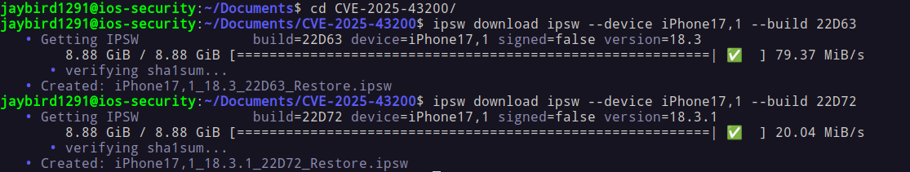
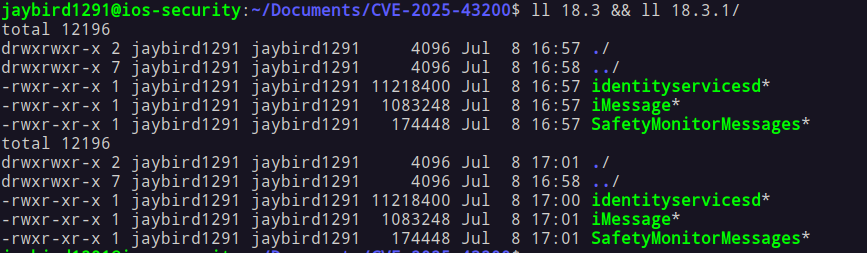

> ⚠️ **Attention :**  
> Je suis un étudiant en cybersécurité. Ce post est personnel et non-professionnel. Mon analyse peut contenir des erreurs ou des imprécisions, je suis encore en apprentissage. Si vous constatez des erreurs ou si vous avez des suggestions, n'hésitez pas à me contacter !


## 1. Citizen Lab révèle l'affaire

Le 12 juin 2025, Citizen Lab publie le rapport [**« First Forensic Confirmation of Paragon's iOS Mercenary Spyware »**](https://citizenlab.ca/2025/06/first-forensic-confirmation-of-paragons-ios-mercenary-spyware-finds-journalists-targeted/).

Le rapport associe le spyware _Graphite_ de Paragon à une **attaque zero-click iMessage** ciblant plusieurs journalistes européens.

Faits principaux :
- Un victime a reçu une threat notif d'Apple en avril 2025.
- Vecteur d'attaque : utilisation d'une attaque sophistiquée zero-click via iMessage.

Tout ça se termine le 11 juin 2025 (UTC), date à laquelle Apple publie **iOS 18.3.1** avec la [**CVE-2025-43200**](https://nvd.nist.gov/vuln/detail/CVE-2025-43200) pour la correction.

---

## 2. CVE-2025-43200 & Avis succinct d'Apple

La [note de sécurité d'Apple](https://support.apple.com/en-us/122174) pour iOS 18.3.1 indique :

> _Impact :_ Un problème logique existait lors du traitement d'une photo ou d'une vidéo malicieusement conçue partagée via un lien iCloud. Apple est au courant d'un rapport selon lequel ce problème aurait été exploité dans une attaque extrêmement sophistiquée contre des individus ciblés.  
> _Description :_ Ce problème a été résolu par une vérification améliorée.  
> _CVE-2025-43200_ - Apple.

Aucun chemin de fichier ni indication du binaire modifié. C'est là que le patch diffing entre en jeu !

---

## 3. Checker le **blacktop/ipsw-diffs** entre 18.3 (22D63) et 18.3.1 (22D72)

Le [diff automatisé de Blacktop](https://github.com/blacktop/ipsw-diffs/tree/main/18_3_22D63__vs_18_3_1_22D72) montre **10 Mach-Os** modifiés, dont trois seulement liés à Messages :
- iMessage (`System/Library/Messages/PlugIns/iMessage.imservice/iMessage`)
- SafetyMonitor (`System/Library/Messages/iMessageApps/SafetyMonitorMessages.bundle/SafetyMonitorMessages`)
- identityservicesd (`System/Library/PrivateFrameworks/IDS.framework/identityservicesd.app/identityservicesd`)

<div class="big-image">
    <div class="image"></div>
</div> 

|Binaire|Pourquoi ce choix ?|Aperçu du diff|
|---|---|---|
|**iMessage.imservice**|Logique iMessage, désérialisation réseau et renvois|**Important :** nouvelle chaîne de log + vérification anticipée|
|**SafetyMonitorMessages**|Pop-ups de sécurité de communication|Aucun delta fonctionnel vu avec le diffing tool|
|**identityservicesd**|Daemon IDS/Push acheminant le trafic vers Messages|Aucun delta fonctionnel vu avec le diffing tool|

---

## 4. Analyse de 18.3 (22D63) et 18.3.1 (22D72)

Depuis iOS 18, Apple a ajouté les **dmg.aea**, rendant l'analyse différent si comme moi vous étiez habitué au dmg basique. Voici un micro-guide (si vous êtes uniquement intéressé à l'analyse technique passé à la partie 5.).

1. **Téléchargement des deux versions d'iOS**
```shell
ipsw download ipsw --device iPhone17,1 --build 22D63
ipsw download ipsw --device iPhone17,1 --build 22D72
```



2. **Extraction du filesystem**
```bash
ipsw extract --dmg fs  iPhone17,1_18.3_22D63_Restore.ipsw
ipsw extract --dmg fs  iPhone17,1_18.3.1_22D72_Restore.ipsw
```

3. **Extraction de la fcs-key et du dmg**
```bash
ipsw extract --fcs-key iPhone17,1_18.3_22D63_Restore.ipsw

ipsw fw aea --pem '044-59182-075.dmg.aea.pem' '044-59515-074.dmg.aea' --output extracted/
# do this for the other one too
```

4. **Montage**
```shell 
ipsw mount fs --pem-db extracted/fcs-keys.json ../iPhone17,1_18.3_22D63_Restore.ipsw
```

If like me this doesn't work for any reasons: 
```shell
sudo apfs-fuse -o allow_other,uid=1001,gid=1001 extracted/044-59515-074.dmg /mnt/ios_old
```

5. **Copie des fichiers nécessaires**
```shell
cp System/Library/PrivateFrameworks/IDS.framework/identityservicesd.app/identityservicesd ~/Documents/CVE-2025-43200/18.3.1/

cp System/Library/Messages/PlugIns/iMessage.imservice/iMessage ~/Documents/CVE-2025-43200/18.3.1/

cp System/Library/Messages/iMessageApps/SafetyMonitorMessages.bundle/SafetyMonitorMessages ~/Documents/CVE-2025-43200/18.3.1/
```



---

## 5. Différences dans iMessage.imservice entre 18.3 (22D63) et 18.3.1 (22D72)

Premièrement voici la similarité :

```bash
radiff2 -s 18.3/iMessage 18.3.1/iMessage
similarity: 0.977
distance: 49654
```

Ensuite nous pouvons creuser plus profondément avec IDA Pro et [Diaphora script](https://github.com/joxeankoret/diaphora) :

<div class="big-image">
    <div class="image"></div>
</div>

Nous pouvons voir un "partial match" pour``-[MessageServiceSession _reAttemptMessageDeliveryForGUID: …]``.

Avec un nouveau log ``"Being requested to re-send a message that wasn't sent by me"``.

<div class="big-image">
    <div class="image"></div>
</div>

En utilisant la Graph view nous pouvons clairement voir la nouvelle vérification :

<div class="big-image">
    <div class="image"></div>
</div>

Voici les deux changements importants : 

1. Une nouvelle vérification de l'auteur qui empêche la primitive de réflexion
```objc
//  APRÈS 18.3.1 - Bloque le renvoi des messages étrangers.
if (![message isFromMe]) {                       // message authored by someone else
    os_log_info(MessageServiceLog,
                "Being requested to re-send a message that wasn't sent by me");
    return;                                      // bail = exploit dies
}
```

_Pourquoi ?_ - On peut supposer que la chaîne zéro-clic de Paragon a créé une trame de contrôle **"renvoi"** pointant vers une GUID dans la DB de discussion de la victime (où `is_from_me == 0`). La protection unique ci-dessus rejette cette requête.

Nous pouvons voir ces informations dans la **SMS.db**: 


2. Test de age-limit, plus de tentatives pour les messages obsolètes
```objc
// AVANT 18.3 - on n'interrompait le renvoi que si le message était encore récent (logique inversée)
if (timeSinceDelivered <= [self _messageRetryTimeout]) {   // !v37
    … proceed toward retry …
}

// AFTER 18.3.1 – interruption immédiate si le message est trop ancien 
if (timeSinceDelivered > [self _messageRetryTimeout]) {    // v37
    os_log_info(MessageServiceLog,
                "Message %@ originally delivered at %@ is too old to retry.",
                guid, deliveredDate);
    return;                                                // no resend
}
```

_Pourquoi ?_ - Apple a restreint la fenêtre de renvoi pour empêcher les attaquants de relancer indéfiniment le même GUID plusieurs mois après.

**Mise en perspective**: 
1. **Vérification de l'auteur** corrige le bug logique central exploité par CVE-2025-43200.  
2. **Test d'ancienneté renforcé** réduit la fenêtre de rejouabilité (défense en profondeur).  

**CVE-2025-43200 est un correctif logique d'une seule ligne**:  
_"Ne renvoie que les messages que tu as réellement écrits."_  
L'exploit a fonctionné car cette invariant évidente n'était jamais appliquée dans l'helper de renvoi. Le correctif d'Apple se compose de :  
1. `if (!msg.isFromMe) return;`
2. Une instruction `os_log` pour le triage / log.

```s
18.3 (vulnerable)          18.3.1 (patched)
┌───────────────────┐      ┌────────────────────────────────┐
│ … look-ups …      │      │ … same …                       │ 
│ age-limit check   │      │ age-limit check (unchanged)    │ 
│ ──────────────────│      │────────────────────────────────│
│ NO author check   │      │ if (!message.isFromMe) {       │ ◄─ NEW
│ retry logic       │      │     log "...not sent by me..." |
└───────────────────┘      │     return;                    │
                           │ }                              │
                           │ retry logic (unchanged)        │
                           └────────────────────────────────┘
```

---

## 6. Comment cela se traduit dans la CVE-2025-43200

L'attaquant :  
1. Injectait ou rejouait une requête iMessage "renvoi" spécialement conçue pointant vers un GUID existant dans la base de données SQLite locale de la victime.  
2. Comme iOS 18.3 ne vérifiait pas `isFromMe`, la méthode `_reAttemptMessageDeliveryForGUID:…` consommait un crédit de renvoi et **réexpédiait le message étranger** (ou sa pièce jointe) vers le contact contrôlé par l'attaquant.  

Le correctif d'iOS 18.3.1 comble cette faille en exigeant que le bit `isFromMe` du GUID soit **vrai**. Le message doit impérativement provenir de l'utilisateur local ; toute requête falsifiée référant à un message tiers déclenche désormais la nouvelle entrée de log et **interrompt immédiatement** le processus.  

---

## 7. Vecteur d'attaque – reconstruction plausible

À ce jour, je n'ai pas identifié de scénario complet et convaincant montrant comment la CVE-2025-43200 s'insère exactement dans les cas documentés par Citizen Lab. Si vous avez d'autres idées ou des artefacts que j'aurais pu manquer, n'hésitez pas à me contacter. 

Mon premier scénario envisageait que ce bug fournisse un canal d'exfiltration furtif. À y regarder de plus près, cela paraît peu probable : la primitive de renvoi ne peut transmettre que des pièces jointes déjà présentes dans la sandbox de Messages. Elle ne permettrait pas, à elle seule, d'extraire des données arbitraires (bases Signal, WhatsApp, etc.).  

---

## 8. Forensique 

Étant donné que je n'ai pas accès aux données des iPhone compromis par Citizen Lab, tout ce qui suit est purement hypothétique ou fondé sur des déductions logiques.

**1. Requêtes de logs unifiés dévoilant l’activité CVE-2025-43200 :**

| À rechercher                                                   | Pourquoi c’est important                                                                                                  |
| -------------------------------------------------------------- | ------------------------------------------------------------------------------------------------------------------------- |
| **`"re-send a message that wasn't sent by me"`**               | Nouvelle chaîne `os_log` introduite uniquement à partir d’iOS 18.3.1 ; sa présence indique que l’appareil a *bloqué* une tentative de renvoi falsifiée. |
| **stack traces `_reAttemptMessageDeliveryForGUID` (pré-patch)** | Sur les appareils vulnérables (18.3/18.2.1), vous pouvez toujours trouver dans les logs de crash des références à ce sélecteur si l’exploit échoue. |

Attention : les logs unifiés rotate au bout d’environ 7 jours sur l’appareil ; pensez à extraire un sysdiagnose complet immédiatement.

**2. Artefacts dans la base de chat (sms.db)**  
```sql
/*  Possible reflection duplicates: same GUID appears as both inbound (is_from_me = 0)
    and outbound (is_from_me = 1) within a short window                */
SELECT guid, date, is_from_me, text
FROM message
WHERE guid IN (
    SELECT guid FROM message WHERE is_from_me = 0
)
ORDER BY date ASC;
```

- Un **GUID dupliqué** passant de `is_from_me = 0` ➜ `1` sans action de l’utilisateur suggère fortement un abus du mécanisme de renvoi.  
- Recouper ce GUID avec la table **attachments**.

**3. Traces IDS & livraison de messages :**  
- Emplacement (dump rooté ou système de fichiers complet iOS) : `/private/var/mobile/Library/Logs/CrashReporter/DiagnosticLogs/ids.*`  
- Rechercher dans les logs avec `grep` :  
    - `"resend-request"`  
    - valeurs de `"guid"` apparaissant également dans les doublons de sms.db  
    - `"handleID"` correspondant à des numéros/email inconnus  

Ces trames de contrôle IDS en clair survivent souvent dans les logs de diagnostic même lorsque les logs unifiés ont été archivés.  
