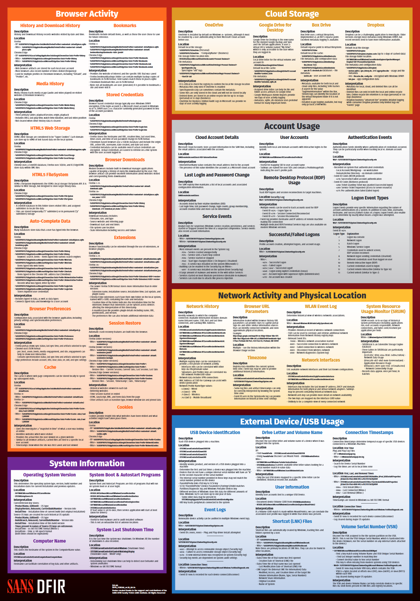
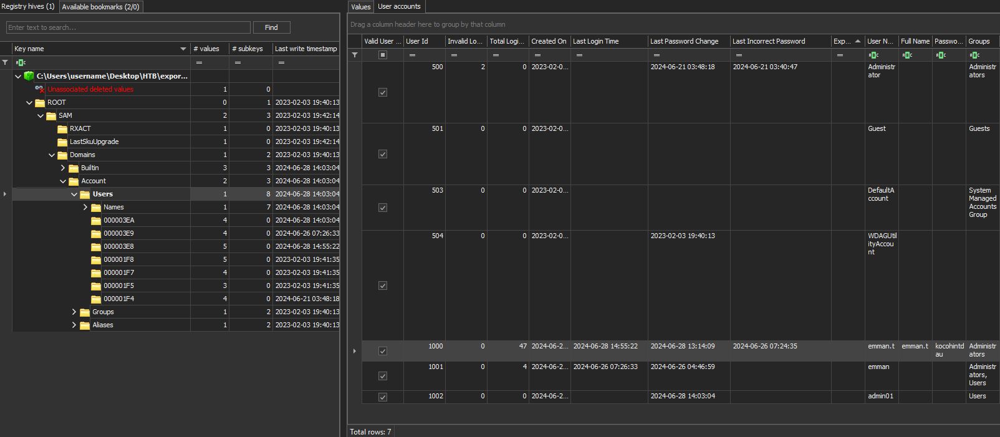
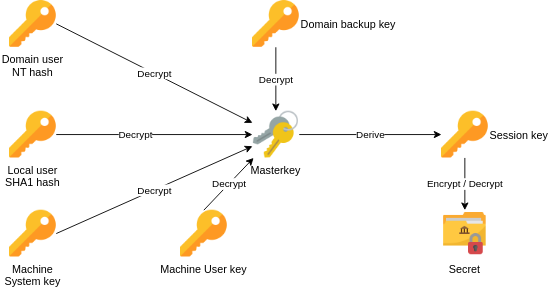
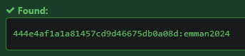
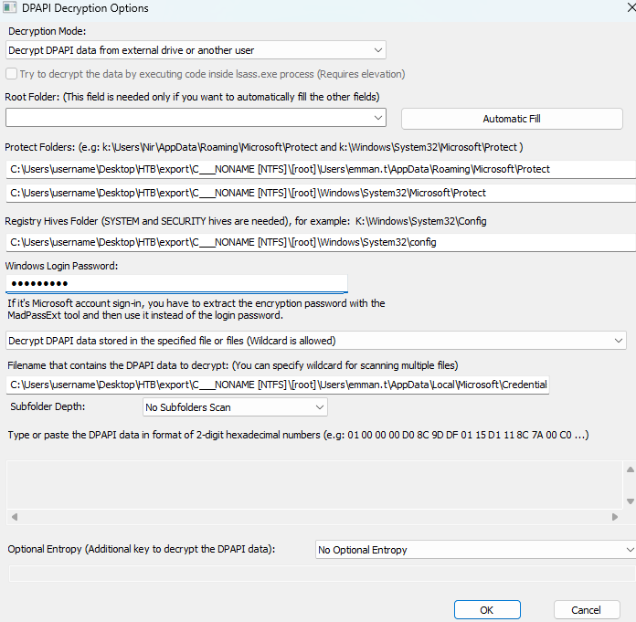
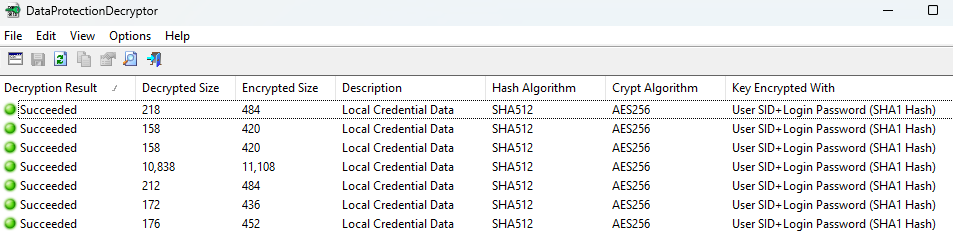
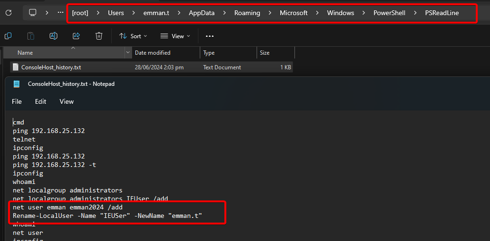
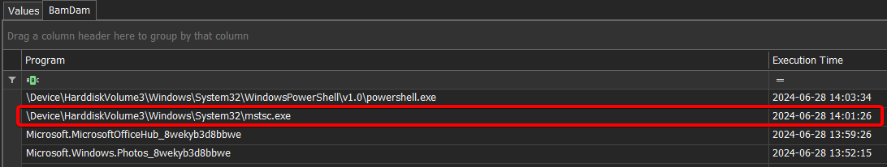
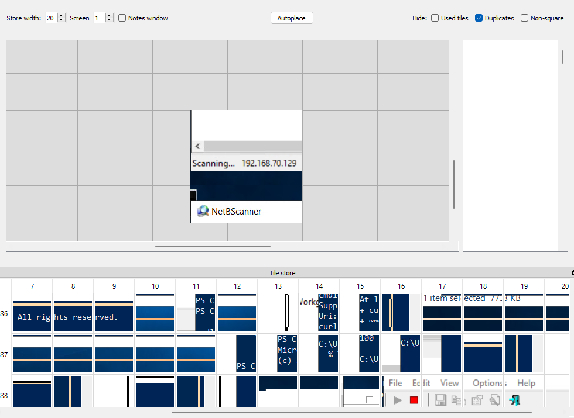

## Scénario
> Our customer discovered illegal RDP sessions without Privileged Access Management (PAM) in their system on June 28. They collected evidence on a server they suspected was an intermediary server to move laterally to others. Even though the attacker deleted the event log, I believe the few remaining artifacts are enough to help confirm the attack flow and trace the attacker's behavior.


## Setup
For this Sherlock scenario, we'll be using:
- Zimmerman Tools (EvtxECmd, Registry Explorer, Timeline Explorer, PECmd, WxTCmd…)
- Impacket (secretsdump.py)
- NirSoft DataProtectionDecryptor
- ANSSI BMC-tools
- BSI-Bund RdpCacheStitcher

We'll also rely on some cheatsheets like the **SANS FOR500** and the **13Cubed Windows Registry** references:

- [https://13cubed.s3.amazonaws.com/downloads/windows_registry_cheat_sheet.pdf](https://13cubed.s3.amazonaws.com/downloads/windows_registry_cheat_sheet.pdf)

  


---

## Question 1
> When was the last failed logon attempt using emman.t user? (UTC)

First, we need to confirm if the event logs were actually wiped as the scenario suggests. To do that, we'll use two of Zimmerman's tools, **EvtxECmd** and **Timeline Explorer**, to see if we can find any relevant records.

```powershell
EvtxECmd.exe -d "C:/C___NONAME [NTFS]\[root]\Windows\System32\winevt\Logs" --csv "C:\Users\username\Desktop\HTB\latus"
```

We look for **Event ID 4625** (*Account failed to log on*), but there is nothing relevant.


And indeed, we can see that the logs were cleared:


We still have a shot at recovering them if we have VSS (Volume Shadow Copy).

**Volume Shadow Copy Service (VSS)** is a Windows feature that creates snapshots of the disk state at a given point in time. If VSS snapshots are available, we can potentially recover older versions of deleted or altered files, including event logs. So even if an attacker cleared the logs on the live system, we might still recover them from a VSS snapshot.

Unfortunately, after checking, we don't have any VSS. So we have to rely on the Registry.

To do that, we'll use another Zimmerman tool called **Registry Explorer**.

We'll look into the **SAM** registry hive. Specifically, in `SAM\Domains\Account\Users`, where we can find artifacts like:
- **last login time**
- last incorrect password
- last password change
- login counts
- group membership
- account creation time, etc.

So we load the file `C___NONAME [NTFS]\[root]\Windows\System32\config\SAM` into **Registry Explorer**:



And sure enough, we can see the "Last Incorrect Password" entry.

**Answer**: `2024-06-26 07:24:35`

---

## Question 2
> What are the first 3 IP addresses that emman.t connected to using Remote Desktop (RDP)?

To answer this, we look at **NTUSER.dat**. This is the registry hive located in the user's profile folder, containing personal settings and desktop environment preferences.

Whenever a user logs on, Windows loads this hive to apply their specific settings (application configs, activity history, etc.).

We're particularly interested in `HKEY_CURRENT_USER\Software\Microsoft\Terminal Server Client` because that's where RDP parameters and a list of servers the user has connected to via RDP are stored.

So we load the user's **NTUSER.dat** into **Registry Explorer** and navigate to the relevant path:


**Answer**: `192.168.86.250,192.168.25.128,192.168.25.131`

---

## Question 3
> What is the destination username used to remote desktop to for the first time on 2024-06-20 16:01:05 UTC?

We can already see this in the screenshot from Question 2.

**Answer**: `tommyxiaomi`

---

## Question 4
> What is the destination IP address of the last Remote Desktop (RDP) session?

Same.

**Answer**: `192.168.70.133`

---
## Question 5
> emman.t is very careless in always saving RDP credentials to connect to other hosts, so we believe that attacker somehow leaked them. Please confirm credentials of the server with ip 192.168.70.133 that was leaked?

This question is quite an interesting little challenge.

First, let's get straight to the point: **where do we find RDP credentials?** When you connect via Microsoft's built-in RDP client, the app offers to save your credentials:


Windows stores these credentials in the **Credential Manager** to keep them "secure." When a user selects "Remember my credentials" during an RDP connection, the creds are saved to the user's folder, here:  
`C:\Users\emman.t\AppData\Local\Microsoft\Credentials`.

**Credential Manager** relies on **DPAPI** (Data Protection API) to encrypt the authentication data. The [API](https://learn.microsoft.com/en-us/windows/win32/api/dpapi/nf-dpapi-cryptprotectdata) is pretty straightforward:

```C++
DPAPI_IMP BOOL CryptProtectData(
  [in]              DATA_BLOB                   *pDataIn,
  [in, optional]    LPCWSTR                     szDataDescr,
  [in, optional]    DATA_BLOB                   *pOptionalEntropy,
  [in]              PVOID                       pvReserved,
  [in, optional]    CRYPTPROTECT_PROMPTSTRUCT   *pPromptStruct,
  [in]              DWORD                       dwFlags,
  [out]             DATA_BLOB                   *pDataOut
);
```

DPAPI is widely used by Microsoft and other apps like Chrome, Edge, etc. to store passwords and various secrets.

DPAPI works with **masterkeys**, which are used to encrypt data protected by DPAPI. Each masterkey is itself encrypted using either a **derivative of the user's password** or the **DPAPI system key**.

These masterkeys are stored in:
- For the user:  
  `C:\Users\<user>\AppData\Roaming\Microsoft\Protect\<SID>`
- For the system:  
  `C:\Windows\System32\Microsoft\Protect\S-1-5-18`

They are:
- Automatically renewed every 3 months or whenever a user password changes.
- Cached (temporarily stored in plaintext) inside the LSASS process (handy for memory forensics or pentests).

Here's how the **DPAPI** mechanism works:



In the center is the **masterkey**, the main key used by DPAPI to encrypt/decrypt secrets.

This **Masterkey** is itself encrypted and protected. Depending on the situation, it can be decrypted by different keys:
- The **NT hash** of a domain user account password.
- The **SHA1 hash** of a local user account password.
- A machine key called **Domain Backup Key** in Active Directory environments, allowing decryption of masterkeys without having the user's password, if you have the right privileges.

Once the Masterkey is decrypted with any of those keys, it's used to derive a **Session Key**—that's what actually encrypts/decrypts the data stored by DPAPI.

To decrypt DPAPI-protected data, we can use plenty of tools:
- On a live system:
  - [LaZagne](https://github.com/AlessandroZ/LaZagne)
  - [pypykatz](https://github.com/skelsec/pypykatz) (dpapi module)
  - [mimikatz](https://github.com/gentilkiwi/mimikatz)
  - [SharpDPAPI](https://github.com/GhostPack/SharpDPAPI)
- Offline (after grabbing the needed files):
  - [pypykatz](https://github.com/skelsec/pypykatz) (dpapi module)
  - [dpapi.py](https://github.com/fortra/impacket/blob/master/examples/dpapi.py) ([impacket](https://github.com/fortra/impacket))
  - [mimikatz](https://github.com/gentilkiwi/mimikatz)
  - [SharpDPAPI](https://github.com/GhostPack/SharpDPAPI)
  - [dpapilab-ng](https://github.com/tijldeneut/dpapilab-ng)
  - [diana](https://github.com/tijldeneut/diana)

If you'd like to dig deeper into DPAPI, check out this post from Synacktiv (the explanation above is based on it): [Windows secrets extraction – a summary](https://www.synacktiv.com/publications/windows-secrets-extraction-a-summary)

Now that we have the theory, how do we apply it to our case? I decided to use:
- **Impacket (secretsdump.py)**
- **NirSoft DataProtectionDecryptor**

The **secretsdump.py** script lets us retrieve the user's password so we can decrypt DPAPI secrets:

```powershell
secretsdump.py -sam "C:\C___NONAME [NTFS]\[root]\Windows\System32\SAM" --security "C:\C___NONAME [NTFS]\[root]\Windows\System32\SECURITY" --system  "C:\C___NONAME [NTFS]\[root]\Windows\System32\SYSTEM" LOCAL
```


Great, we've got the user's password hash—so we can brute-force it:



Once we have the password, we can decrypt the credentials using **DataProtectionDecryptor**:






There's also an unintentional way to discover the user's password:


It turns out if we look into the PowerShell command history, we can see where the challenge creator set up these user accounts:



**Answer**: `Administrator:C@mv@0s3rv3r`

---
## Question 6
> When was the last time the Remote Desktop Connection application was executed? (UTC)

To answer this, we'll look into **Prefetch** artifacts.

**Prefetch** is a mechanism designed to speed up the launch of frequently used applications by caching certain data from previous executions. Windows stores these details in `.pf` files under:
`C:\Windows\Prefetch\`.

Each `.pf` file contains:
- The executable name
- The number of times the application has been launched
- Timestamps of the last execution
- Paths of associated files and libraries loaded during the process startup

In the case of an RDP connection, the executable is usually `MSTSC.EXE`. Analyzing its corresponding Prefetch file (`MSTSC.EXE-XXXXXX.pf`) can reveal if an RDP connection was initiated from this machine and the exact time it was launched.

To load them into **Timeline Explorer**, we first need to parse them using `PECmd`:

```powershell
PECmd.exe -d "C:\___NONAME [NTFS]\[root]\Windows\Prefetch" --csv "C:\Users\username\Desktop\HTB\latus" 
```

And indeed, we can see **MSTSC.exe** launch data:


**Answer**: `2024-06-28 13:56:48`

---

## Question 7
> When was the last time the Remote Desktop Connection application was terminated? (UTC)

First, we look into **UserAssist** (within the **NTUSER.dat** registry hive) under: `NTUSER.DAT\Software\Microsoft\Windows\CurrentVersion\Explorer\UserAssist\`. 

This key keeps track of the user's application activity, including:
- The number of times a program was launched
- The exact time the application was last run
- The exact time it was closed/terminated (last process end)

These details are stored in subkeys encoded with ROT13, but **Registry Explorer** conveniently decodes them:


What immediately stands out is the discrepancy between the "Last Executed" value from UserAssist and the "Last Run" data in Prefetch.

Why the difference between Prefetch and UserAssist?
- **Prefetch (.pf)**:
  - Logs executions at the process level (`mstsc.exe`).
  - Increments its count each time the process is loaded into memory, regardless of how it's launched.
- **UserAssist (registry)**:
  - Only records executions triggered by direct user interaction (e.g., clicking an icon, using the Start Menu, typing in search, using a shortcut).
  - **Does not necessarily count indirect executions** (command line, auto-start, scripts, etc.).

So, in this context, UserAssist alone doesn't give us the correct last close time.

Next, we turned to the **BAM** key (`HKLM\SYSTEM\CurrentControlSet\Services\bam\UserSettings\`) which explicitly tracks the lifetime of applications.

BAM keeps a precise record for each executable, including:
- The last time the app was executed (process start)
- The exact time it was closed (process termination)


For more details on RDP artifacts, check out:  
[https://www.thedfirspot.com/post/lateral-movement-remote-desktop-protocol-rdp-artifacts](https://www.thedfirspot.com/post/lateral-movement-remote-desktop-protocol-rdp-artifacts)



**Answer**: `2024-06-28 14:01:26`

---

## Question 8
> How long did the penultimate RDP session last?

We checked the **ActivitiesCache.db**:


After loading it into Timeline Explorer, we can clearly see the various RDP session durations:


For some unknown reason, the answer is off by -1 second.  

**Answer**: `00:11:42`

---

## Question 9
> When did the attacker disconnect the last Remote Desktop (RDP) session? (UTC)

For this, we look at the "Default.rdp" file in the user's `...\Documents\` directory. Windows automatically generates this file whenever you connect via MSTSC.

It can include:
- The IP address or hostname of the last RDP connection
- The username used to connect
- Graphics settings (resolution, color depth, etc.)
- Local resource sharing options (clipboard, local drives, printers, etc.)
- Performance settings (visual quality, compression, etc.)

It also shows us when the file was last modified:


**Answer**: `2024-06-28 13:51:03`

---

## Question 10
> What is the size of the remote desktop configured?

We go back to Default.rdp and find:


**Answer**: `1920:1080`

---

## Question 11
> What tool did attacker use to discover the network after moving laterally to 192.168.70.133?

To figure this out, we need to look at the **RDP bitmap cache**.

When investigating sessions that used Windows Remote Desktop Protocol (RDP), the **RDP bitmap cache** is a commonly overlooked but very useful artifact.

This cache improves RDP performance by storing screen sections locally. If part of the screen hasn't changed, the system can pull it from the local cache instead of fetching it again, speeding up the user's experience.

From a forensic standpoint, the bitmap cache can reveal important clues about the user's on-screen activity: which windows were open, displayed content, and actions taken during the session.

For more details, check out: [https://www.cyberengage.org/post/analyzing-and-extracting-bitmap-cache-files-from-rdp-sessions](https://www.cyberengage.org/post/analyzing-and-extracting-bitmap-cache-files-from-rdp-sessions)

These files are located in `C:\Users\user\AppData\Local\Microsoft\Terminal Server Client\Cache\`.

We used the ANSSI "[BMC-Tools](https://github.com/ANSSI-FR/bmc-tools)" to parse & export the cache, and then **BSI Bund**'s "[RdpCacheStitcher](https://github.com/BSI-Bund/RdpCacheStitcher)" to analyze them:



By reconstructing the cached images, we can see the attacker used "NetBScanner" to scan the network.

**Answer**: `NetBScanner`

---
## Question 12
> When was the event log deleted by the attacker? (UTC)

Let's circle back to what we discovered in Question 1:


**Answer**: `2024-06-28 14:03:25`

---

## Question 13
> What time did attacker disconnect session to 192.168.70.129? (UTC)

Right after the event logs were cleared, we see an "An account was logged off" entry:


**Answer**: `2024-06-28 14:03:53`

---

Lab completed!


