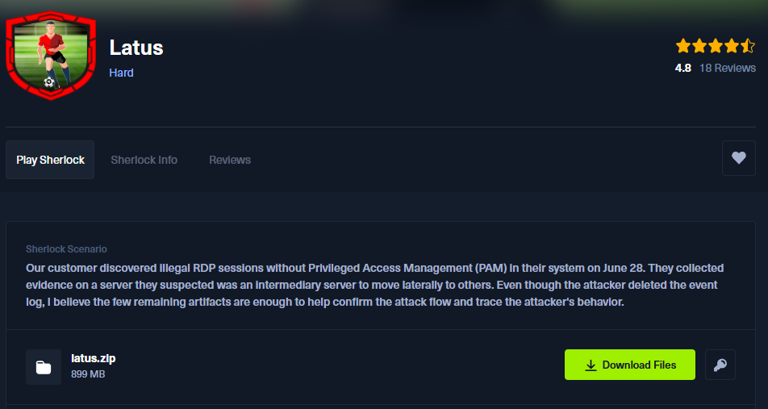

## Scénario
> Le 28 juin, notre client a détecté des sessions RDP non autorisées, sans déploiement de PAM, dans leur environnement. Ils ont récupéré des preuves sur un serveur qu’ils suspectaient de servir de pivot pour un mouvement latéral vers d’autres cibles. Même si l’attaquant a supprimé les events log, je pense que les quelques artefacts restants suffisent à confirmer le déroulement de l’attaque et à retracer le comportement de l’assaillant.


## Setup
Pour ce Sherlock nous allons utiliser : 
- Zimmerman Tools (EvtxECmd, Registry Explorer, Timeline Explorer, PECmd, WxTCmd...)
- Impacket (secretsdump.py)
- NirSoft DataProtectionDecryptor
- ANSSI BMC-tools
- BSI-Bund RdpCacheStitcher

On va aussi s'appuyer sur des cheatsheets tels que celle de la **FOR500** de SANS et celle portant sur les registres windows de **13Cubed** : 

- https://13cubed.s3.amazonaws.com/downloads/windows_registry_cheat_sheet.pdf

- 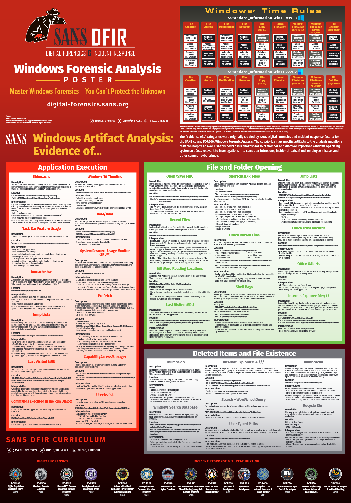
- 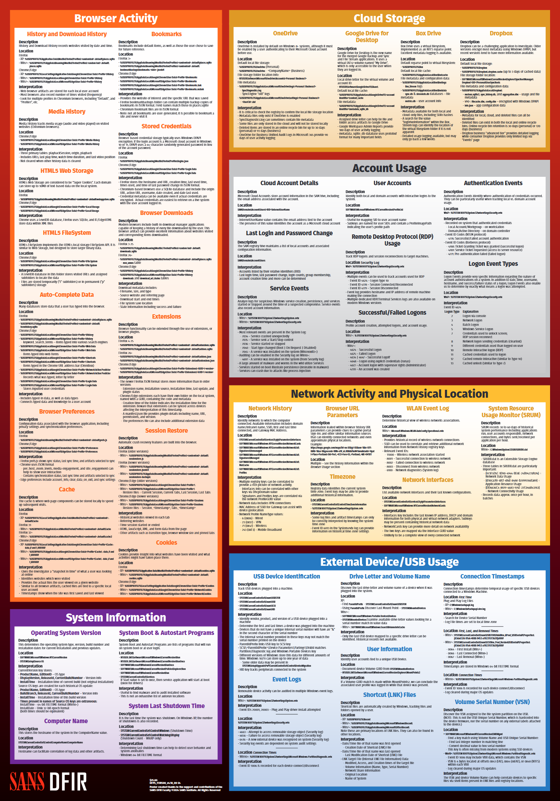


## Question 1
> Quand a eu lieu la dernière tentative de connexion échouée utilisant l'utilisateur emman.t ? (UTC)

Premièrement on va vérifier si, comme le scénario l'explique, les events logs ont bien été effacés. Pour cela, nous allons utiliser les tools de Zimmerman **EvtxECmd** et **Timeline Explorer** afin de répondre à cette question. 

```powershell
EvtxECmd.exe -d "C:/C___NONAME [NTFS]\[root]\Windows\System32\winevt\Logs" --csv "C:\Users\username\Desktop\HTB\latus"
```

On recherche l'**ID 4625** *(Account failed to log on)*, mais RAS. 

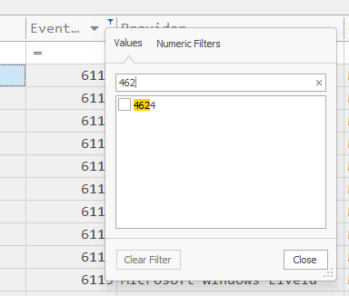

Et effectivement on voit bien que les logs ont été effacés :

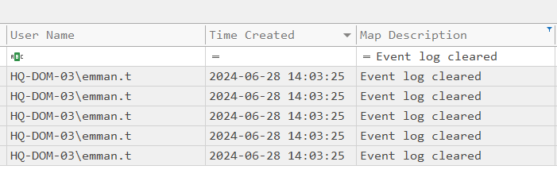

Il nous reste cependant une chance de les retrouver si on dispose de VSS (Volume Shadow Copy). 

Le (VSS) est une fonctionnalité Windows qui crée des snapshots de l’état d’un disque à un moment donné. Si des VSS sont disponibles, on peut retrouver des versions antérieures de fichiers supprimés ou altérés, y compris les events log. Donc, même si un attaquant a effacé les logs sur la machine en live, il est parfois possible de récupérer ceux qui existaient au moment où le snapshot VSS a été créé.

Malheureusement, après vérification, on n'a pas de VSS. On est donc obligé de se rediriger sur les Registry. 

Pour ça nous allons utiliser un autre outil de Zimmerman, **Registry Explorer**. 

On va aller voir du côté de la **registry hive SAM**. En effet, on pourra y retrouver des artéfacts dans ``SAM\Domains\Account\Users`` tels que : 
- **last login time**
- last incorrect password
- last password change
- login counts
- group membership
- account creation time etc.

Pour cela, on va charger le fichier ``C___NONAME [NTFS]\[root]\Windows\System32\config\SAM`` dans **Registry Explorer** :

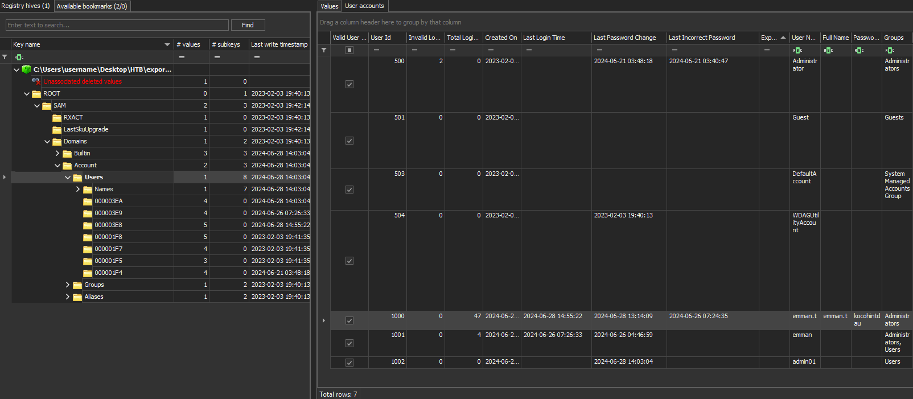

Et effectivement on retrouve le "Last Incorrect Password"

**Réponse** : ``2024-06-26 07:24:35``

---
## Question 2
> Quelles sont les 3 premières adresses IP auxquelles emman.t s'est connecté via Remote Desktop (RDP) ?

Pour répondre à cette question on va aller regarder du côté du **NTUSER.dat**. C'est la registry hive située dans le dossier de profil de l'utilisateur, il contient toutes les configurations personnelles et le préférences de l'environnement de bureau. 

Lorsqu'un utilisateur se connecte, ce fichier est chargé pour appliquer ses paramètres spécifiques (les paramètres d'application, l'historique des activités, etc.).

On va particulièrement porter notre attention sur ``HKEY_CURRENT_USER\Software\Microsoft\Terminal Server Client`` car c'est ici que sont stockés les paramètres RDP et la liste des serveurs auxquels l'utilisateur s'est connecté via RDP.

On charge donc le fichier **NTUSER.dat** de l'utilisateur en question dans **Registry Explorer** et on se rend au chemin voulu :

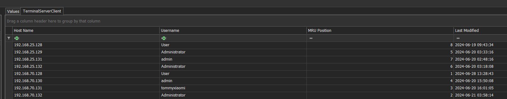

**Réponse** : ``192.168.86.250,192.168.25.128,192.168.25.131``

---
## Question 3
> Quel est le nom d'utilisateur de destination utilisé pour se connecter en Remote Desktop pour la première fois le 2024-06-20 à 16:01:05 UTC ?

On a déjà la réponse sur le screen de la question 2.

**Réponse** : ``tommyxiaomi``

---
## Question 4
> Quelle est l'adresse IP de destination de la dernière session Remote Desktop (RDP) ?

Idem.

**Réponse** : ``192.168.70.133``

---
## Question 5
> emman.t est très négligent en sauvegardant systématiquement ses identifiants RDP pour se connecter à d'autres hôtes, ce qui laisse penser que l'attaquant les a, d'une manière ou d'une autre, divulgués. Pouvez-vous confirmer les identifiants divulgués du serveur avec l'IP 192.168.70.133 ?

Cette question est un petit défi très intéressant. 

Premièrement, allons droit au but, où pouvons-nous trouver les **credentials RDP** ? Lorsqu'on se connecte en RDP via l'application de Microsoft par défaut, l'app nous propose de sauvegarder les credentials : 

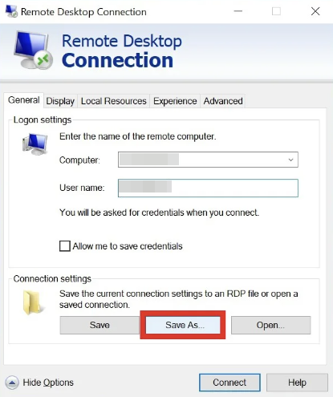

Pour stocker ces credentials, Windows utilise le système de **Credential Manager** pour gérer et stocker de manière "sécurisée". Lorsque l’utilisateur sauvegarde ses identifiants lors d’une connexion RDP, ces credentials sont enregistrés dans le dossier spécifique de l’utilisateur, ici situé à ``C:\Users\emman.t\AppData\Local\Microsoft\Credentials``.

**Credential Manager** s'appuie sur la **DPAPI** *(Data Protection API)* afin de chiffrer les informations d'authentifications. L'[API](https://learn.microsoft.com/en-us/windows/win32/api/dpapi/nf-dpapi-cryptprotectdata) est très straightforward : 

```C++
DPAPI_IMP BOOL CryptProtectData(
  [in]              DATA_BLOB                   *pDataIn,
  [in, optional]    LPCWSTR                     szDataDescr,
  [in, optional]    DATA_BLOB                   *pOptionalEntropy,
  [in]              PVOID                       pvReserved,
  [in, optional]    CRYPTPROTECT_PROMPTSTRUCT   *pPromptStruct,
  [in]              DWORD                       dwFlags,
  [out]             DATA_BLOB                   *pDataOut
);
```

Cette API est largement utilisée par Microsoft et d'autres applications telles que Chrome, Edge etc. afin de stocker des mots de passe et autres secrets en tout genre.

DPAPI fonctionne en utilisant des clés appelées **masterkeys**. Ces masterkeys servent à chiffrer les données protégées par DPAPI. Chaque masterkey est elle-même chiffrée à l'aide d'un **dérivé du mot de passe de l'utilisateur** ou de la **clé système DPAPI**. 

Ces masterkeys sont stockées dans :
- Pour l'utilisateur : ``C:\Users\<user>\AppData\Roaming\Microsoft\Protect\<SID>``
- Pour le système : ``C:\Windows\System32\Microsoft\Protect\S-1-5-18``

Ces **masterkeys** :
- sont renouvelés automatiquement tous les 3 mois ou après un changement de mot de passe utilisateur.
- mise en cache (stockage temporaire en clair) dans le processus LSASS (très utile memory forensic ou alors en pentest)

Voici comment fonctionne le mécanisme **DPAPI** : 

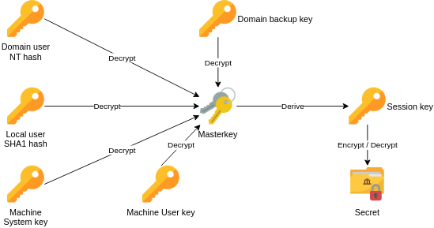

Au centre, on retrouve la **masterkey** qui est la clé principale utilisée par DPAPI pour chiffrer et déchiffrer des secrets.

Cette **Masterkey** est elle-même chiffrée et protégée. Selon la situation, elle peut être déchiffrée à partir de différentes clés :
    - Le **NT hash** du mot de passe utilisateur d'un compte de domaine.
    - Le hash **SHA1 du mot de passe d’un compte utilisateur local**.
    - Une clé machine nommée **Domain Backup Key**, spécifique aux environnements Active Directory, permettant de déchiffrer les masterkeys sans avoir le mot de passe utilisateur, si l’on possède les droits suffisants.

Une fois la Masterkey déchiffrée grâce à l'une de ces clés, elle permet de dériver une clé de session (**Session Key**), qui est directement utilisée pour chiffrer ou déchiffrer les données protégées par DPAPI.

Pour déchiffrer des données protégées par DPAPI on peut s'aider de pas mal de tool : 
- utilisable sur un live system : 
	- [LaZagne](https://github.com/AlessandroZ/LaZagne)
	- [pypykatz](https://github.com/skelsec/pypykatz) - dpapi module
	- [mimikatz](https://github.com/gentilkiwi/mimikatz)
	- [SharpDPAPI](https://github.com/GhostPack/SharpDPAPI)
- offline après avoir récupéré les fichiers nécessaires :
	- [pypykatz](https://github.com/skelsec/pypykatz) - dpapi module
	- [dpapi.py](https://github.com/fortra/impacket/blob/master/examples/dpapi.py) - [impacket](https://github.com/fortra/impacket)
	- [mimikatz](https://github.com/gentilkiwi/mimikatz)
	- [SharpDPAPI](https://github.com/GhostPack/SharpDPAPI)
	- [dpapilab-ng](https://github.com/tijldeneut/dpapilab-ng)
	- [diana](https://github.com/tijldeneut/diana)

Si vous souhaitez rentrer davantage dans les détails de la DPAPI, je vous invite à lire cette publication de Synacktiv (l'explication ci-dessus est basé sur le post): https://www.synacktiv.com/publications/windows-secrets-extraction-a-summary

Maintenant qu'on sait tout ça, comment peut-on l'appliquer à notre situation ? Ici j'ai souhaité partir sur :
- Impacket (secretsdump.py)
- NirSoft DataProtectionDecryptor

Le script **secretsdump.py** va nous permettre de récupérer le mot de passe de l'utilisateur en question afin de pouvoir déchiffrer les secrets DPAPI : 

```powershell
secretsdump.py -sam "C:\C___NONAME [NTFS]\[root]\Windows\System32\SAM" --security "C:\C___NONAME [NTFS]\[root]\Windows\System32\SECURITY" --system  "C:\C___NONAME [NTFS]\[root]\Windows\System32\SYSTEM" LOCAL
```

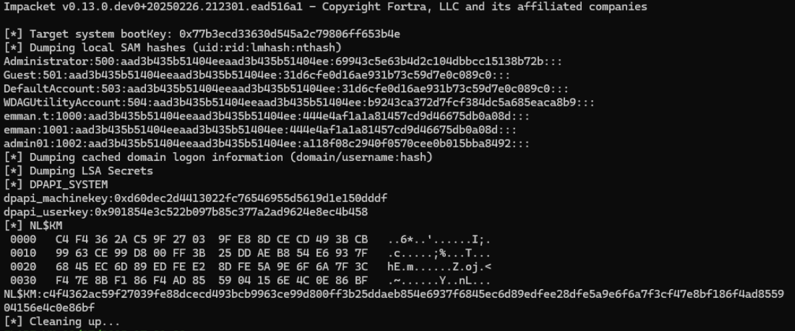

Parfait, on a récupéré le hash du mot de passe de l'utilisateur en question, on peut ensuite le bruteforce : 

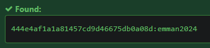

Maintenant qu'on a son mot de passe on peut déchiffrer les credentials via l'outil DataProtectionDecryptor :

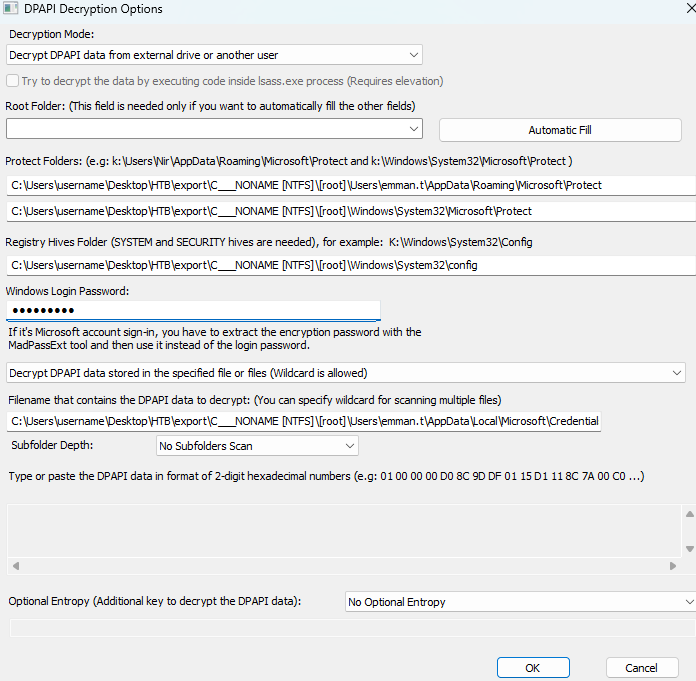

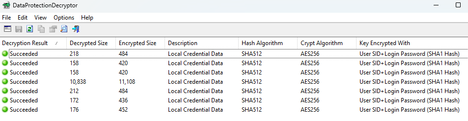

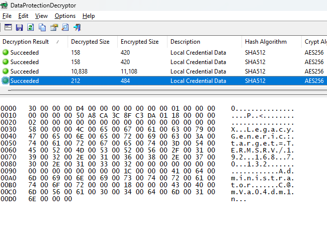

Il existe aussi une façon non intentionnel de trouver le mot de passe du user : 

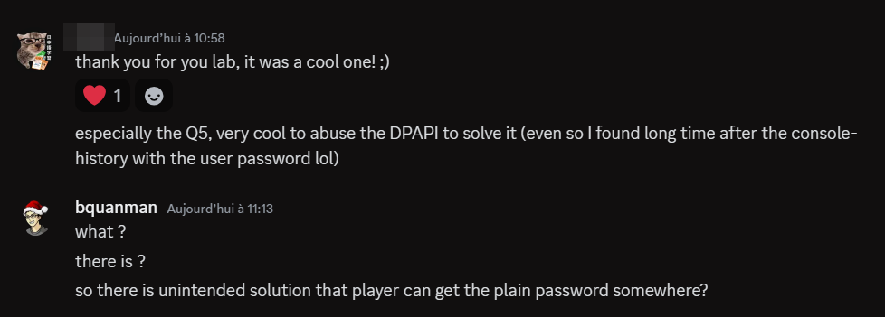

Effectivement, si on va dans l'historique des commandes powershell, on peut retrouver le moment ou le créateur du challenge a créé les users : 

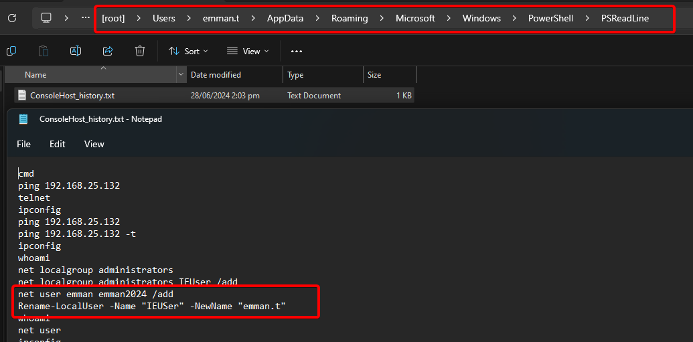

**Réponse** : ``Administrator:C@mv@0s3rv3r``

---
## Question 6
> Quand l'application Remote Desktop Connection a-t-elle été exécutée pour la dernière fois ? (UTC)

Pour répondre à cette question on va se pencher sur les artéfacts **Prefetch**. 

Le **Prefetch** est un mécanisme conçu pour accélérer le lancement des applications couramment utilisées en conservant certaines données relatives aux exécutions précédentes. Windows stocke ces informations sous forme de fichiers `.pf` dans le dossier suivant ``C:\Windows\Prefetch\``.

Chaque fichier `.pf` contient notamment :
- le nom de l’exécutable
- le nombre de fois où l'application a été lancée
- les timestamps de dernière exécution
- les chemins vers les fichiers associés et bibliothèques chargées durant le démarrage du processus

Dans le cas d'une connexion RDP, l’exécutable utilisé est généralement `MSTSC.EXE`. L’analyse du fichier Prefetch associé (`MSTSC.EXE-XXXXXX.pf`) permet ainsi de vérifier si une connexion RDP a été établie depuis cette machine, ainsi que le moment précis de son lancement.

Pour les charger dans **Timeline Explorer** on doit les parser, pour cela on va utiliser ``PECmd`` : 

```powershell
PECmd.exe -d "C:\___NONAME [NTFS]\[root]\Windows\Prefetch" --csv "C:\Users\username\Desktop\HTB\latus" 
```

Et effectivement on retrouve les informations de lancement de ``MSTSC.exe`` : 

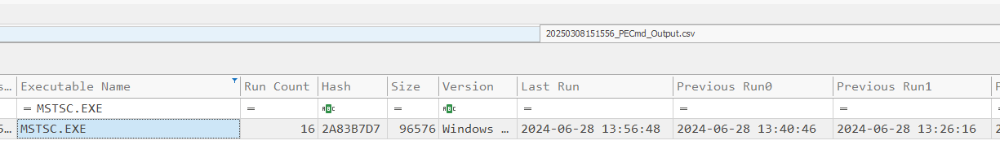

**Réponse** : ``2024-06-28 13:56:48``

---
## Question 7
> Quand l'application Remote Desktop Connection a-t-elle été fermée pour la dernière fois ? (UTC)

Premièrement on va chercher du côté du **UserAssist** (dans la registry hive **NTUSER.dat**) se situant : ``NTUSER.DAT\Software\Microsoft\Windows\CurrentVersion\Explorer\UserAssist\``. 

Cette clé conserve l’historique d’utilisation des applications exécutées par l’utilisateur notamment :
- le nombre d’exécutions d’un programme
- le moment précis de la dernière exécution de l'application
- le moment précis où l'application a été fermée ou terminée (dernier arrêt du processus)

Ces informations sont stockées dans des sous-clés encodées via ROT13 mais heureusement **Registry Explorer** nous rend tout cela lisible : 

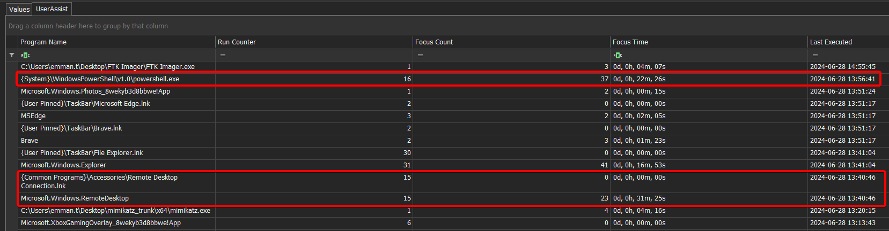

Mais ce qui nous choque en premier c'est la différence entre la valeur "Last Executed" contenu dans le UserAssist et la "Last Run" dans le Prefetch. 

Pourquoi cette divergence entre Prefetch et UserAssist ?
- **Prefetch (.pf)** :
    - Enregistre les exécutions directement au niveau du processus (`mstsc.exe`).
    - Le compteur augmente à chaque chargement du processus en mémoire, peu importe comment il est démarré.
- **UserAssist (registre)** :
    - Enregistre uniquement les exécutions effectuées par interaction directe de l’utilisateur (ex : clic sur l’icône, menu Démarrer, barre de recherche, raccourci).
    - **Ne comptabilise pas nécessairement les exécutions indirectes** (exécution via ligne de commande, exécution automatique, scripts, etc.).

Donc on fait fausse route ici.

On peut alors se pencher sur la clé **BAM** (`HKLM\SYSTEM\CurrentControlSet\Services\bam\UserSettings\`) qui enregistre explicitement la durée de vie des applications. 

En effet, BAM maintient pour chaque exécutable un historique précis comprenant :
- le dernier moment d’exécution (lancement de l’application)
- le moment précis de fermeture (terminaison du processus)

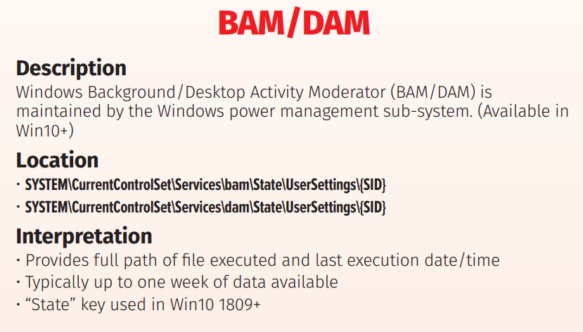

Vous pouvez retrouver plus d'informations sur les artéfacts RDP ici : https://www.thedfirspot.com/post/lateral-movement-remote-desktop-protocol-rdp-artifacts

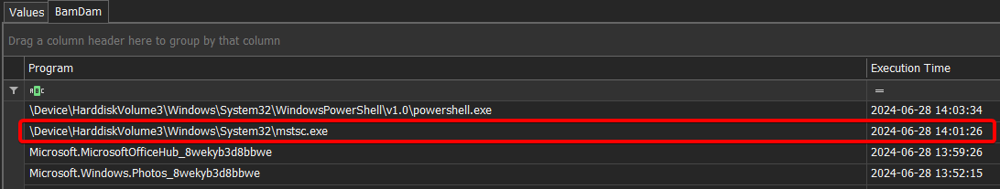

**Réponse** : ``2024-06-28 14:01:26``

---
## Question 8
> Quelle a été la durée de l'avant-dernière session RDP ?

Pour répondre à cette question on va se pencher sur l'**ActivitiesCache.db** : 

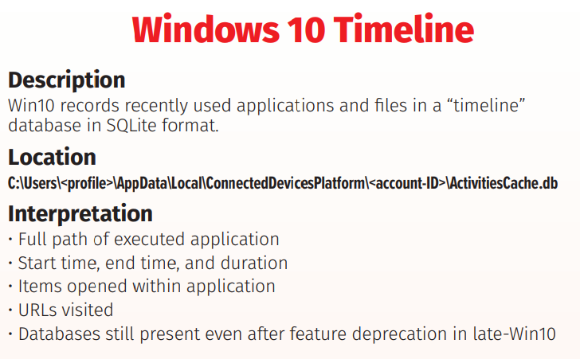

Après l'avoir chargé dans Timeline Explorer on voit bien les différentes "duration" des sessions RDP : 

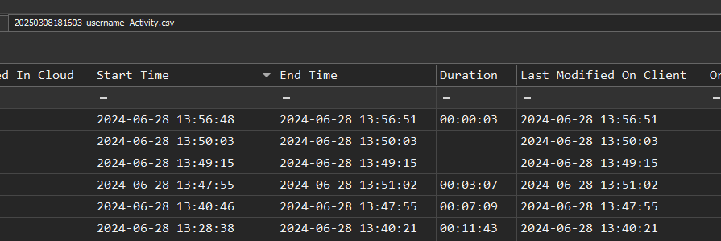

Pour une raison inconnue, la réponse prend -1 sec.  

**Réponse** : ``00:11:42``

---
## Question 9
> Quand l'attaquant a-t-il déconnecté la dernière session Remote Desktop (RDP) ? (UTC)

Pour cela on va aller voir le fichier "Default.rdp" contenu dans le ``...\Documents\`` de l'utilisateur. En effet, ce fichier est généré automatiquement par Windows lorsqu'une connexion RDP est établie via l'application MSTSC.

On peut y retrouver : 
- l'adresse IP ou nom du serveur utilisé lors de la dernière connexion RDP
- le nom d’utilisateur ayant été utilisé pour la connexion
- le paramètres graphiques (résolution, couleurs, etc.)
- l'options de partage des périphériques locaux (presse-papiers, disques locaux, imprimantes, etc.)
- les paramètres de performances (qualité graphique, compression, etc.).

Mais on peut aussi  voir quand est-ce que le fichier a été modifié pour la dernière fois :

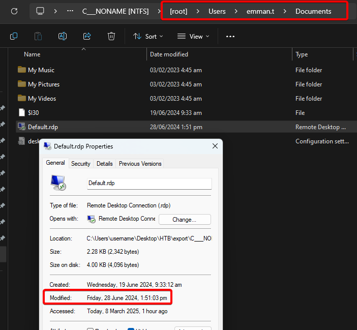

**Réponse** : ``2024-06-28 13:51:03``

---
## Question 10
> Quelle est la taille du bureau à distance configuré ?

On retourne sur le fichier Default.rdp et on y retrouve :

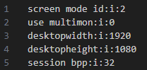

**Réponse** : ``1920:1080``

---
## Question 11
> Quel outil l'attaquant a-t-il utilisé pour explorer le réseau après s'être déplacé latéralement vers 192.168.70.133 ?

Pour répondre à cette question on va devoir chercher du côté du **cache bitmap RDP**. 

Lors de l’analyse des sessions utilisant le protocole RDP (Remote Desktop Protocol) sous Windows, le **cache bitmap RDP** constitue un artefact souvent négligé, mais pourtant très pertinent en forensic. 

Ce cache permet d'améliorer les performances des sessions RDP en stockant localement des sections d'écran déjà affichées. Ainsi, lorsqu'une partie de l'écran reste statique, le système peut rapidement récupérer l'image en mémoire locale plutôt que de la recharger à distance, ce qui fluidifie l'expérience utilisateur.

D'un point de vue forensic, ce cache peut représenter une source précieuse d'informations. En effet, l'analyse des fichiers du cache bitmap peut révéler des détails sensibles sur les activités de l'utilisateur, telles que les fenêtres ouvertes, les contenus affichés ou les actions réalisées pendant la session RDP. 

Si vous voulez plus d'informations je vous invite à lire le post : https://www.cyberengage.org/post/analyzing-and-extracting-bitmap-cache-files-from-rdp-sessions.

On retrouve ces fichiers ici ``C:\Users\user\AppData\Local\Microsoft\Terminal Server Client\Cache\``.

Pour les parser & exporter on va utiliser le tool de l'ANSSI "[BMC-Tools](https://github.com/ANSSI-FR/bmc-tools)". 

Ensuite, on va utiliser le tool de la BSI Bund "[RdpCacheStitcher](https://github.com/BSI-Bund/RdpCacheStitcher)" pour les analyser :

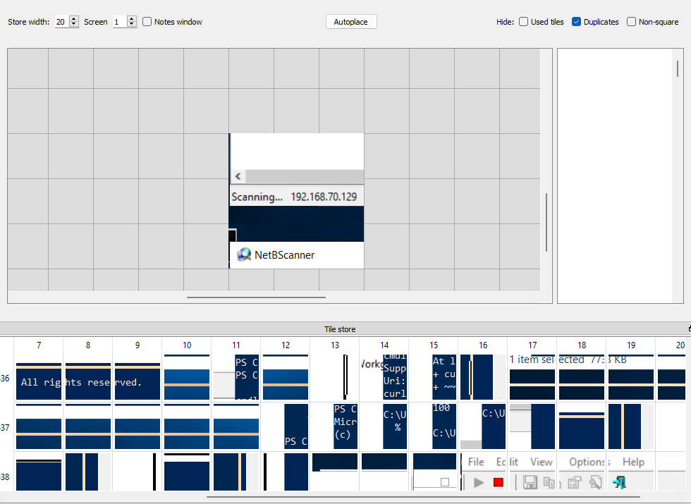

En reconstruisant, on voit donc bien que l'attaquant a utilisé "NetBScanner" pour scanner le réseau. 

**Réponse** : ``NetBScanner``

---
## Question 12
> Quand l'attaquant a-t-il supprimé le journal des événements ? (UTC)

On revient sur ce qu'on avait trouvé lors de la question 1 : 


**Réponse** : ``2024-06-28 14:03:25``


---
## Question 13
> À quelle heure l'attaquant a-t-il déconnecté la session vers 192.168.70.129 ? (UTC)

Si on regarde juste après l'effacement des events log, on voit bien un "An account was logged off" :

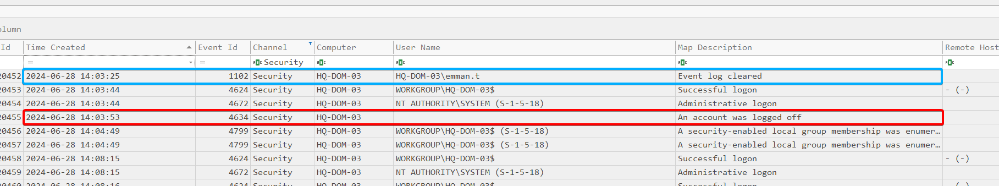

**Réponse** : ``2024-06-28 14:03:53``

---

Lab terminé ! 


