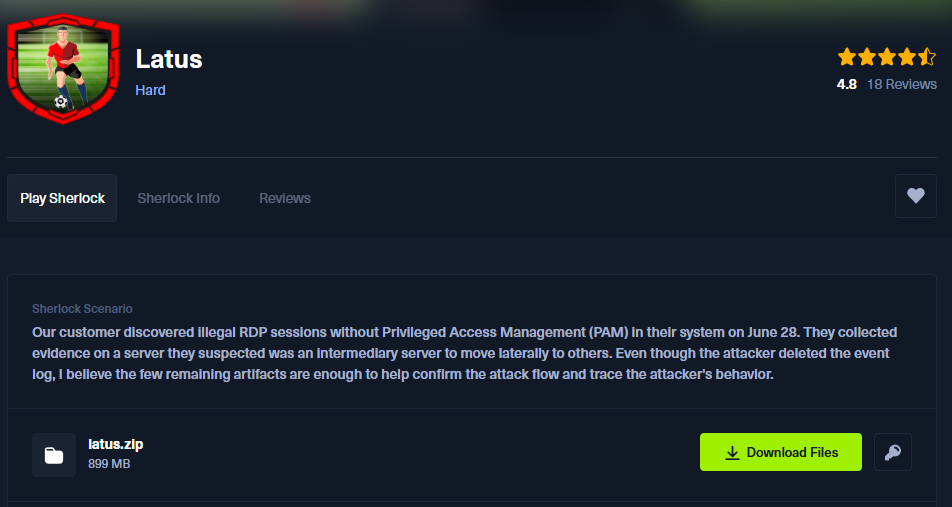
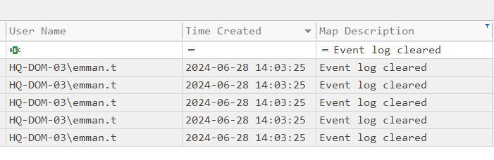
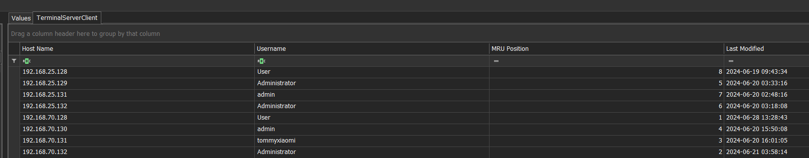
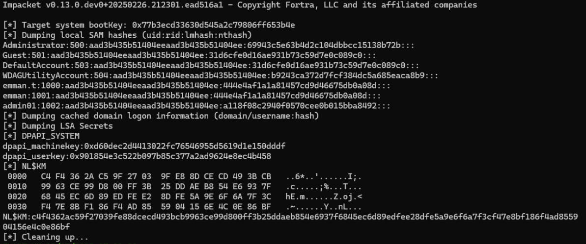
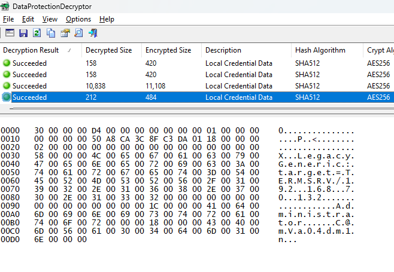
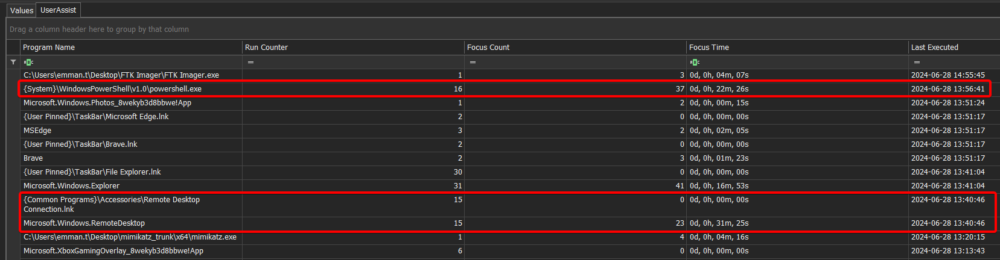
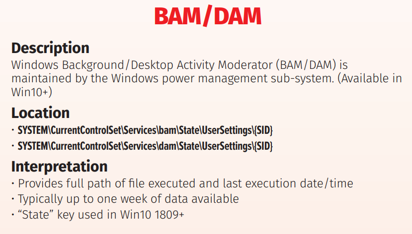
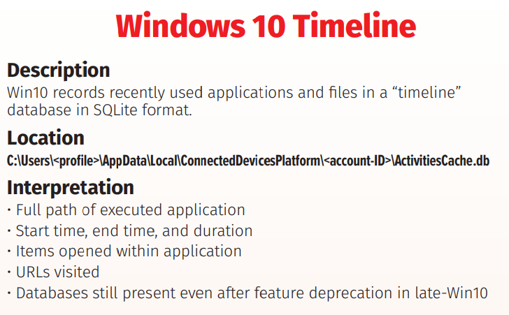
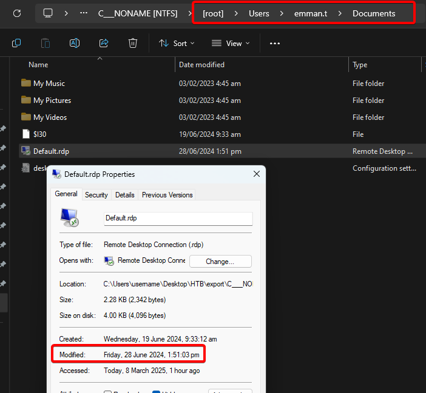
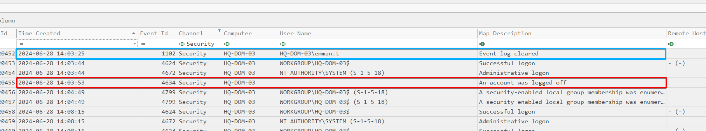

## シナリオ
> 6月28日、顧客の環境にてPAM (Privileged Access Management) を経由しない不正なRDPセッションが検出されました。攻撃者は別サーバへの横展開（ラテラルムーブメント）のために踏み台として使ったと思われるサーバで証拠を収集しました。攻撃者はイベントログ（event logs）を削除していますが、残されたわずかなアーティファクトでも攻撃の流れを再現し、攻撃者の行動を追跡するには十分だと考えています。

## Setup
このSherlockチャレンジで使用するツール：
- Zimmerman Tools (EvtxECmd, Registry Explorer, Timeline Explorer, PECmd, WxTCmd...)
- Impacket (secretsdump.py)
- NirSoft DataProtectionDecryptor
- ANSSI BMC-tools
- BSI-Bund RdpCacheStitcher

また、次のチートシートも参考にします：

- https://13cubed.s3.amazonaws.com/downloads/windows_registry_cheat_sheet.pdf

- 
- 


## 質問 1
> emman.tユーザによる最後のログオン失敗はいつ発生したか？（UTC）

まず、シナリオ通り本当にイベントログ（event logs）が削除されたのか確認するために、Zimmerman Toolsの**EvtxECmd** と **Timeline Explorer** を使って調査します。

```powershell
EvtxECmd.exe -d "C:/C___NONAME [NTFS]\[root]\Windows\System32\winevt\Logs" --csv "C:\Users\username\Desktop\HTB\latus"
```

**Event ID 4625** (*Account failed to log on*) を探しましたが、関連するものは何も見つかりませんでした。


そして、実際に、ログがクリアされているのが確認できます：



もし VSS (Volume Shadow Copy) があれば、ログの復元のチャンスはあります。

**Volume Shadow Copy Service (VSS)** は、特定の時点でのディスクの状態をスナップショットとして作成する Windows の機能です。VSS のスナップショットが存在すれば、削除または変更されたファイル（イベントログを含む）の以前のバージョンを復元できる可能性があります。つまり、攻撃者がライブシステム上でログをクリアしても、VSS のスナップショットから復元できるかもしれません。

しかし、調査した結果、VSS は存在しなかったため、レジストリに頼る必要があります。

そのため、別の Zimmerman ツールである **Registry Explorer** を使用します。

**SAM** レジストリハイブ、具体的には `SAM\Domains\Account\Users` を調査します。ここでは以下のようなアーティファクトが見つかります：
- **last login time**
- last incorrect password
- last password change
- login counts
- group membership
- account creation time など

そこで、`C___NONAME [NTFS]\[root]\Windows\System32\config\SAM` ファイルを **Registry Explorer** にロードします：


そして、確かに "Last Incorrect Password" エントリが確認できます。

**Answer**: `2024-06-26 07:24:35`

---

## 質問 2
> What are the first 3 IP addresses that emman.t connected to using Remote Desktop (RDP)?

これに答えるために、**NTUSER.dat** を調べます。これはユーザーのプロファイルフォルダにあるレジストリハイブで、個人設定やデスクトップ環境のプリファレンスが含まれています。

ユーザーがログオンする際、Windows はこのハイブを読み込み、各ユーザー固有の設定（アプリケーションの設定、アクティビティ履歴など）を適用します。

特に注目すべきは `HKEY_CURRENT_USER\Software\Microsoft\Terminal Server Client` です。ここには、RDP パラメータや、ユーザーが RDP 経由で接続したサーバーのリストが保存されています。

そこで、ユーザーの **NTUSER.dat** を **Registry Explorer** にロードし、該当のパスに移動します：



**Answer**: `192.168.86.250,192.168.25.128,192.168.25.131`

---

## 質問 3
> What is the destination username used to remote desktop to for the first time on 2024-06-20 16:01:05 UTC?

質問 2 のスクリーンショットから既に確認できます。

**Answer**: `tommyxiaomi`

---

## 質問 4
> What is the destination IP address of the last Remote Desktop (RDP) session?

同様です。

**Answer**: `192.168.70.133`

---

## 質問 5
> emman.t is very careless in always saving RDP credentials to connect to other hosts, so we believe that attacker somehow leaked them. Please confirm credentials of the server with ip 192.168.70.133 that was leaked?

この質問は、非常に興味深いチャレンジです。

まず、要点に入ります：**RDP 資格情報はどこに保存されているのか？**  
Microsoft の組み込み RDP クライアントを使用して接続すると、アプリは資格情報を保存するオプションを提供します：


Windows はこれらの資格情報を **Credential Manager** に保存し、「安全に」保管します。ユーザーが RDP 接続中に「資格情報を記憶する」を選択すると、資格情報はユーザーのフォルダ内に保存されます。具体的には：  
`C:\Users\emman.t\AppData\Local\Microsoft\Credentials`

**Credential Manager** は **DPAPI** (Data Protection API) に依存して、認証データを暗号化します。[この API](https://learn.microsoft.com/en-us/windows/win32/api/dpapi/nf-dpapi-cryptprotectdata) は非常にシンプルです。

```C++
DPAPI_IMP BOOL CryptProtectData(
  [in]              DATA_BLOB                   *pDataIn,
  [in, optional]    LPCWSTR                     szDataDescr,
  [in, optional]    DATA_BLOB                   *pOptionalEntropy,
  [in]              PVOID                       pvReserved,
  [in, optional]    CRYPTPROTECT_PROMPTSTRUCT   *pPromptStruct,
  [in]              DWORD                       dwFlags,
  [out]             DATA_BLOB                   *pDataOut
);
```

DPAPI は、Microsoft や Chrome、Edge などの他のアプリケーションがパスワードや各種シークレットを保存するために広く使用されています。

DPAPI は **masterkeys** を使用して、DPAPI によって保護されたデータを暗号化します。各 masterkey 自体は、**ユーザーのパスワードの派生値** もしくは **DPAPI システムキー** を使用して暗号化されています。

これらの masterkeys は以下に保存されます：
- ユーザー用:  
  `C:\Users\<user>\AppData\Roaming\Microsoft\Protect\<SID>`
- システム用:  
  `C:\Windows\System32\Microsoft\Protect\S-1-5-18`

これらは：
- ユーザーパスワードの変更時や、3 ヶ月ごとに自動的に更新されます。
- LSASS プロセス内にキャッシュ（一時的に平文で保存）されます（メモリフォレンジクスやペンテストに役立ちます）。

**DPAPI** のメカニズムは以下のように動作します：


中央にあるのが **masterkey** で、これは DPAPI によるシークレットの暗号化/復号に使用される主要な鍵です。

この **Masterkey** 自体も暗号化され保護されています。状況に応じて、以下の異なる鍵で復号可能です：
- ドメインユーザーアカウントパスワードの **NT hash**
- ローカルユーザーアカウントパスワードの **SHA1 hash**
- Active Directory 環境における **Domain Backup Key** と呼ばれるマシンキー（適切な権限があれば、ユーザーのパスワードがなくても masterkeys の復号が可能）

Masterkey がこれらの鍵のいずれかで復号されると、**Session Key** が導出されます。これが実際に DPAPI によって保存されたデータの暗号化/復号を行います。

DPAPI で保護されたデータを復号するために、以下のような多数のツールが使用できます：
- ライブシステム上で：
  - [LaZagne](https://github.com/AlessandroZ/LaZagne)
  - [pypykatz](https://github.com/skelsec/pypykatz) (dpapi module)
  - [mimikatz](https://github.com/gentilkiwi/mimikatz)
  - [SharpDPAPI](https://github.com/GhostPack/SharpDPAPI)
- オフライン（必要なファイルを取得後）：
  - [pypykatz](https://github.com/skelsec/pypykatz) (dpapi module)
  - [dpapi.py](https://github.com/fortra/impacket/blob/master/examples/dpapi.py) ([impacket](https://github.com/fortra/impacket))
  - [mimikatz](https://github.com/gentilkiwi/mimikatz)
  - [SharpDPAPI](https://github.com/GhostPack/SharpDPAPI)
  - [dpapilab-ng](https://github.com/tijldeneut/dpapilab-ng)
  - [diana](https://github.com/tijldeneut/diana)

DPAPI についてさらに掘り下げたい場合は、Synacktiv の以下の投稿をご覧ください（上記の説明はこれに基づいています）：[Windows secrets extraction – a summary](https://www.synacktiv.com/publications/windows-secrets-extraction-a-summary)

さて、理論が分かったところで、今回のケースにどう適用するかを考えます。私は以下のツールを使用することにしました：
- **Impacket (secretsdump.py)**
- **NirSoft DataProtectionDecryptor**

**secretsdump.py** スクリプトを使用すると、ユーザーのパスワードを取得して、DPAPI シークレットを復号することができます：

```powershell
secretsdump.py -sam "C:\C___NONAME [NTFS]\[root]\Windows\System32\SAM" --security "C:\C___NONAME [NTFS]\[root]\Windows\System32\SECURITY" --system  "C:\C___NONAME [NTFS]\[root]\Windows\System32\SYSTEM" LOCAL
```



ユーザーのパスワードハッシュを取得できたので、ブルートフォース攻撃を試みます：


パスワードが判明すれば、**DataProtectionDecryptor** を使用して資格情報を復号できます：




さらに、偶然にもユーザーのパスワードを発見する別の方法もあります：


PowerShell のコマンド履歴を調べると、チャレンジ作成者がこれらのユーザーアカウントをセットアップした痕跡が見つかります：


**Answer**: `Administrator:C@mv@0s3rv3r`

---
## 質問 6
> リモートデスクトップ接続アプリケーションが最後に実行されたのはいつですか？ (UTC)

これに答えるため、**Prefetch** のアーティファクトを調査します。

**Prefetch** は、頻繁に使用されるアプリケーションの起動を高速化するため、過去の実行からの特定のデータをキャッシュする仕組みです。Windows はこれらの詳細を `.pf` ファイルとして、`C:\Windows\Prefetch\` に保存します。

各 `.pf` ファイルには以下が含まれます：
- 実行可能ファイルの名前
- アプリケーションが起動された回数
- 最後の実行時刻
- プロセス起動時に読み込まれた関連ファイルやライブラリのパス

RDP 接続の場合、実行可能ファイルは通常 `MSTSC.EXE` です。対応する Prefetch ファイル（`MSTSC.EXE-XXXXXX.pf`）を解析することで、このマシンから RDP 接続が開始されたかどうかや、正確な起動時刻を確認できます。

これらを **Timeline Explorer** に読み込むため、まず `PECmd` を使用して解析する必要があります：

```powershell
PECmd.exe -d "C:\___NONAME [NTFS]\[root]\Windows\Prefetch" --csv "C:\Users\username\Desktop\HTB\latus" 
```

そして実際に、**MSTSC.exe** の起動データが確認できます：


**回答**: `2024-06-28 13:56:48`

---

## 質問 7
> リモートデスクトップ接続アプリケーションが最後に終了されたのはいつですか？ (UTC)

まず、**NTUSER.dat** レジストリハイブ内の `NTUSER.DAT\Software\Microsoft\Windows\CurrentVersion\Explorer\UserAssist\` にある **UserAssist** を調査します。

このキーは、ユーザーのアプリケーション活動を記録しており、以下が含まれます：
- プログラムが起動された回数
- アプリケーションが最後に実行された正確な時刻
- アプリケーションが終了（プロセス終了）した正確な時刻

これらの詳細は ROT13 でエンコードされたサブキーに保存されていますが、**Registry Explorer** が便利にデコードしてくれます：



すぐに目立つのは、UserAssist の「Last Executed」値と Prefetch の「Last Run」データとの不一致です。

なぜ Prefetch と UserAssist で違いがあるのでしょうか？
- **Prefetch (.pf)**:
  - プロセスレベル（`mstsc.exe`）での実行を記録します。
  - プロセスがメモリに読み込まれるたびに、その回数を増加させます（起動方法に関係なく）。
- **UserAssist (registry)**:
  - アイコンのクリック、スタートメニューの使用、検索入力、ショートカット利用など、直接的なユーザー操作による実行のみを記録します。
  - **間接的な実行**（コマンドライン、オートスタート、スクリプトなど）は必ずしもカウントしません。

したがって、この文脈では、UserAssist 単体では正確な最終終了時刻を示しません。

次に、アプリケーションのライフタイムを明示的に追跡する **BAM** キー（`HKLM\SYSTEM\CurrentControlSet\Services\bam\UserSettings\`）に注目しました。

BAM は各実行可能ファイルについて、以下の正確な記録を保持します：
- アプリが最後に実行された時刻（プロセス開始）
- 終了した正確な時刻（プロセス終了）



RDP アーティファクトの詳細については、以下もご参照ください：  
[https://www.thedfirspot.com/post/lateral-movement-remote-desktop-protocol-rdp-artifacts](https://www.thedfirspot.com/post/lateral-movement-remote-desktop-protocol-rdp-artifacts)


**回答**: `2024-06-28 14:01:26`

---

## 質問 8
> 最後から2番目の RDP セッションの持続時間はどれくらいでしたか？

**ActivitiesCache.db** を確認しました：



Timeline Explorer に読み込んだ後、様々な RDP セッションの持続時間がはっきりと確認できます：


何らかの理由で、答えは -1 秒ずれています。  

**回答**: `00:11:42`

---

## 質問 9
> 攻撃者が最後のリモートデスクトップ (RDP) セッションを切断したのはいつですか？ (UTC)

これについては、ユーザーの `...\Documents\` ディレクトリにある "Default.rdp" ファイルを調査します。Windows は MSTSC 経由で接続するたびにこのファイルを自動生成します。

このファイルには以下が含まれる場合があります：
- 最後の RDP 接続の IP アドレスまたはホスト名
- 接続に使用されたユーザー名
- グラフィック設定（解像度、色深度など）
- ローカルリソース共有オプション（クリップボード、ローカルドライブ、プリンタなど）
- パフォーマンス設定（画質、圧縮など）

また、ファイルの最終更新時刻も示されています：



**回答**: `2024-06-28 13:51:03`

---

## 質問 10
> 設定されているリモートデスクトップのサイズは何ですか？

Default.rdp を再度確認すると、以下が見つかります：


**回答**: `1920:1080`

---

## 質問 11
> 攻撃者は 192.168.70.133 への横展開後、ネットワークを発見するためにどのツールを使用したのでしょうか？

これを解明するため、**RDP bitmap cache** を調査する必要があります。

Windows Remote Desktop Protocol (RDP) を使用したセッションを調査する際、**RDP bitmap cache** は見落とされがちですが、非常に有用なアーティファクトです。

このキャッシュは、画面の一部をローカルに保存することで RDP のパフォーマンスを向上させます。画面の一部が変更されていなければ、システムは再度取得するのではなくローカルキャッシュから読み出すため、ユーザー体験が高速化されます。

フォレンジックの観点から、bitmap cache はユーザーの画面上の活動、つまりどのウィンドウが開かれていたか、表示されたコンテンツ、セッション中に行われた操作など、重要な手がかりを明らかにします。

詳細については、以下もご参照ください：  
[https://www.cyberengage.org/post/analyzing-and-extracting-bitmap-cache-files-from-rdp-sessions](https://www.cyberengage.org/post/analyzing-and-extracting-bitmap-cache-files-from-rdp-sessions)

これらのファイルは `C:\Users\user\AppData\Local\Microsoft\Terminal Server Client\Cache\` にあります。

キャッシュを解析およびエクスポートするために、ANSSI の "[BMC-Tools](https://github.com/ANSSI-FR/bmc-tools)" を使用し、その後 **BSI Bund** の "[RdpCacheStitcher](https://github.com/BSI-Bund/RdpCacheStitcher)" を用いて解析しました：


キャッシュされた画像を再構築することで、攻撃者がネットワークスキャンに "NetBScanner" を使用したことが確認できます。

**回答**: `NetBScanner`

---

## 質問 12
> 攻撃者によってイベントログが削除されたのはいつですか？ (UTC)

質問 1 で発見した内容に戻ります：


**回答**: `2024-06-28 14:03:25`

---

## 質問 13
> 攻撃者が 192.168.70.129 へのセッションを切断した時刻は？ (UTC)

イベントログがクリアされた直後に、"An account was logged off" エントリが見られます：



**回答**: `2024-06-28 14:03:53`

---

Lab 完了！


