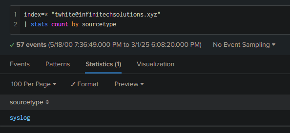
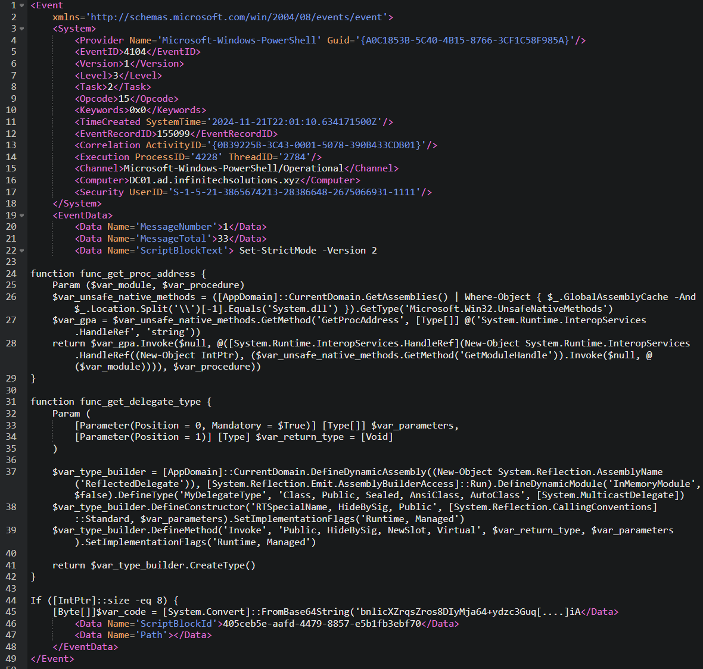
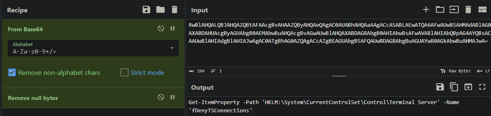
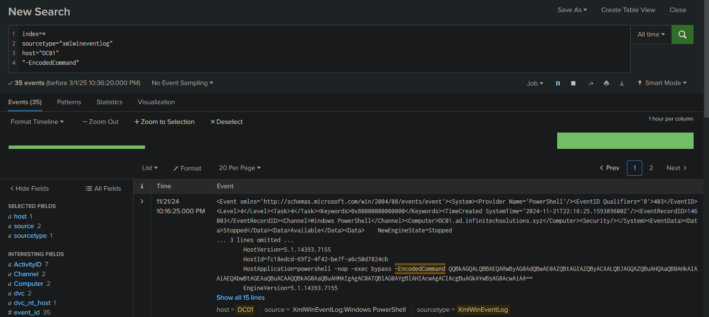

## Scénario
> Un employé informatique d’InfiniTech Solutions a signalé une activité inhabituelle associée à son compte e-mail. Lors de l’investigation, il a été découvert que les identifiants professionnels de l’employé avaient été divulgués lors d’une récente fuite de données.
> 
> L’employé avait utilisé son adresse mail professionnelle pour s’inscrire sur une plateforme tierce, ce qui a exposé ses identifiants. Des acteurs malveillants ont exploité ces identifiants pour se connecter au compte mail de l’employé et envoyer des e-mails de phishing à d’autres employés de l’organisation.
> 
> Votre tâche est d’enquêter sur cet incident en analysant les logs, en déterminant l’étendue de l’attaque, en identifiant si des utilisateurs ont interagi avec les mails de phishing, et en découvrant l’impact de la campagne de phishing sur le réseau.


## Setup
Pour ce scénario d'investigation, nous allons principalement utiliser Splunk Search pour analyser les logs. En complément, nous utiliserons d’autres outils tels que xml.onlineviewer, Cyberchef ainsi que VirusTotal.

## Rappels
Splunk est une plateforme d’analyse qui permet de collecter, indexer et rechercher des données générées par des systèmes, applications et équipements réseau. Il récupère ses logs via divers mécanismes tels que des agents installés sur les endpoints, l’ingestion de fichiers de logs ou encore des API.

Une fois collectées, les données sont indexées, ce qui permet de les organiser et de faciliter la recherche. Splunk utilise le langage de recherche SPL (Search Processing Language) pour interroger ces données. 

## Initial Access

### Question 1
**Quel compte de messagerie a été compromis et utilisé pour lancer l'attaque ?**

Premièrement, vérifions les "sourcetype" disponibles sur notre 

```sql
index="main" 
| stats count by sourcetype
```

Les sourcetypes dans Splunk sont des étiquettes qui indiquent le type de données ou l'origine des événements collectés.


Pour répondre à cette question, on va se focus sur les "syslog" premièrement. En effet, les syslog regroupent les logs générés par divers équipements et contiennent généralement des informations détaillées sur les activités système et de sécurité.

Pour aller plus vite et éviter de s'inonder d'informations, on va chercher avec un regex pour uniquement afficher les adresses mails :

```sql
* sourcetype=syslog
| regex _raw="[\w\.-]+@[\w\.-]+\.\w+"
``` 

On voit beaucoup de logs, pour nous faciliter la tâche, on va compter combien de fois chaque adresse mail apparaît et afficher les résultats sous forme de tableau : 
```sql
* sourcetype=syslog 
| rex field=_raw "(?<email>[\w\.-]+@[\w\.-]+\.\w+)" 
| stats count by email 
| sort -count 
| head 10
| rename count AS "Number of occurrences", email AS "Email address"
```

On peut même visualiser ça sous forme de graphique : 


**Réponse** : ``twhite@infinitechsolutions.xyz``

### Question 2
**Après avoir identifié le compte compromis, l'attaquant a envoyé des mails de phishing à d'autres employés de l'entreprise. Quels sont les noms de ces employés, classés par ordre chronologique et séparés par des virgules ?**

Le formatage de log d'envoi de mail est comme cela : 
```css
User [email_expéditeur] [adresse_IP]; Message [ID_message] for [email_destinataire]
```

Pour la recherche on va donc faire : 
```sql
* sourcetype=syslog 
"User twhite@infinitechsolutions.xyz"
| rex field=_raw "Message <[^>]+> for (?<recipient>[\w\.-]+@[\w\.-]+\.\w+)"
| table _time recipient
| sort _time
| stats list(recipient) as recipients
| eval recipients=mvjoin(recipients, ", ")
```

Cette requête nous permet d'identifier et lister chronologiquement les destinataires en question. 

En effet, on y sélectionne le user du compte compromis et on utilise un regex pour extraire et stocker dans une variable l'adresse mail du destinataire. 

Ensuite, on trie les résultats par ordre chronologique et on format le résultat pour que ça soit bien lisible.  


**Réponse** : ``rnichols,llopez,gbaker,ahall``


### Question 3
**Quel est le nom de la pièce jointe malveillante envoyée depuis le compte compromis ?**

Cette question m'a posé plus de problème que ce que à quoi je m'attendais. En effet, premièrement j'ai cherché : 
```sql
* sourcetype=syslog 
  "User twhite@infinitechsolutions.xyz" 
  | regex _raw="for (rnichols|llopez|gbaker|ahall)@infinitechsolutions\.xyz"
```

Néanmoins aucune trace de pièce jointe. Je me suis donc dit "mhmm je ne dois pas être sur le bon sourcetype, je vais rechercher les autres." 

J'ai donc recherché : 
```sql
index=* "twhite@infinitechsolutions.xyz" 
| stats count by sourcetype
```



Uniquement **syslog**, je suis donc sur le bon sourcetype. Je continue donc à réfléchir et je me dis "je vais bypass le problème de formatage et simplement chercher des extensions de fichier"

Je demande donc à ChatGPT de me faire une liste d'extension et je me retrouve avec cette requête : 

```sql
index=* sourcetype=syslog
twhite@infinitechsolutions.xyz
| rex field=_raw "attachment=(?<malicious_attachment>[\w\.-]+\.(exe|zip|pdf|docx|xlsm|js|vbs|scr|bat))"
| table _time malicious_attachment
| sort _time
```


Toujours rien, pas de pièce jointe.

Étant toujours bloqué, j'ai décidé de réfléchir différemment. Le titre du lab est "Midnight RDP", ce qui me fait penser à l'APT nommée "Midnight Blizzard".


Dans mes recherches, je suis tombé sur un article intitulé "How Midnight Blizzard Uses Malicious .RDP Files to Exploit Windows Systems: A Technical Guide" (Yua Mikanana).


Bon, au vu du nom du lab, c'est évident. Je cherche donc ".RDP" et j'obtiens le fichier :


**Réponse** : ``cloud zerotrust compliance.rdp``

## Execution

### Question 1
**Après avoir analysé les interactions des utilisateurs, quel employé a téléchargé et exécuté la pièce jointe malveillante ?**

On change de sourcetype, on passe sur les WinEventLog. 

Les WinEventLog correspondent aux journaux d'événements de Windows, qui enregistrent diverses activités du système (comme les erreurs, les avertissements, les informations de sécurité ou les activités applicatives) pour permettre un suivi et une analyse des événements sur un système Windows.

```sql
index=* sourcetype="xmlwineventlog" 
cloud zerotrust compliance.rdp
```


On voit donc bien le username de l'utilisateur qui a téléchargé ce fichier : **C:\Users\rnichols\Downloads\cloud zerotrust compliance.rdp**

**Réponse** : ``rnichols``

### Question 2
**Sur la machine DC, une balise DLL a été exécutée par l'attaquant en mémoire. Quels sont les 10 premiers octets du hachage SHA-256 de ce fichier DLL malveillant ?**

Premièrement, listons les DLL ayant un lien avec PowerShell sur le DC :
```sql
index=* sourcetype=xmlwineventlog 
"Powershell"
| search host="DC01"
| rex field=_raw "(?<file>\b\w{6,8}\.\w{3}\b)"
| search file="*dll"
```


On remarque que le script complet est trop long pour être enregistré en un seul événement. Il est donc découpé en segments. On peut le voir grâce au ``MessageNumber`` : 


Les deux événements partagent le même ActivityID ``{0B39225B-3C43-0001-5078-390B433CDB01}`` ainsi que d’autres identifiants, ce qui montre qu’ils appartiennent à la même exécution de script.

Le premier segment (``MessageNumber = 1``) contient le début du script, incluant la configuration de l’environnement PowerShell et la définition de fonctions telles que ``func_get_proc_address`` et ``func_get_delegate_type``.



Le dernier segment (``MessageNumber = 33``) contient la fin du script, notamment la partie qui effectue le décodage d’une chaîne Base64 (XORée avec la clé 35) et qui alloue de la mémoire pour exécuter le code décodé.


Ensemble, ces segments reconstituent l’intégralité d’un payload qui cherche vraisemblablement à injecter et exécuter du code en mémoire.

Le script, une fois reconstitué, décode un payload obfusqué (d’abord en Base64, puis XORé avec 35) et utilise des fonctions Windows natives (comme ``VirtualAlloc`` via ``GetProcAddress`` et ``GetDelegateForFunctionPointer``) pour allouer de la mémoire et exécuter le code malveillant.

```powershell
[...]
$var [...] -bxor 35
[...]
```

On peut le reconstituer via une recherche Splunk : 
```sql
index=* sourcetype=xmlwineventlog 
EventID=4104
0B39225B-3C43-0001-5078-390B433CDB01
| stats values(ScriptBlockText) as Script by SystemTime
| table Script
```


On peut ensuite désencoder le script via Cyberchef :


On retrouve notre DLL en question : 


Enfin, on extrait le fichier et on récupère son hash :


**Réponse** : ``0ee6bc20a7f855d881cce962de09c77960ea5c85ca013e3d123fce61109ff8c5``

## Persistence

### Question 1
**Après l'établissement de la connexion malveillante, un fichier a été déposé sur le système. Quel est le nom de ce fichier déposé ?**

On sait que le fichier .rdp a été exécuté vers 20:45:27 (cf. question 1 de la partie Execution). 

On va donc chercher à partir de ce moment-là.

Premièrement, j'ai tenté de rechercher dans Splunk des téléchargements via des commandes PowerShell (Invoke-WebRequest, curl, etc.), mais ça n'a rien donné.

J'ai donc modifié ma recherche :

```sql
index=* 
sourcetype="xmlwineventlog" 
"rnichols" 
| rex field=_raw "CommandLine=(?<CommandLine>.*)" 
| fillnull value="" 
| search NOT CommandLine="</Data></EventData></Event>","" 
| stats  values(CommandLine) as CommandLine by _time, ParentCommandLine    
| sort  — _time
```


Alors pourquoi cela fonctionne  ? 

Voici le détail de l’événement : 


Le champ `TerminalSessionId=3` suggère fortement que l'utilisateur était connecté via une session RDP, car :
- La session **0** est souvent utilisée par **SYSTEM**.
- Les sessions interactives locales **commencent généralement à 1**.
- Les sessions **RDP** prennent souvent des ID plus élevés (`2`, `3`, etc.).

`explorer.exe` est le processus principal de l’interface graphique Windows et agit comme un lanceur pour les programmes démarrés par un utilisateur interactif.

**Scénarios possibles** expliquant ce comportement : 
1. **Session interactive (RDP ou non)** : 
- Si `rnichols` s'est connecté **via RDP**, `explorer.exe` s’est lancé en tant que shell utilisateur et a exécuté les programmes définis dans **Startup** (`ztssvc.exe`).
- Cette situation se produit **même sans RDP** si l’utilisateur se connecte physiquement ou via un service comme `runas`.

2. **Exécution automatique au démarrage de l'utilisateur** :
- `ztssvc.exe` étant dans **Startup**, il est exécuté **dès que l'utilisateur se connecte** (que ce soit en local ou via RDP).

3. **Injection ou Persistance via** `explorer.exe` :
- Si un attaquant a **persisté** un malware via `Startup`, `explorer.exe` va automatiquement exécuter ce binaire dès qu'un utilisateur se connecte.

4. **Exploit ou Exécution forcée par un attaquant** :
- Si `explorer.exe` a été compromis (via injection DLL ou autre technique), il aurait pu être utilisé pour exécuter `ztssvc.exe`.

**Réponse** : ``ztssvc.exe``

### Question 2
**Pour conserver un accès à long terme, l'attaquant a créé une tâche planifiée sur la machine compromise. Quel est le nom de cette tâche ?**

```sql
index=* sourcetype="xmlwineventlog"  
EventCode=4698 OR EventCode=4702
| search user="rnichols"
| table _time EventCode TaskName Command User
| rename EventCode as "Event ID", TaskName as "Scheduled Task", Command as "Executed Command"
| sort _time
```


### Question 3
**Dans le cadre de sa stratégie de persistance, l'attaquant a créé un nouveau compte utilisateur. Quel est le nom de ce compte non autorisé ?**

Toujours avec la même requête que pour la question 1 : 
```sql
index=*  sourcetype="xmlwineventlog" 
"rnichols" 
| rex field=_raw "CommandLine=(?<CommandLine>.*)" 
| fillnull value="" 
| search NOT CommandLine="</Data></EventData></Event>","" 
| stats  values(CommandLine) as CommandLine by _time, ParentCommandLine    
| sort  — _time
```

On peut y trouver une commande PowerShell encodée qui paraît très suspecte :


On prend cette commande et on la décode via Cyberchef :


**Réponse** : ``Administrator``

### Question 4
**Pour faciliter l'accès à distance, l'attaquant a modifié les paramètres du bureau à distance. Quel est le nom de la clé de registre qui détermine si les connexions RDP (Remote Desktop Protocol) sont autorisées ?**

Ayant déjà investigué et administré pas mal de Windows, je connaissais déjà la réponse. Néanmoins, voici comment la trouver :

On recherche toujours les commandes PowerShell avec -EncodedCommand, car l'attaquant en a exécuté plusieurs :


On y trouve cette commande : 




**Réponse** : ``fDenyTSConnections``

### Question 5 
**Des recherches supplémentaires ont révélé la création d'un nouveau compte d'utilisateur sur le DC. Quel est le nom de ce compte ?**

On peut supposer que cela a été fait de la même manière que sur l'autre host. On recherche donc :

```sql
index=*  
sourcetype="xmlwineventlog"
host="DC01"
"-EncodedCommand"
```




**Réponse** : ``rniclos``

## Privilege Escalation

### Question 1
**En examinant la technique d'escalade de privilège, quels sont les 6 derniers octets du CLSID de l'interface COM privilégiée que l'attaquant a exploitée ?**

Le CLSID est un identifiant unique global (GUID) utilisé par Windows COM (Component Object Model) pour identifier des objets COM dans le registre.

Les attaquants utilisent des CLSID de COM Interfaces privilégiées pour exécuter du code avec des privilèges élevés :

- Ils exploitent des COM Objects mal configurés pour escalader leurs privilèges.
- Un attaquant peut créer, manipuler ou appeler une interface COM privilégiée* via `regsvr32.exe`, `powershell`, `mshta.exe` ou `rundll32.exe`.

Ici, on sait que le malware est ``ztssvc.exe``. On va donc rechercher tout EventCode "1" (création de processus) lié à l'exécution de ``ztssvc.exe`` et filtrer uniquement sur les IntegrityLevel "High" :

```sql
index=*  
sourcetype="xmlwineventlog" 
EventCode=1
| search Image="*ztssvc.exe*"
| search IntegrityLevel="High" 
| table _time User CommandLine IntegrityLevel ParentCommandLine
| sort _time
```


**Réponse** : ``7CE93B6DC937``

### Question 2
**Pour élever ses privilèges, l'attaquant a déposé un autre fichier sur le système. Quel est le nom de ce fichier ?**

On refait la même commande et on vérifie tout ce qui s'est passé après le téléchargement du premier fichier (`ztssvc.exe`) :

```sql
index=*  
sourcetype="xmlwineventlog" 
"rnichols" 
| rex field=_raw "CommandLine=(?<CommandLine>.*)" 
| fillnull value="" 
| search NOT CommandLine="</Data></EventData></Event>","" 
| search NOT ParentCommandLine=""
| stats  values(CommandLine) as CommandLine by _time, ParentCommandLine    
| sort  — _time
```


**Réponse** : ``Akagi64.exe``

## Defense Evasion

### Question 1
**L'attaquant a cherché à modifier le comportement du système pour affaiblir les paramètres de sécurité. Quel est le nom de la clé de registre qui régit les paramètres de l'invite du Contrôle de compte d'utilisateur (UAC) pour les utilisateurs administratifs ?**

On trouve la réponse dans les commandes PowerShell encodées déjà observées :


**Réponse** : ``ConsentPromptBehaviorAdmin``

### Question 2
**Pour éviter d'être détecté, l'attaquant a déplacé la balise dans un répertoire protégé du système. Quel est le nom de ce fichier malveillant déplacé ?**

S’il y a eu déplacement, il devrait y avoir un événement de création ou de renommage de fichier (Event ID 11 ou 2).

```sql
index=*  
sourcetype=xmlwineventlog 
EventCode=11 OR EventCode=2
"rnichols"
| search TargetFilename="C:\\Windows\\System32\\*" OR TargetFilename="C:\\Windows\\SysWOW64\\*" OR TargetFilename="C:\\ProgramData\\*"
| table _time User TargetFilename ProcessName
| sort _time
```


**Réponse** : ``Amazon ZeroTrust Compl.exe``

## Discovery

### Question 1
**En déterminant la première action de l'attaquant sur la machine compromise, quelle a été la première commande exécutée pour recueillir des informations sur le système ?**

Sachant que la machine a été compromise à 20:45:27 (cf. question 1 de la partie Execution), on va chercher à partir de ce moment-là :

```sql
index=*   
sourcetype="xmlwineventlog"  
"rnichols"  
| rex field=_raw "CommandLine=(?<CommandLine>.*)"  
| fillnull value=""  
| search NOT CommandLine="</Data></EventData></Event>",""  
| search NOT ParentCommandLine=""  
| stats  values(CommandLine) as CommandLine by _time, ParentCommandLine      
| sort  — _time
```


**Réponse** : ``whoami /groups``

## Lateral Movement

### Question 1
**Quel outil l'attaquant a-t-il utilisé pour se déplacer latéralement vers le DC ?**

Encore une fois, on va devoir investiguer les commandes PowerShell encodées, cette fois-ci celles émises par ``Amazon ZeroTrust Compl.exe``.

```powershell
powershell -nop -exec bypass -EncodedCommand UwBlAHQALQBJAHQAZQBtACAAVwBTAE0AYQBuADoAXABsAG8AYwBhAGwAaABvAHMAdABcAEMAbABpAGUAbgB0AFwAVAByAHUAcwB0AGUAZABIAG8AcwB0AHMAIAAtAFYAYQBsAHUAZQAgACIARABDADAAMQAuAGEAZAAuAGkAbgBmAGkAbgBpAHQAZQBjAGgAcwBvAGwAdQB0AGkAbwBuAHMALgB4AHkAegAiACAALQBGAG8AcgBjAGUA
```


Cette commande modifie les paramètres de Windows Remote Management (WinRM) sur ``IT01`` pour faire confiance à ``DC01.ad.infinitechsolutions.xyz`` pour les connexions distantes. C’est un bon indicateur de mouvement latéral via PowerShell Remoting (**WinRM**).

**Réponse** : ``WinRM``

## Command & Control

### Question 1
**En remontant le fil des activités de l'attaquant, quelle était l'adresse IP à partir de laquelle les courriels malveillants ont été envoyés ?**

On revient aux toutes premières questions en cherchant le user qui a envoyé le phishing :

```sql
index=* 
sourcetype=syslog 
"User twhite@infinitechsolutions.xyz"
```


**Réponse** : ``3.78.253.99``

### Question 2

Puisque ``cloud zerotrust compliance.rdp`` a été exécuté sur ``IT01`` et qu’on connaît l’adresse IP de l’expéditeur de mail, on peut tester directement :

```sql
index=* sourcetype=xmlwineventlog 
(EventCode=1 OR EventCode=3)
| search host="IT01"
| search DestinationPort=3389 AND DestinationIp=3.78.253.99
| table _time User DestinationIp DestinationPort
| sort _time
```


**Réponse** : ``3.78.253.99:3389``

### Question 3
**L'analyse a révélé que le fichier déposé fonctionne comme une balise Cobalt Strike. Quel est le point de terminaison du serveur de commande et de contrôle (C&C) avec lequel cette balise communique ?**

Premièrement vérifions bien quel fichier est le Cobalt Strike beacon : 


Ensuite, on continue l'investigation en recherchant à quelle IP/port s’est connecté ``Amazon ZeroTrust Compl.exe`` :

```sql
index=* sourcetype=xmlwineventlog
EventCode=3
| search Image="*Amazon ZeroTrust Compl.exe*"
| search NOT DestinationIp=""
| table _time User Image DestinationIp DestinationPort Protocol
| sort _time
```
(EventCode 3 correspond à une connexion réseau établie par un processus sur une machine Windows)


**Réponse** : ``3.78.244.11:8080``

### Question 4
**En examinant la configuration de la DLL, quelle valeur est associée à la clé 'C2Server' qui dirige la communication de la balise ?**

On retourne sur VirusTotal et on retrouve cette information dans l'onglet "Behavior".


**Réponse** : ``3.78.244.11,/dot.gif``

---

Lab terminé ! 


