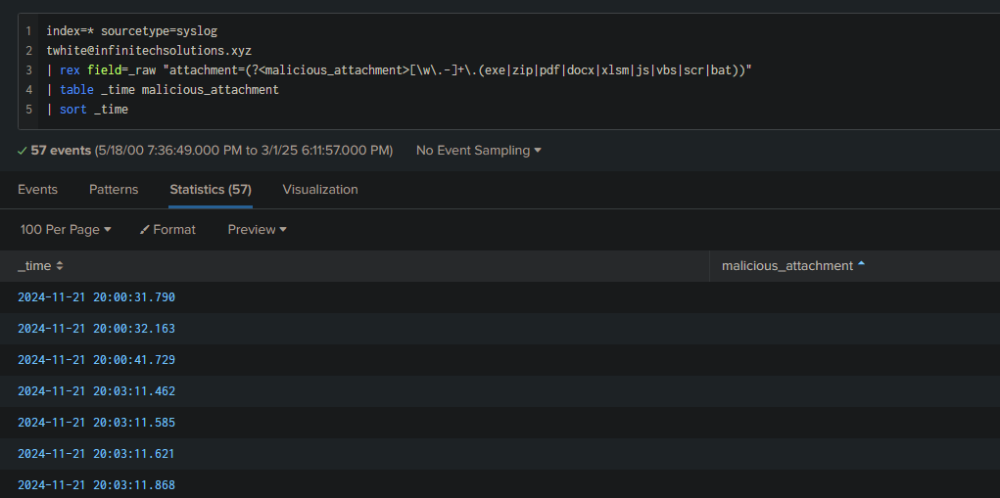
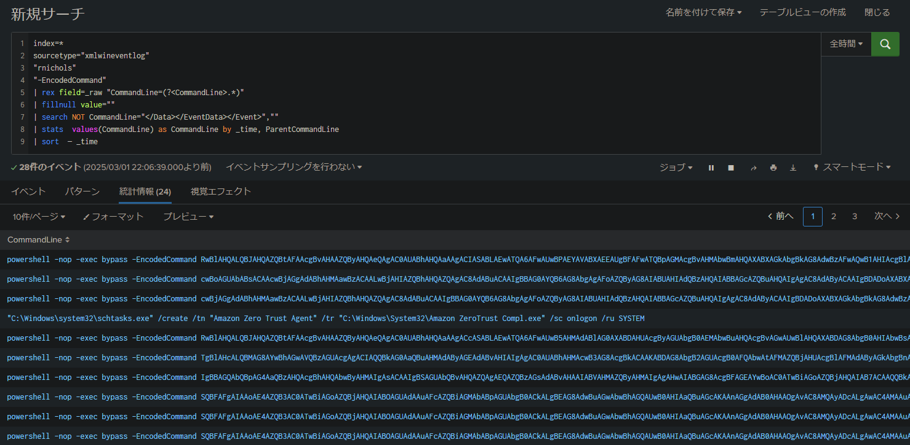
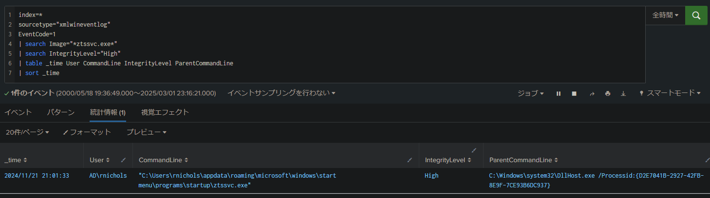
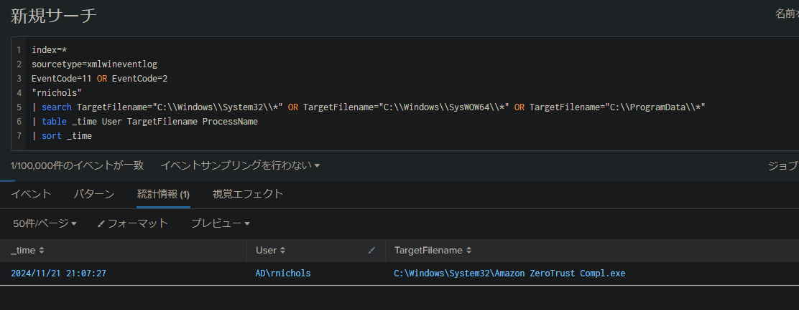

## シナリオ
> InfiniTech Solutions の IT 従業員が、自身のメールアカウントに関連する異常なアクティビティを報告しました。調査の結果、その従業員の業務用認証情報が、最近のデータ漏洩により流出していたことが判明しました。
> 
> 従業員は、業務用メールアドレスを使ってサードパーティのプラットフォームに登録したため、認証情報が露出してしまいました。攻撃者はこの認証情報を悪用し、従業員のメールアカウントにアクセス、社内の他の従業員へフィッシングメールを送信しました。
> 
> あなたのタスクは、ログを解析し、攻撃の範囲を把握し、ユーザーがフィッシングメールとどのように関わったのかを特定し、フィッシングキャンペーンがネットワークに与えた影響を明らかにすることです。

## セットアップ
この調査シナリオでは、主に Splunk Search を使ってログを解析します。また、xml.onlineviewer、Cyberchef、VirusTotal といった他のツールも併用します。

## 注意事項
Splunk は、システム、アプリケーション、ネットワーク機器などが生成するデータを収集、インデックス化、検索するための解析プラットフォームです。エンドポイントにインストールされたエージェント、ログファイルの取り込み、あるいは API を通じてログを取得します。

取得したデータはインデックス化され、整理されることで検索プロセスが容易になります。Splunk は、このデータを問い合わせるために SPL（Search Processing Language）を使用します。

## 初期アクセス

### 質問 1
**どのメールアカウントが侵害され、攻撃の発信に使われたのか？**

まず、システム上で利用可能な "sourcetypes" を確認してみましょう:

```sql
index="main" 
| stats count by sourcetype
```

Splunk の sourcetype は、収集されたイベントのデータタイプや発信元を示すラベルです。


この質問に答えるため、まず "syslog" に注目します。syslog は、様々なデバイスから生成されるログを集約し、システムやセキュリティの詳細な情報を含むことが多いです。

情報が溢れ出すのを防ぐため、正規表現を用いてメールアドレスのみを表示するように検索します:

```sql
* sourcetype=syslog
| regex _raw="[\w\.-]+@[\w\.-]+\.\w+"
``` 

大量のログが表示されるので、各メールアドレスの出現回数をカウントし、テーブル形式で結果を表示します:
```sql
* sourcetype=syslog 
| rex field=_raw "(?<email>[\w\.-]+@[\w\.-]+\.\w+)" 
| stats count by email 
| sort -count 
| head 10
| rename count AS "Number of occurrences", email AS "Email address"
```

これをグラフで可視化することも可能です:


**回答**: ``twhite@infinitechsolutions.xyz``

### 質問 2
**侵害されたアカウントを特定した後、攻撃者は社内の他の従業員にフィッシングメールを送信しました。時系列順に、カンマ区切りでこれらの従業員の名前を教えてください。**

メール送信ログのフォーマットは以下の通りです: 
```css
User [sender_email] [IP_address]; Message [message_ID] for [recipient_email]
```

検索には以下のクエリを実行します: 
```sql
* sourcetype=syslog 
"User twhite@infinitechsolutions.xyz"
| rex field=_raw "Message <[^>]+> for (?<recipient>[\w\.-]+@[\w\.-]+\.\w+)"
| table _time recipient
| sort _time
| stats list(recipient) as recipients
| eval recipients=mvjoin(recipients, ", ")
```

このクエリにより、受信者が時系列順に抽出され、一覧表示されます。

具体的には、侵害されたアカウントのユーザーを選択し、正規表現で受信者のメールアドレスを抽出して変数に格納しています。その後、結果を時系列で並べ替え、読みやすい形式に整えています。


**回答**: ``rnichols,llopez,gbaker,ahall``

### 質問 3
**侵害されたアカウントから送信された悪意のある添付ファイルの名前は何ですか？**

この質問は、予想以上に手間取りました。最初は、以下のように検索しました: 
```sql
* sourcetype=syslog 
  "User twhite@infinitechsolutions.xyz" 
  | regex _raw="for (rnichols|llopez|gbaker|ahall)@infinitechsolutions\.xyz"
```

しかし、添付ファイルの痕跡は一切見つかりませんでした。そこで、「ふむ、正しい sourcetype にいないのか、他のものも検索してみよう」と思い、次のクエリで検索しました: 
```sql
index=* "twhite@infinitechsolutions.xyz" 
| stats count by sourcetype
```


利用可能な sourcetype は **syslog** のみなので、正しい場所にいることが分かります。それから、フォーマットの問題を回避するために、単にファイル拡張子を探す方法に切り替えました。

ChatGPT にファイル拡張子のリストを求めた結果、以下のクエリにたどり着きました: 
```sql
index=* sourcetype=syslog
twhite@infinitechsolutions.xyz
| rex field=_raw "attachment=(?<malicious_attachment>[\w\.-]+\.(exe|zip|pdf|docx|xlsm|js|vbs|scr|bat))"
| table _time malicious_attachment
| sort _time
```



それでも添付ファイルは見つかりませんでした。

どうしても行き詰まったので、別の視点から考えることにしました。ラボのタイトルが "Midnight RDP" であることから、これは「Midnight Blizzard」として知られる APT を思い出させました。


調査中に、「How Midnight Blizzard Uses Malicious .RDP Files to Exploit Windows Systems: A Technical Guide」（著: Yua Mikanana）という記事も見つけました。

ラボのタイトルを考えると、答えは明らかでした。そこで、".RDP" を検索した結果、以下のファイルが見つかりました:


**回答**: ``cloud zerotrust compliance.rdp``

## 実行

### 質問 1
**ユーザーの相互作用を分析した結果、悪意のある添付ファイルをダウンロードして実行した従業員は誰ですか？**

sourcetype を変更して、WinEventLog に切り替えます。

WinEventLog は、Windows のイベントログで、エラー、警告、セキュリティ情報、またはアプリケーションイベントなど、システム上の様々な活動を記録し、追跡および解析を可能にします。

```sql
index=* sourcetype="xmlwineventlog" 
cloud zerotrust compliance.rdp
```


ここで、ファイルをダウンロードしたユーザーのユーザー名が明確に確認できます: **C:\Users\rnichols\Downloads\cloud zerotrust compliance.rdp**

**回答**: ``rnichols``

### 質問 2
**DC マシン上で、攻撃者がメモリ内で実行した DLL タグについて、この悪意のある DLL ファイルの SHA-256 ハッシュの最初の 10 バイトは何ですか？**

まず、DC 上で PowerShell に関連する DLL をリストアップします:
```sql
index=* sourcetype=xmlwineventlog 
"Powershell"
| search host="DC01"
| rex field=_raw "(?<file>\b\w{6,8}\.\w{3}\b)"
| search file="*dll"
```


完全なスクリプトが 1 つのイベントに収録するには長すぎるため、セグメントに分割されていることが分かります。これは ``MessageNumber`` によって確認できます:


2 つのイベントは同じ ActivityID ``{0B39225B-3C43-0001-5078-390B433CDB01}`` やその他の識別子を共有しており、同じスクリプト実行に属していることを示しています。

最初のセグメント (``MessageNumber = 1``) には、PowerShell 環境の設定や、``func_get_proc_address``、``func_get_delegate_type`` といった関数の定義など、スクリプトの冒頭部分が含まれています。


最後のセグメント (``MessageNumber = 33``) には、Base64 文字列（キー 35 で XOR されたもの）のデコードや、デコードされたコードを実行するためのメモリ割り当て部分が含まれています。


これらのセグメントを合わせることで、メモリ内にコードを注入・実行するためのペイロード全体が再構成されます。

再構成されたスクリプトは、難読化されたペイロード（まず Base64、次に 35 で XOR されたもの）をデコードし、ネイティブな Windows 関数（例: ``VirtualAlloc`` を介した ``GetProcAddress`` や ``GetDelegateForFunctionPointer``）を使用してメモリを割り当て、悪意のあるコードを実行します。

```powershell
[...]
$var [...] -bxor 35
[...]
```

Splunk 検索を使用して再構成することができます:
```sql
index=* sourcetype=xmlwineventlog 
EventID=4104
0B39225B-3C43-0001-5078-390B433CDB01
| stats values(ScriptBlockText) as Script by SystemTime
| table Script
```


その後、Cyberchef を使ってスクリプトをデコードします:


そして、問題の DLL が見つかります:


最後に、ファイルを抽出し、そのハッシュを取得します:


**回答**: ``0ee6bc20a7f855d881cce962de09c77960ea5c85ca013e3d123fce61109ff8c5``

## Persistence

### 質問 1
**悪意ある接続が確立された後、システム上にファイルがドロップされました。このドロップされたファイルの名前は何ですか？**

.rdp ファイルが 20:45:27 ごろに実行されたことが分かっています（実行セクションの質問 1 を参照）。

そのため、その時刻から検索を開始します。

まず、PowerShell コマンド（Invoke-WebRequest、curl など）を使って Splunk でダウンロードを検索してみましたが、結果は得られませんでした。

そこで、検索クエリを以下のように変更しました:

```sql
index=* 
sourcetype="xmlwineventlog" 
"rnichols" 
| rex field=_raw "CommandLine=(?<CommandLine>.*)" 
| fillnull value="" 
| search NOT CommandLine="</Data></EventData></Event>","" 
| stats  values(CommandLine) as CommandLine by _time, ParentCommandLine    
| sort  — _time
```


なぜこれが動作するのでしょうか？

以下はイベントの詳細です:


フィールド `TerminalSessionId=3` は、ユーザーが RDP セッションを介して接続していたことを強く示唆しています。なぜなら:
- **セッション 0** はしばしば **SYSTEM** に使用されます。
- ローカルの対話セッションは **通常 1 から始まります**。
- **RDP** セッションはしばしばより高い ID（例: `2`, `3` など）を持ちます。

`explorer.exe` は Windows のグラフィカルインターフェースの主要プロセスであり、対話型ユーザーが起動するプログラムのランチャーとして機能します。

**この動作を説明する考えられるシナリオ:**
1. **対話セッション（RDP であるかどうかにかかわらず）:**
   - もし `rnichols` が **RDP 経由**で接続していれば、`explorer.exe` はユーザーシェルとして起動し、**Startup** に定義されたプログラム（`ztssvc.exe`）を実行します。
   - ユーザーが物理的にログインした場合や、`runas` などのサービスを通じても同様の状況が発生します。

2. **ユーザーのログイン時に自動実行:**
   - `ztssvc.exe` が **Startup** に配置されているため、ユーザーがログインするとすぐに実行されます（ローカルログインでも RDP 経由でも）。

3. **`explorer.exe` を介したインジェクションまたは永続化:**
   - 攻撃者が Startup を利用してマルウェアを持続させた場合、`explorer.exe` はユーザーがログインするたびに自動的にそのバイナリを実行します。

4. **攻撃者によるエクスプロイトまたは強制実行:**
   - もし `explorer.exe` が（例えば DLL インジェクションなどにより）改ざんされていれば、`ztssvc.exe` を実行するために使用された可能性があります。

**回答**: ``ztssvc.exe``

### 質問 2
**長期的なアクセスを維持するために、攻撃者は侵害されたマシン上でスケジュールされたタスクを作成しました。このタスクの名前は何ですか？**

```sql
index=* sourcetype="xmlwineventlog"  
EventCode=4698 OR EventCode=4702
| search user="rnichols"
| table _time EventCode TaskName Command User
| rename EventCode as "Event ID", TaskName as "Scheduled Task", Command as "Executed Command"
| sort _time
```


### 質問 3
**永続性戦略の一環として、攻撃者は新たなユーザーアカウントを作成しました。この不正なアカウントの名前は何ですか？**

質問 1 と同じクエリを使用します: 
```sql
index=*  sourcetype="xmlwineventlog" 
"rnichols" 
| rex field=_raw "CommandLine=(?<CommandLine>.*)" 
| fillnull value="" 
| search NOT CommandLine="</Data></EventData></Event>","" 
| stats  values(CommandLine) as CommandLine by _time, ParentCommandLine    
| sort  — _time
```

結果の中に、非常に怪しげなエンコードされた PowerShell コマンドが見つかります:


このコマンドを Cyberchef を使ってデコードしました:


**回答**: ``Administrator``

### 質問 4
**リモートアクセスを容易にするため、攻撃者はリモートデスクトップの設定を変更しました。RDP (Remote Desktop Protocol) 接続の許可を決定するレジストリキーの名前は何ですか？**

多数の Windows システムの調査・管理経験から、既に答えは分かっていましたが、確認方法は以下の通りです:

攻撃者が実行した複数の `-EncodedCommand` を含む PowerShell コマンドを常に検索します:



その中で、以下のコマンドが確認できます:


**回答**: ``fDenyTSConnections``

### 質問 5
**さらなる調査により、DC 上で新しいユーザーアカウントが作成されたことが判明しました。このアカウントの名前は何ですか？**

これは他のホストで行われたのと同じ方法で実施されたと考えられます。そこで、以下のように検索します:

```sql
index=*  
sourcetype="xmlwineventlog"
host="DC01"
"-EncodedCommand"
```


**回答**: ``rniclos``

## 特権昇格

### 質問 1
**特権昇格手法を調査した際、攻撃者が悪用した特権 COM インターフェースの CLSID の最後の 6 バイトは何ですか？**

CLSID は、Windows COM (Component Object Model) において、レジストリ内の COM オブジェクトを識別するためのグローバルに一意な識別子 (GUID) です。

攻撃者は、特権を持つ COM インターフェースの CLSID を利用して、より高い権限でコードを実行します：
- 誤設定された COM オブジェクトを悪用して特権を昇格させます。
- 攻撃者は `regsvr32.exe`、`powershell`、`mshta.exe`、または `rundll32.exe` を介して、特権 COM インターフェース* を作成、操作、または呼び出すことが可能です。

ここでは、マルウェアが ``ztssvc.exe`` であることが分かっているので、``ztssvc.exe`` の実行に関連する EventCode "1"（プロセス作成）イベントを検索し、IntegrityLevel が "High" のものだけをフィルタリングします:

```sql
index=*  
sourcetype="xmlwineventlog" 
EventCode=1
| search Image="*ztssvc.exe*"
| search IntegrityLevel="High" 
| table _time User CommandLine IntegrityLevel ParentCommandLine
| sort _time
```



**回答**: ``7CE93B6DC937``

### 質問 2
**特権昇格のために、攻撃者はシステム上に別のファイルをドロップしました。このファイルの名前は何ですか？**

最初のファイル（``ztssvc.exe``）のダウンロード後に発生したすべての動作を確認するため、同じコマンドを実行します:

```sql
index=*  
sourcetype="xmlwineventlog" 
"rnichols" 
| rex field=_raw "CommandLine=(?<CommandLine>.*)" 
| fillnull value="" 
| search NOT CommandLine="</Data></EventData></Event>","" 
| search NOT ParentCommandLine=""
| stats  values(CommandLine) as CommandLine by _time, ParentCommandLine    
| sort  — _time
```


**回答**: ``Akagi64.exe``

## 防御回避

### 質問 1
**攻撃者は、システムの動作を変更してセキュリティ設定を弱体化させようと試みました。管理者ユーザー向けのユーザーアカウント制御 (UAC) プロンプト設定を管理するレジストリキーの名前は何ですか？**

この回答は、先に観察されたエンコードされた PowerShell コマンド内に見つかります:


**回答**: ``ConsentPromptBehaviorAdmin``

### 質問 2
**検出を回避するため、攻撃者はタグを保護されたシステムディレクトリに移動させました。この移動された悪意あるファイルの名前は何ですか？**

移動が行われた場合、ファイルの作成または名前変更のイベント (Event ID 11 または 2) が発生しているはずです。

```sql
index=*  
sourcetype=xmlwineventlog 
EventCode=11 OR EventCode=2
"rnichols"
| search TargetFilename="C:\\Windows\\System32\\*" OR TargetFilename="C:\\Windows\\SysWOW64\\*" OR TargetFilename="C:\\ProgramData\\*"
| table _time User TargetFilename ProcessName
| sort _time
```



**回答**: ``Amazon ZeroTrust Compl.exe``

## 発見

### 質問 1
**侵害されたマシン上で攻撃者の最初の行動を特定するため、システム情報を収集する最初のコマンドは何でしたか？**

マシンが 20:45:27 に侵害されたことが分かっているので（実行セクションの質問 1 を参照）、その時刻から検索を開始します:

```sql
index=*   
sourcetype="xmlwineventlog"  
"rnichols"  
| rex field=_raw "CommandLine=(?<CommandLine>.*)"  
| fillnull value=""  
| search NOT CommandLine="</Data></EventData></Event>",""  
| search NOT ParentCommandLine=""  
| stats  values(CommandLine) as CommandLine by _time, ParentCommandLine      
| sort  — _time
```


**回答**: ``whoami /groups``

## 横方向の移動

### 質問 1
**攻撃者はどのツールを使用して DC への横方向の移動を行いましたか？**

再度、エンコードされた PowerShell コマンドを調査する必要があります。今回は、``Amazon ZeroTrust Compl.exe`` によって発行されたコマンドです:

```powershell
powershell -nop -exec bypass -EncodedCommand UwBlAHQALQBJAHQAZQBtACAAVwBTAE0AYQBuADoAXABsAG8AYwBhAGwAaABvAHMAdABcAEMAbABpAGUAbgB0AFwAVAByAHUAcwB0AGUAZABIAG8AcwB0AHMAIAAtAFYAYQBsAHUAZQAgACIARABDADAAMQAuAGEAZAAuAGkAbgBmAGkAbgBuAGkAdABlAGMAaABzAG8AbAB1AHQAZQBuAHMALgB4AHkAegAiACAALQBGAG8AcgBjAGUA
```


このコマンドは、``IT01`` 上の Windows Remote Management (WinRM) の設定を変更し、``DC01.ad.infinitechsolutions.xyz`` をリモート接続用に信頼するようにしています。これは、PowerShell リモーティング（**WinRM**）を介した横方向の移動の強い指標です。

**回答**: ``WinRM``

## コマンド＆コントロール

### 質問 1
**攻撃者の活動をたどると、悪意のあるメールが送信された元の IP アドレスは何でしたか？**

フィッシングメールを送信したユーザーを検索することで、最初の質問に戻ります:

```sql
index=* 
sourcetype=syslog 
"User twhite@infinitechsolutions.xyz"
```


**回答**: ``3.78.253.99``


### 質問 2

``cloud zerotrust compliance.rdp`` が ``IT01`` で実行され、送信者のメール IP アドレスが判明しているため、以下のクエリで直接テストできます:

```sql
index=* sourcetype=xmlwineventlog 
(EventCode=1 OR EventCode=3)
| search host="IT01"
| search DestinationPort=3389 AND DestinationIp=3.78.253.99
| table _time User DestinationIp DestinationPort
| sort _time
```


**回答**: ``3.78.253.99:3389``

### 質問 3
**解析の結果、ドロップされたファイルが Cobalt Strike のビーコンとして機能していることが明らかになりました。このビーコンが通信するコマンド＆コントロール (C&C) サーバーのエンドポイントは何ですか？**

まず、どのファイルが Cobalt Strike のビーコンであるかを確認します:


その後、``Amazon ZeroTrust Compl.exe`` がどの IP/ポートに接続したかを調査します:

```sql
index=* sourcetype=xmlwineventlog
EventCode=3
| search Image="*Amazon ZeroTrust Compl.exe*"
| search NOT DestinationIp=""
| table _time User Image DestinationIp DestinationPort Protocol
| sort _time
```
*(EventCode 3 は、Windows マシン上のプロセスが確立したネットワーク接続に対応します)*


**回答**: ``3.78.244.11:8080``

### 質問 4
**DLL の設定を調査すると、ビーコンの通信を指示する 'C2Server' キーにはどのような値が設定されていますか？**

VirusTotal に戻り、「Behavior」タブでこの情報を確認します。


**回答**: ``3.78.244.11,/dot.gif``

---

Lab 完了！


