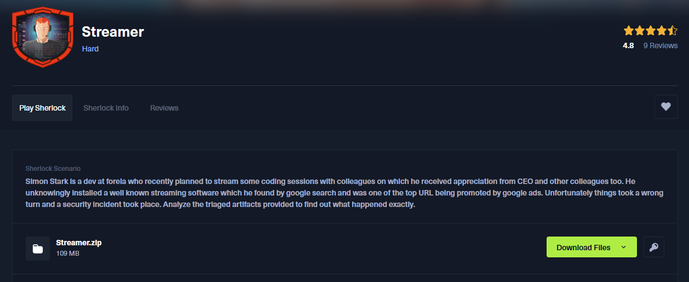
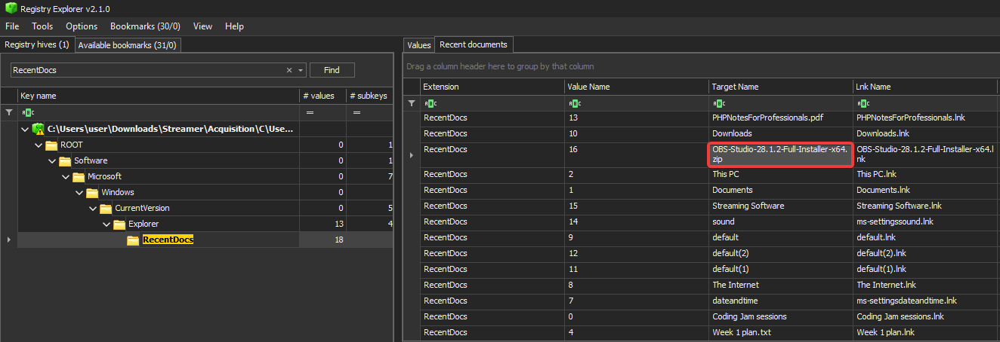
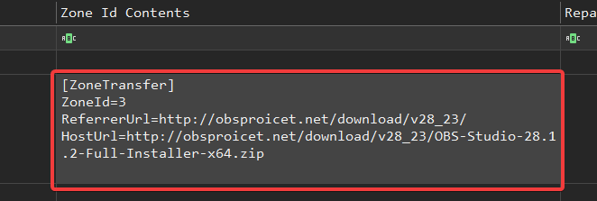
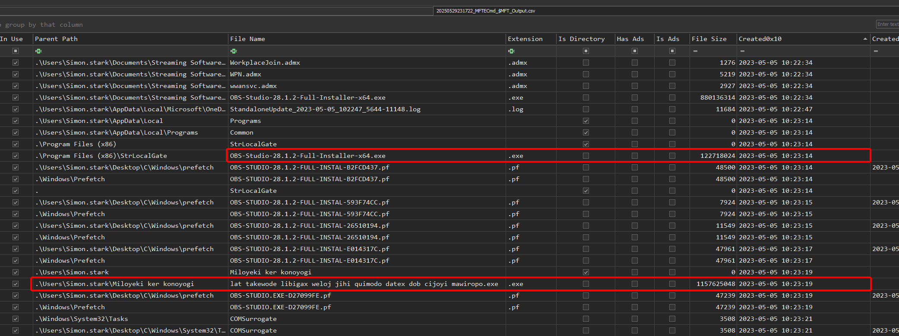
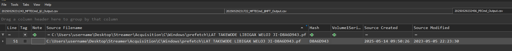
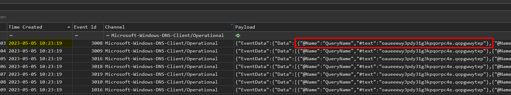
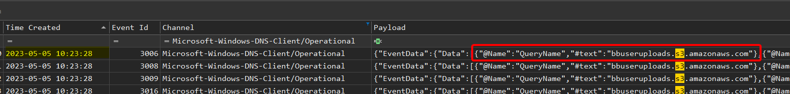
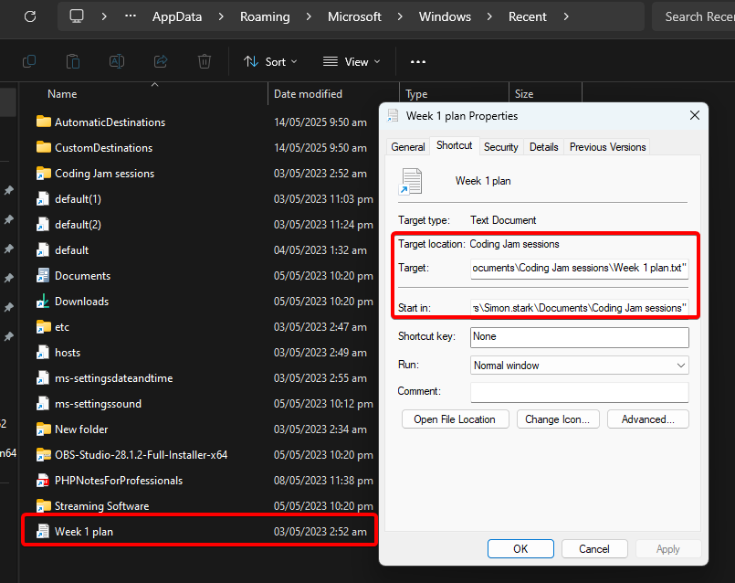
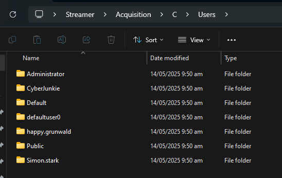
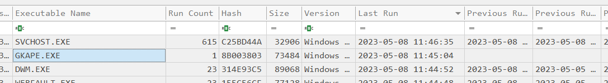

## Scenario
> Simon Stark is a dev at forela who recently planned to stream some coding sessions with colleagues on which he received appreciation from CEO and other colleagues too. He unknowingly installed a well known streaming software which he found by google search and was one of the top URL being promoted by google ads. Unfortunately things took a wrong turn and a security incident took place. Analyze the triaged artifacts provided to find out what happened exactly.


## Attack-Flow Diagram – Overview

*(Skip this if you don’t want spoilers.)*


## Setup
For this Sherlock we’ll use :  
- Eric Zimmerman's Tools (Registry Explorer, EvtxECmd, MFTECmd TimeLine Explorer, PECmd...)
- HxD Hex Editor
- strings

We'll also use those cheat sheets:
- https://cdn.13cubed.com/downloads/windows_event_log_cheat_sheet.pdf
- https://cdn.13cubed.com/downloads/windows_registry_cheat_sheet.pdf
- https://cdn.13cubed.com/downloads/anatomy_of_an_ntfs_file_record.pdf


## Question 1
> What's the original name of the malicious zip file which the user downloaded thinking it was a legit copy of the software?

The answer lives in the user hive **NTUSER.DAT**: the key **RecentDocs** lists files recently opened by the user.



**Answer** : ``OBS-Studio-28.1.2-Full-Installer-x64.zip``

---
## Question 2
> Simon Stark renamed the downloaded zip file to something else. What's the renamed Name of the file alongside the full path?

To answer this question, we first need to understand that any renaming operation under NTFS (the Windows filesystem) generates a modification of the **$FILE_NAME** *(attribute 0x30)* in the MFT. 

We therefore use **MFTECmd** to parse the $MFT: 
```powershell
MFTECmd.exe -f "C:\$MFT" --csv "C:\Temp\Out"
```

Then import it into **Timeline Explorer**:


**Answer** : ``C:\Users\Simon.stark\Documents\Streaming Software\Obs Streaming Software.zip``

---
## Question 3
> What's the timestamp when the file was renamed?

Still in the same place:


**Answer** : ``2023-05-05 10:22:23``

---
## Question 4
> What's the Full URL from where the software was downloaded?

Still in the same place:



Downloading a file under Windows (via a browser like Edge or Internet Explorer) automatically creates an auxiliary data stream on the NTFS called **Zone.Identifier**. 

This ADS ("Alternate Data Stream") is stored with the file itself and contains, in particular:
- **ZoneId** : the security zon (3 = internet)
- **ReferrerUrl** : the URL of the page that launched the download
- **HostUrl** : the exact URL of the downloaded file

**Answer** : ``http://obsproicet.net/download/v28_23/OBS-Studio-28.1.2-Full-Installer-x64.zip``

---
## Question 5
> Dig down deeper and find the IP Address on which the malicious domain was being hosted.

Here it's very simple: we parse the event logs with **EvtxECmd** and look for the domain name: 

```powershell
EvtxECmd.exe -d 'C:\Windows\System32\winevt\Logs\' --csv 'C:\Temp\out'
```


**Answer** : ``13.232.96.186``

---
## Question 6
> Multiple Source ports connected to communicate and download the malicious file from the malicious website. Answer the highest source port number from which the machine connected to the malicious website.

On Windows, if the firewall is configured to log connections, it will record each access attempt, not as a domain name, but as the target IP.

The **pfirewall.log** file (*C:\Windows\System32\LogFiles\Firewall*) records, for each packet examined:
- date and time,
- action (e.g. "ALLOW" or "DROP"),
- protocol (TCP/UDP),
- source IP address,
- destination IP address,
- source and destination ports, etc.

Here there are only 6 connections to this IP, so don't bother, you can find it manually in 5 seconds:


**Answer** : ``50045``

---
## Question 7
> The zip file had a malicious setup file in it which would install a piece of malware and a legit instance of OBS studio software so the user has no idea they got compromised. Find the hash of the setup file.

To answer this question, let's take a look at the Amcache hive. It registers all executables as they are launched, installed, copied, etc. For each application, it stores several metadata: full path, date of appearance, and in particular the **hash SHA1** of the binary.

In concrete terms, when the user has extracted the zip and the malicious setup has been executed (or even simply opened), Windows has added an entry in the:

```r
HKEY_LOCAL_MACHINE\SOFTWARE\Microsoft\Windows\CurrentVersion\AppModel\InventoryApplicationFile
```
(corresponding to Amcache\InventoryApplicationFile in the Amcache.hve hive)


If we'd had a complete copy of the disk, we could have calculated the hash on the fly to go faster. However, this is a bad idea. 

Unlike the simple hash calculated on the fly, **Amcache** records the SHA1 from the first execution or extraction in the local system, regardless of any subsequent modification (unless the Amcache entry is explicitly edited/deleted).

Even if the user has deleted the zip or renamed the setup, Amcache retains this old trace until the file is reinstalled or the entry is cleaned up.

**Answer** : ``35e3582a9ed14f8a4bb81fd6aca3f0009c78a3a1``

---
## Question 8
> The malicious software automatically installed a backdoor on the victim's workstation. What's the name and filepath of the backdoor?

Let's go back to the **$MFT** as it records every file creation and **execution**. 

To proceed, I've simply looked for a temporal link with the execution of the malicious setup:
- I knew that at time T0 (2023-05-05 10:23:14), the user had launched the malicious setup.
- a few seconds later (T0 + a few seconds), a new entry appeared in the timeline: ``C:\Program Files\Miloyeki ker konoyogi\lat takewode libigax weloj jihi quimodo datex dob cijoyi mawiropo.exe``.
- as it didn't exist before (no previous entry in the **$MFT** for this path), we can deduce that this is the file created by the malicious setup.



**Answer** : ``C:\Users\Simon.stark\Miloyeki ker konoyogi\lat takewode libigax weloj jihi quimodo datex dob cijoyi mawiropo.exe``

---
## Question 9
> Find the prefetch hash of the backdoor.

When you run a program under Windows, the system saves a *.pf* (prefetch) file in **C:\Windows\Prefetch** whose name combines:
1. The executable name (`LAT TAKEWODE....exe`)
2. A hash calculated from its full path on disk

This hash is not random; Windows generates it to distinguish several instances of the same executable if they reside in different paths.

```powershell
.\PECmd.exe -d 'C:\Windows\prefetch' --csv 'C:\Temp\Out'
```



**Answer** : ``D8A6D943``

---
## Question 10
> The backdoor is also used as a persistence mechanism in a stealthy manner to blend in the environment. What's the name used for persistence mechanism to make it look legit?

The most commonly used persistence mechanisms are: 
- Run / RunOnce registry keys
- Windows service
- Scheduled tasks
- Startup folder, etc.

Here, it relies on the creation of a scheduled task whose name mimics a **COMSurrogate** system process. When Windows creates or modifies a scheduled task, an event **ID 4698** ("A scheduled task was created") is recorded in the security log (**Security.evtx**).

```powershell
 .\EvtxECmd.exe -d 'C:\Windows\System32\winevt\Logs\' --csv 'C:\Temp\Out\'
```


```xml
<?xml version="1.0" encoding="UTF-16"?>
<Task version="1.2" xmlns="http://schemas.microsoft.com/windows/2004/02/mit/task">
  <RegistrationInfo>
    <Date>2023-05-05T15:23:21</Date>
    <Author>FORELA\simon.stark</Author>
    <URI>\COMSurrogate</URI>
  </RegistrationInfo>
  <Triggers>
    <LogonTrigger>
      <StartBoundary>2023-05-05T15:23:00</StartBoundary>
      <Enabled>true</Enabled>
    </LogonTrigger>
  </Triggers>
  <Principals>
    <Principal id="Author">
      <RunLevel>HighestAvailable</RunLevel>
      <UserId>FORELA\simon.stark</UserId>
      <LogonType>InteractiveToken</LogonType>
    </Principal>
  </Principals>
  <Settings>
    <MultipleInstancesPolicy>IgnoreNew</MultipleInstancesPolicy>
    <DisallowStartIfOnBatteries>true</DisallowStartIfOnBatteries>
    <StopIfGoingOnBatteries>true</StopIfGoingOnBatteries>
    <AllowHardTerminate>true</AllowHardTerminate>
    <StartWhenAvailable>false</StartWhenAvailable>
    <RunOnlyIfNetworkAvailable>false</RunOnlyIfNetworkAvailable>
    <IdleSettings>
      <Duration>PT10M</Duration>
      <WaitTimeout>PT1H</WaitTimeout>
      <StopOnIdleEnd>true</StopOnIdleEnd>
      <RestartOnIdle>false</RestartOnIdle>
    </IdleSettings>
    <AllowStartOnDemand>true</AllowStartOnDemand>
    <Enabled>true</Enabled>
    <Hidden>false</Hidden>
    <RunOnlyIfIdle>false</RunOnlyIfIdle>
    <WakeToRun>false</WakeToRun>
    <ExecutionTimeLimit>PT72H</ExecutionTimeLimit>
    <Priority>7</Priority>
  </Settings>
  <Actions Context="Author">
    <Exec>
      <Command>C:\Users\Simon.stark\Miloyeki</Command>
      <Arguments>ker konoyogi\lat takewode libigax weloj jihi quimodo datex dob cijoyi mawiropo.exe</Arguments>
    </Exec>
  </Actions>
</Task>
```

**Answer** : ``COMSurrogate``

---
## Question 11
> What's the bogus/invalid randomly named domain which the malware tried to reach?

Since the scheduled task was created at 10:23:21, we position ourselves around this time in the **Microsoft-Windows-DNS-Client/Operational** channel to locate the "invalid" domain that the malware tried to resolve.



**Answer** : ``oaueeewy3pdy31g3kpqorpc4e.qopgwwytep``

---
## Question 12
> The malware tried exfiltrating the data to a s3 bucket. What's the url of s3 bucket?

Same but filtered with "s3":



**Answer** : ``bbuseruploads.s3.amazonaws.com``

---
## Question 13
> What topic was simon going to stream about in week 1? Find a note or something similar and recover its content to answer the question.

The user's recent files contain a shortcut to the file "Week 1 plan.txt". But there's no trace of the file, as we don't have a copy of the folder in question. 



So we're going to analyze the **$MFT**. As we have already seen, every file, even if it has been deleted or moved, has an entry in the MFT, and we will be able to find the resident data:


- **Non-resident**: for files of sufficient size, NTFS does not store their data directly in the MFT. The `$DATA` field then contains "runs" (blocks) which point to clusters on the disk where the actual contents are stored.
- **Resident**: when the file is very small (historically: less than 1 KB or of the order of a few hundred bytes, depending on Windows version and attribute size), its data is stored **directly inside the MFT entry**, in the `$DATA` block. This is known as **resident data**.

```r
┌───────────────┬─────────────────────────────────┬─────────────────────┐
│ MFT Header    │ Attribut #0  (STANDARD_INFO)    │  ...                │
│ (48 bytes…)   ├─────────────────────────────────┤                     │
│               │ Attribut #1  (FILE_NAME)│       │                     │
│               ├─────────────────────────────────┤                     │
│               │ Attribut #2  (DATA, resident)   │ <—                  │
│               │                                 │                     │
│               └─────────────────────────────────┴─────────────────────┘
│	......                                                              │
└───────────────────────────────────────────────────────────────────────┘
```

cf. https://youtu.be/B4b6Ocf3wYs?si=rUruujZiEIdjgFKD 


**Answer** : ``Filesystem Security``

---
## Question 14
> What's the name of Security Analyst who triaged the infected workstation?

A little bit of "guess" because this question is not interesting. If you've done a lot of Sherlock, you're starting to get the hang of this CyberJunkie. 



**Answer** : ``CyberJunkie``

---
## Question 15
> What's the network path from where acquisition tools were run?

First, we need to find the tool used. There are several ways of doing this: 
- check the LNK & Jump Lists files
- Event ID 4688 (A new process has been created)
- AmCache (InventoryApplicationFile)
- $MFT as described above
- Prefetch files

For the sake of speed, I decided to use the prefetch files. Logically, the acquisition tool was launched as recently as possible: 



But no path.

So I check in : 
- AppCompatCache: RAS
- Event ID 4688: RAS
- $MFT: RAS

I'll look for NTUSER.DAT but RAS too... Nevertheless, we can see that we have **ntuser.dat.LOG1** and **LOG2**.

These are transaction logs associated with the user registry hive (**NTUSER.DAT**). 

Every modification made to the registry keys and values (for example, when a network path is added to an MRU or a UserAssist key) is first written to this log before being integrated ("committed") into **NTUSER.DAT** itself. In concrete terms:
- this is the transactional log of the user hive: every time an application or Windows writes something to HKCU (RunMRU, UserAssist, RecentDocs, etc.), the modification is first logged in NTUSER.DAT.LOG1 (and LOG2), then merged into NTUSER.DAT at a checkpoint
- if the session is abruptly closed or no checkpoint has yet taken place, NTUSER.DAT.LOG1 may contain entries that do not yet appear in NTUSER.DAT

So I run a string search and bingo: 


**Answer** : ``\\DESKTOP-887GK2L\Users\CyberJunkie\Desktop\Forela-Triage-Workstation\Acquisiton and Triage tools``

---

## IOC Table

| Category              | Field / Type               | Indicator Value                                                                                                                    | Source / Note                                         | Hash (to add)                     |
|-----------------------|----------------------------|------------------------------------------------------------------------------------------------------------------------------------|-------------------------------------------------------|-----------------------------------|
| **Files (origin)**    | Original ZIP               | `OBS-Studio-28.1.2-Full-Installer-x64.zip`                                                                                        | NTUSER.DAT → RecentDocs                               | *(file missing)*                  |
|                       | Malicious setup            | `OBS Studio 28.1.2 Full Installer x64.exe`                                                                                        | Amcache InventoryApplicationFile                      | **SHA-1 = 35e3582a9ed14f8a4bb81fd6aca3f0009c78a3a1** |
|                       | Backdoor EXE               | `C:\Users\Simon.stark\Miloyeki ker konoyogi\lat takewode libigax weloj jihi quimodo datex dob cijoyi mawiropo.exe`               | $MFT                                                  | *(file missing)*           |
| **Network**           | Download domain            | `obsproicet.net`                                                                                                                  | Zone.Identifier ADS                                   | —                                 |
|                       | Exact URL                  | `http://obsproicet.net/download/v28_23/OBS-Studio-28.1.2-Full-Installer-x64.zip`                                                 | Zone.Identifier ADS                                   | —                                 |
|                       | Hosting IP                 | `13.232.96.186`                                                                                                                   | pfirewall.log                                         | —                                 |
|                       | Highest source port        | `50045`                                                                                                                           | pfirewall.log                                         | —                                 |
|                       | Bogus domain               | `oaueeewy3pdy31g3kpqorpc4e.qopgwwytep`                                                                                            | DNS-Client Operational                                | —                                 |
|                       | S3 exfil bucket            | `bbuseruploads.s3.amazonaws.com`                                                                                                  | DNS-Client Operational                                | —                                 |
| **Persistence**       | Scheduled Task name        | `\COMSurrogate`                                                                                                                   | Security.evtx (4698)                                  | —                                 |
|                       | Prefetch hash              | `D8A6D943`                                                                                                                        | Prefetch filename                                     | —                                 |

---

Lab finished! 


https://labs.hackthebox.com/achievement/sherlock/1271052/899