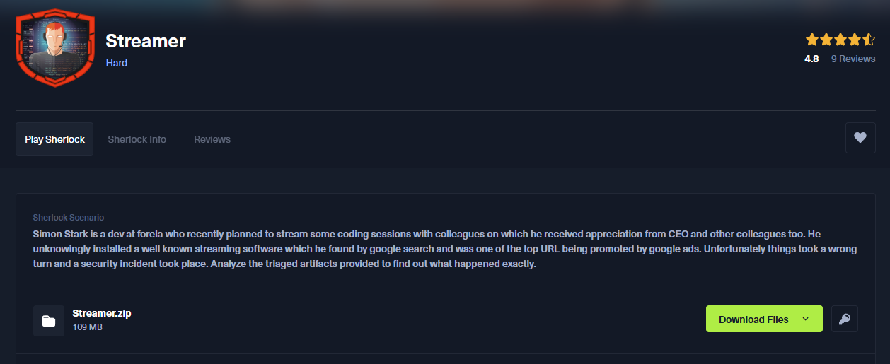

## Scénario
> Simon Stark est un développeur chez forela qui a récemment prévu de diffuser des sessions de programmation avec ses collègues, ce qui lui a valu l'appréciation du PDG et d'autres collègues. Il a installé sans le savoir un logiciel de streaming bien connu qu'il a trouvé par le biais d'une recherche sur Google et qui était l'une des principales URL promues par les publicités de Google. Malheureusement, les choses ont mal tourné et un incident de sécurité s'est produit. Analysez les artefacts triés fournis pour découvrir ce qui s'est passé exactement.


## Attack Flow Diagram - Schéma global

Pour un rapide overview du challenge voici l'attack flow diagram que j'ai réalisé, si vous ne voulez pas vous spoil vous pouvez le sauter :

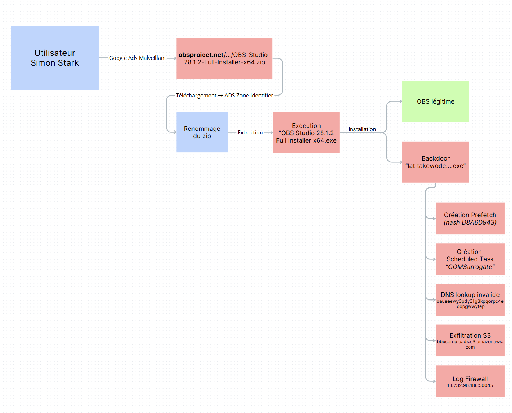


## Setup
Pour ce Sherlock nous allons utiliser : 
- Eric Zimmerman's Tools (Registry Explorer, EvtxECmd, MFTECmd TimeLine Explorer, PECmd...)
- HxD Hex Editor
- strings

Pour nous aider on va aussi s'appuyer sur des Cheatsheets tels que :
- https://cdn.13cubed.com/downloads/windows_event_log_cheat_sheet.pdf
- https://cdn.13cubed.com/downloads/windows_registry_cheat_sheet.pdf
- https://cdn.13cubed.com/downloads/anatomy_of_an_ntfs_file_record.pdf


## Question 1
> Quel est le nom original du fichier zip malveillant que l'utilisateur a téléchargé en pensant qu'il s'agissait d'une copie légitime du logiciel ?

Pour répondre à cette question nous allons chercher dans la hive utilisateur **NTUSER.DAT**. En effet, c'est ici que sont enregistrées, dans la clé *RecentDocs*, les fichiers récemment ouverts par l’utilisateur.

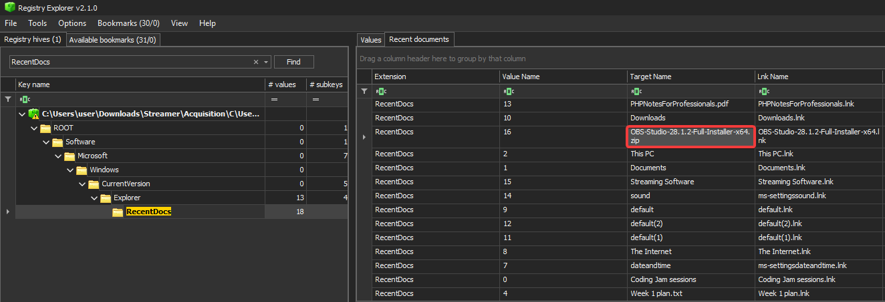

**Réponse** : ``OBS-Studio-28.1.2-Full-Installer-x64.zip``

---
## Question 2
> Simon Stark a renommé le fichier zip téléchargé en un autre nom. Quel est le nom renommé du fichier ainsi que le chemin d'accès complet ?

Pour répondre à cette question, il faut d’abord comprendre que toute opération de renommage sous NTFS (le filesystem de Windows) génère une modification du **$FILE_NAME** *(attribut 0x30)* dans la MFT. 

On utilise donc **MFTECmd** pour parser la $MFT : 
```powershell
MFTECmd.exe -f "C:\$MFT" --csv "C:\Temp\Out"
```

Puis on l'importe dans **Timeline Explorer** :

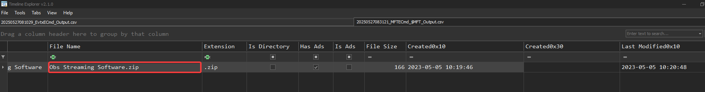

**Réponse** : ``C:\Users\Simon.stark\Documents\Streaming Software\Obs Streaming Software.zip``

---
## Question 3
> Quelle est l'heure à laquelle le fichier a été renommé ?

Toujours au même endroit :

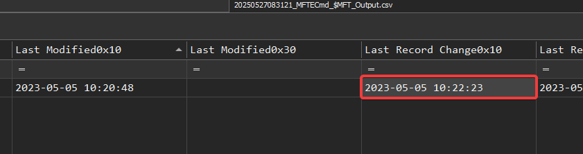

**Réponse** : ``2023-05-05 10:22:23``

---
## Question 4
> Quelle est l'URL complète à partir de laquelle le logiciel a été téléchargé ?

Toujours au même endroit : 

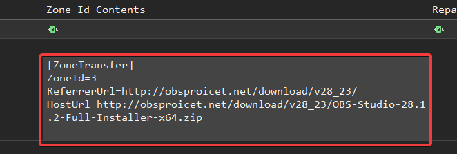

Le fait de télécharger un fichier sous Windows (via un navigateur comme Edge ou Internet Explorer) crée automatiquement, sur le NTFS, un flux de données auxiliaire nommé **Zone.Identifier**. 

Ce flux ADS (“Alternate Data Stream”) est stocké avec le fichier lui-même et contient notamment :
- **ZoneId** : la zone de sécurité (3 = internet)
- **ReferrerUrl** : l’URL de la page qui a lancé le téléchargement
- **HostUrl** : l’URL exacte du fichier téléchargé

**Réponse** : ``http://obsproicet.net/download/v28_23/OBS-Studio-28.1.2-Full-Installer-x64.zip``

---
## Question 5
> Approfondissez vos recherches et trouvez l'adresse IP sur laquelle le domaine malveillant était hébergé.

Ici très simple, on parse avec **EvtxECmd** les event logs et on cherche le nom de domaine : 

```powershell
EvtxECmd.exe -d 'C:\Windows\System32\winevt\Logs\' --csv 'C:\Temp\out'
```


**Réponse** : ``13.232.96.186``

---
## Question 6
> Plusieurs ports sources sont connectés pour communiquer et télécharger le fichier malveillant à partir du site web malveillant. Répondez au numéro de port source le plus élevé à partir duquel la machine s'est connectée au site web malveillant.

Sur Windows si le pare-feu est configuré pour loggé les connexions, il va enregistrer chaque tentative d’accès, non pas sous forme de nom de domaine, mais sous la forme de l’IP cible.

Le fichier **pfirewall.log** (*C:\Windows\System32\LogFiles\Firewall*) enregistre, pour chaque paquet examiné :
- la date et l’heure,
- l’action (par exemple “ALLOW” ou “DROP”),
- le protocole (TCP/UDP),
- l’adresse IP source,
- l’adresse IP de destination,
- les ports source et destination etc.

Ici seulement 6 connexions à cette IP donc pas la peine de s'embêter, on peut le trouver manuellement en 5 secondes :

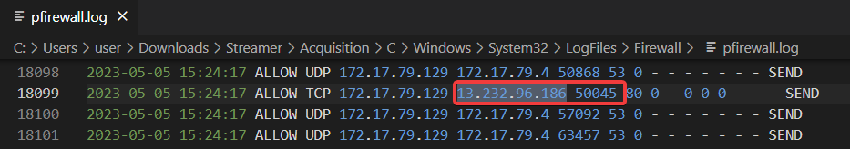

**Réponse** : ``50045``

---
## Question 7
> Le fichier zip contenait un fichier d'installation malveillant qui installait un logiciel malveillant et une instance légitime du logiciel OBS studio, de sorte que l'utilisateur n'avait aucune idée qu'il avait été compromis. Trouvez le hachage du fichier d'installation.

Pour répondre à cette question on va chercher du côté de la hive Amcache. Elle recense tous les exécutables lorsqu’ils sont lancés, installés, copiés, etc. Elle stocke pour chaque application plusieurs metadata : chemin complet, date d’apparition, et notamment le **hash SHA1** du binaire.

Concrètement, au moment où l’utilisateur a extrait le zip et que le setup malveillant a été exécuté (ou même simplement ouvert en soit), Windows a ajouté une entrée dans la clé :

```r
HKEY_LOCAL_MACHINE\SOFTWARE\Microsoft\Windows\CurrentVersion\AppModel\InventoryApplicationFile
```
(correspondant à Amcache\InventoryApplicationFile dans le hive Amcache.hve)

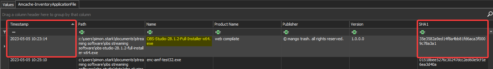

Si nous avions eu une copie du disque complète, on aurait pu calculer le hash à la volée pour aller plus rapidement. Néanmoins, c'est une mauvaise idée. 

Contrairement au simple hash calculé à la volée, **Amcache** enregistre le SHA1 dès la première exécution ou extraction dans le système local, indépendamment de toute modification ultérieure (à moins que l’entrée Amcache soit explicitement édité / supprimé).

Même si l’utilisateur a effacé le zip ou renommé le setup, Amcache conserve cette ancienne trace tant que le fichier n’est pas réinstallé ou que l’entrée n’est pas nettoyée.

**Réponse** : ``35e3582a9ed14f8a4bb81fd6aca3f0009c78a3a1``

---
## Question 8
> Le logiciel malveillant a installé automatiquement une porte dérobée sur le poste de travail de la victime. Quels sont le nom et le chemin d'accès au fichier de la porte dérobée ?

Retournons à la **$MFT** car elle enregistre chaque création et **exécution** de fichier. 

Pour procéder j'ai simplement chercher un lien temporel avec l'exécution du setup malveillant :
- je savais qu’à l’instant T0 (2023-05-05 10:23:14), l’utilisateur a lancé le setup malveillant
- quelques secondes plus tard (T0 + quelques secondes) apparaît dans la chronologie une nouvelle entrée : ``C:\Program Files\Miloyeki ker konoyogi\lat takewode libigax weloj jihi quimodo datex dob cijoyi mawiropo.exe``
- comme il n’existait pas avant (aucune entrée antérieure dans le **$MFT** pour ce chemin), on en déduit que c’est ce fichier qu’a créé le setup malveillant.

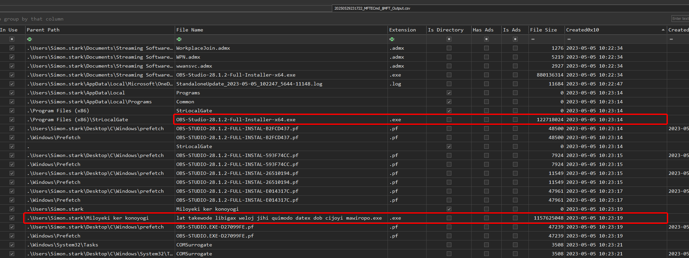

**Réponse** : ``C:\Users\Simon.stark\Miloyeki ker konoyogi\lat takewode libigax weloj jihi quimodo datex dob cijoyi mawiropo.exe``

---
## Question 9
> Trouver le "prefetch hash" de la backdoor.

Lorsque qu'on exécute un programme sous Windows, le système enregistre un fichier *.pf* (prefetch) dans **C:\Windows\Prefetch** dont le nom combine :
1. Le nom de l’exécutable (`LAT TAKEWODE….exe`)
2. Un hash calculé à partir de son chemin complet sur le disque

Ce hash n’est pas aléatoire, Windows le génère pour distinguer plusieurs instances du même exécutable si elles résident à des chemins différents.

```powershell
.\PECmd.exe -d 'C:\Windows\prefetch' --csv 'C:\Temp\Out'
```

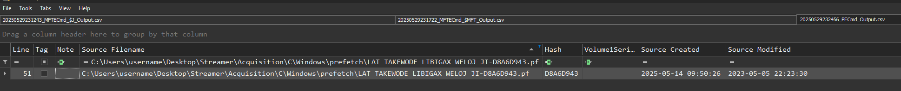

**Réponse** : ``D8A6D943``

---
## Question 10
> La backdoor est également utilisée comme mécanisme de persistance de manière furtive pour se fondre dans l'environnement. Quel est le nom utilisé pour le mécanisme de persistance afin qu'il ait l'air légal ?

Les mécanismes de persistance les plus couramment mis en oeuvre sont : 
- Clés de registre Run / RunOnce
- Service Windows
- Tâches planifiées
- Dossier de démarrage (dossier Startup) etc.

Ici, il repose sur la création d’une tâche planifiée dont le nom imite un processus système **COMSurrogate**. Quand Windows crée ou modifie une tâche planifiée, un événement **ID 4698** (“A scheduled task was created”) est enregistré dans le journal de sécurité (**Security.evtx**).

```powershell
 .\EvtxECmd.exe -d 'C:\Windows\System32\winevt\Logs\' --csv 'C:\Temp\Out\'
```

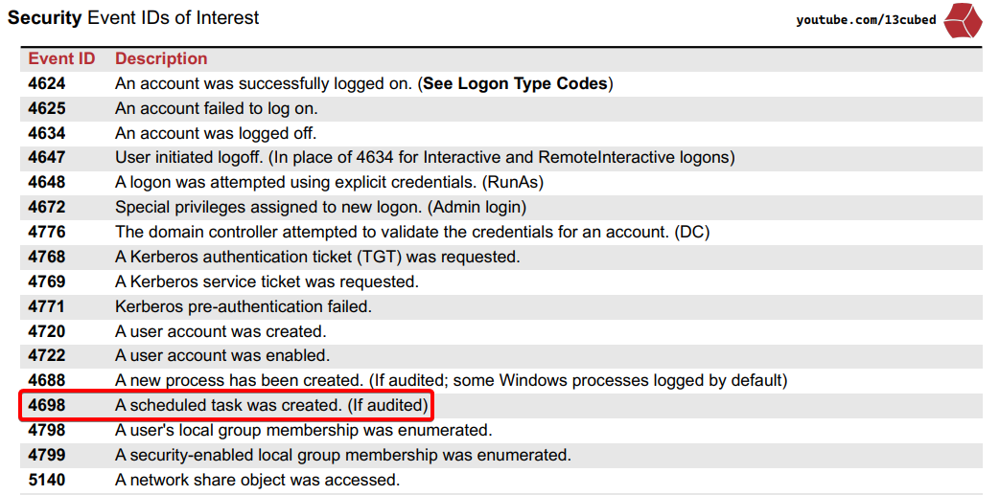

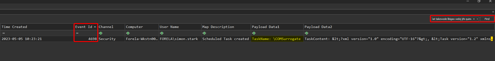

```xml
<?xml version="1.0" encoding="UTF-16"?>
<Task version="1.2" xmlns="http://schemas.microsoft.com/windows/2004/02/mit/task">
  <RegistrationInfo>
    <Date>2023-05-05T15:23:21</Date>
    <Author>FORELA\simon.stark</Author>
    <URI>\COMSurrogate</URI>
  </RegistrationInfo>
  <Triggers>
    <LogonTrigger>
      <StartBoundary>2023-05-05T15:23:00</StartBoundary>
      <Enabled>true</Enabled>
    </LogonTrigger>
  </Triggers>
  <Principals>
    <Principal id="Author">
      <RunLevel>HighestAvailable</RunLevel>
      <UserId>FORELA\simon.stark</UserId>
      <LogonType>InteractiveToken</LogonType>
    </Principal>
  </Principals>
  <Settings>
    <MultipleInstancesPolicy>IgnoreNew</MultipleInstancesPolicy>
    <DisallowStartIfOnBatteries>true</DisallowStartIfOnBatteries>
    <StopIfGoingOnBatteries>true</StopIfGoingOnBatteries>
    <AllowHardTerminate>true</AllowHardTerminate>
    <StartWhenAvailable>false</StartWhenAvailable>
    <RunOnlyIfNetworkAvailable>false</RunOnlyIfNetworkAvailable>
    <IdleSettings>
      <Duration>PT10M</Duration>
      <WaitTimeout>PT1H</WaitTimeout>
      <StopOnIdleEnd>true</StopOnIdleEnd>
      <RestartOnIdle>false</RestartOnIdle>
    </IdleSettings>
    <AllowStartOnDemand>true</AllowStartOnDemand>
    <Enabled>true</Enabled>
    <Hidden>false</Hidden>
    <RunOnlyIfIdle>false</RunOnlyIfIdle>
    <WakeToRun>false</WakeToRun>
    <ExecutionTimeLimit>PT72H</ExecutionTimeLimit>
    <Priority>7</Priority>
  </Settings>
  <Actions Context="Author">
    <Exec>
      <Command>C:\Users\Simon.stark\Miloyeki</Command>
      <Arguments>ker konoyogi\lat takewode libigax weloj jihi quimodo datex dob cijoyi mawiropo.exe</Arguments>
    </Exec>
  </Actions>
</Task>
```

**Réponse** : ``COMSurrogate``

---
## Question 11
> Quel est le domaine erroné/invalide nommé de manière aléatoire que le logiciel malveillant a tenté d'atteindre ?

Puisque la tâche planifiée a été créée à 10:23:21, on se place autour de cet horaire dans le channel **Microsoft-Windows-DNS-Client/Operational** pour repérer le domaine "invalide" que le malware a tenté de résoudre.

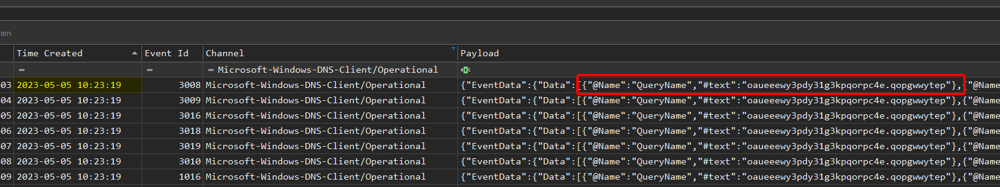

**Réponse** : ``oaueeewy3pdy31g3kpqorpc4e.qopgwwytep``

---
## Question 12
> Le logiciel malveillant a essayé d'exfiltrer les données vers un seau s3. Quelle est l'url du seau s3 ?

Idem mais on filtre avec "s3" :

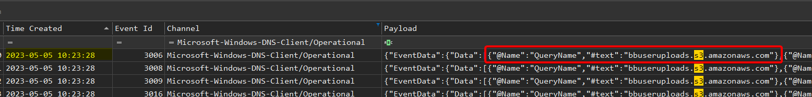

**Réponse** : ``bbuseruploads.s3.amazonaws.com``

---
## Question 13
> Sur quel sujet Simon allait-il faire un stream en semaine 1 ? Trouvez une note ou quelque chose de similaire et récupérez son contenu pour répondre à la question.

On retrouve dans les fichiers récents de l'utilisateur un shortcut vers le fichier "Week 1 plan.txt". Mais aucune trace du fichier car on n'a pas la copie du dossier en question. 

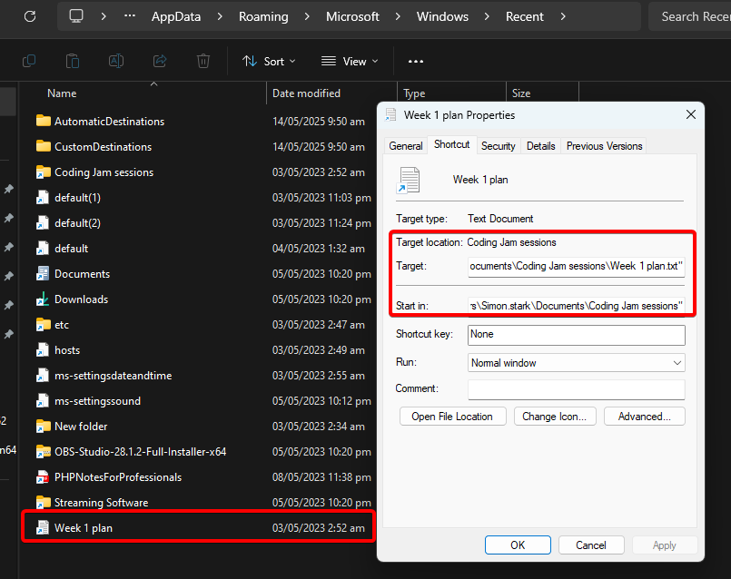

On va donc analyser la **$MFT**. Comme on l'a déjà vu, chaque fichier même s'il a été effacé ou déplacé possède une entrée dans la MFT et on va pouvoir retrouver la "resident data" :

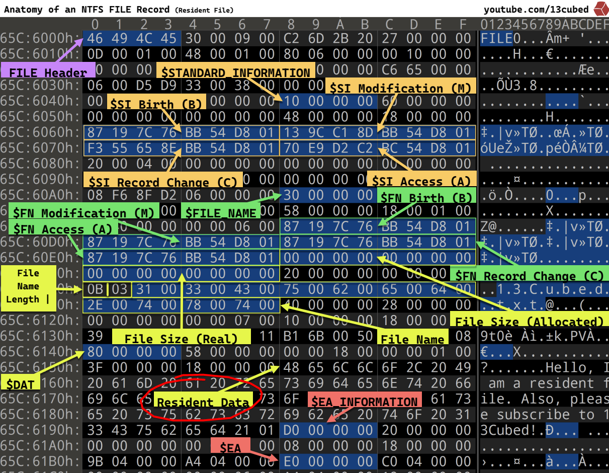

- **Non-resident** : pour les fichiers de taille suffisante, NTFS ne stocke pas directement leurs données dans la MFT. Le champ `$DATA` contient alors des “runs” (des blocs) qui pointent vers des clusters sur le disque où le contenu réel est stocké.
- **Resident** : quand que le fichier est très petit (historiquement : moins de 1 KB ou de l’ordre de quelques centaines d’octets, selon la version de Windows et la taille de l’attribut), ses données sont stockées **directement à l’intérieur même de l’entrée MFT**, dans le bloc `$DATA`. On parle alors de **resident data**.

```r
┌───────────────┬─────────────────────────────────┬─────────────────────┐
│ MFT Header    │ Attribut #0  (STANDARD_INFO)    │  ...                │
│ (48 bytes…)   ├─────────────────────────────────┤                     │
│               │ Attribut #1  (FILE_NAME)│       │                     │
│               ├─────────────────────────────────┤                     │
│               │ Attribut #2  (DATA, resident)   │ <— c’est là qu’est  │
│               │                                 │    stocké le texte. │
│               └─────────────────────────────────┴─────────────────────┘
│	......                                                              │
└───────────────────────────────────────────────────────────────────────┘
```

cf. https://youtu.be/B4b6Ocf3wYs?si=rUruujZiEIdjgFKD 

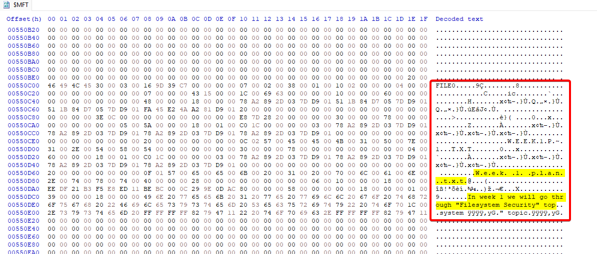

**Réponse** : ``Filesystem Security``

---
## Question 14
> Quel est le nom de l'analyste de sécurité qui a trié le poste de travail infecté ?

Un peu de guess car la question n'est pas très intéressante, si vous avez fait pas mal de Sherlock vous commencez à avoir l'habitude c'est CyberJunkie. 

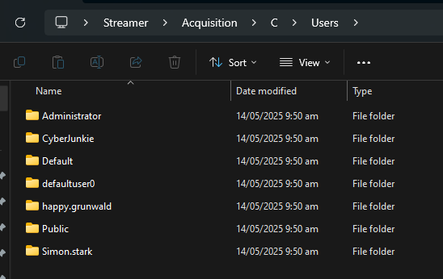

**Réponse** : ``CyberJunkie``

---
## Question 15
> Quel est le chemin d'accès au réseau à partir duquel les outils d'acquisition ont été exécutés ?

Premièrement nous devons trouver le tool utilisé. Pour cela, plusieurs méthodes : 
- vérifier les fichiers LNK & Jump Lists
- Event ID 4688 (A new process has been created)
- AmCache (InventoryApplicationFile)
- $MFT comme on l'a vu plus tôt
- Les fichiers Prefetch

Pour le plus de rapidité j'ai décidé de passer via les fichiers prefetch. Logiquement le tool d'acquisition a été lancé le plus récemment possible : 

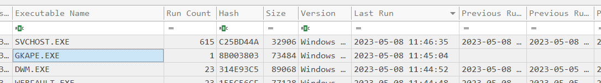

Néanmoins pas de chemin.

Du coup, je vérifie dans : 
- AppCompatCache : RAS
- Event ID 4688 : RAS
- $MFT : RAS

Je vais donc chercher du côté du NTUSER.DAT mais RAS aussi... Néanmoins on voit bien qu'on a **ntuser.dat.LOG1** et **LOG2**.

Ce sont des journaux de transactions associé à la ruche de registre utilisateur (**NTUSER.DAT**). 

Chaque modification apportée aux clés et valeurs du registre (par exemple, lorsqu’un chemin réseau est ajouté dans un MRU ou un clé UserAssist) est d’abord écrite dans ce journal avant d’être intégrée (“committée") dans **NTUSER.DAT** lui-même. Concrètement :
- c’est le log transactionnel de la ruche utilisateur : à chaque fois qu’une application ou Windows écrit quelque chose dans HKCU (RunMRU, UserAssist, RecentDocs, etc.), la modification est d’abord consignées dans NTUSER.DAT.LOG1 (et LOG2), puis fusionnée dans NTUSER.DAT à un checkpoint
- si on ferme brutalement la session ou qu’aucun “checkpoint” n’a encore eu lieu, NTUSER.DAT.LOG1 peut contenir des entrées qui n’apparaissent pas encore dans NTUSER.DAT

Je lance donc une recherche via string et bingo : 

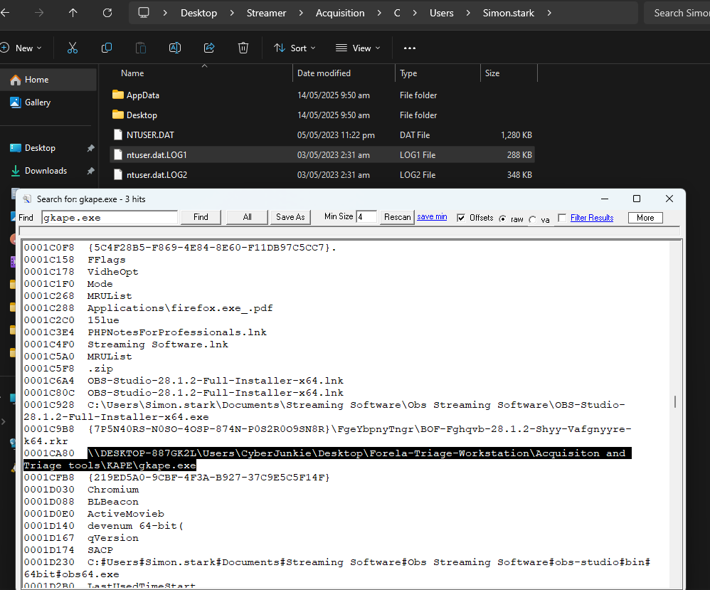

**Réponse** : ``\\DESKTOP-887GK2L\Users\CyberJunkie\Desktop\Forela-Triage-Workstation\Acquisiton and Triage tools``

---

## IOC Table

| Catégorie              | Type / Champ        | Valeur (indicateur)                                                                                                | Notes                              | Hash                                                 |
| ---------------------- | ------------------- | ------------------------------------------------------------------------------------------------------------------ | ---------------------------------- | ---------------------------------------------------- |
| **Fichiers (origine)** | Nom ZIP original    | `OBS-Studio-28.1.2-Full-Installer-x64.zip`                                                                         | NTUSER.DAT ▸ RecentDocs            | RAS (pas le fichier)                                 |
|                        | Setup malveillant   | `OBS Studio 28.1.2 Full Installer x64.exe`                                                                         | Amcache ▸ InventoryApplicationFile | **SHA-1 = 35e3582a9ed14f8a4bb81fd6aca3f0009c78a3a1** |
|                        | Backdoor EXE        | `C:\Users\Simon.stark\Miloyeki ker konoyogi\lat takewode libigax weloj jihi quimodo datex dob cijoyi mawiropo.exe` | $MFT                               | RAS (pas le fichier)                                 |
| **Réseau**             | Domain              | `obsproicet.net`                                                                                                   | ADS Zone.Identifier                |                                                      |
|                        | URL exacte          | `http://obsproicet.net/download/v28_23/OBS-Studio-28.1.2-Full-Installer-x64.zip`                                   | ADS Zone.Identifier                |                                                      |
|                        | IP serveur          | `13.232.96.186`                                                                                                    | pfirewall.log                      |                                                      |
|                        | Port source max     | `50045` (TCP)                                                                                                      | pfirewall.log                      |                                                      |
|                        | Domain invalide     | `oaueeewy3pdy31g3kpqorpc4e.qopgwwytep`                                                                             | DNS-Client Operational             |                                                      |
|                        | Bucket S3 exfil     | `bbuseruploads.s3.amazonaws.com`                                                                                   | DNS-Client Operational             |                                                      |
| **Persistance**        | Scheduled Task Name | `\COMSurrogate`                                                                                                    | Security.evtx (4698)               |                                                      |
|                        | Prefetch hash       | `D8A6D943`                                                                                                         | Nom du .pf                         |                                                      |

---

Lab terminé ! 


https://labs.hackthebox.com/achievement/sherlock/1271052/899