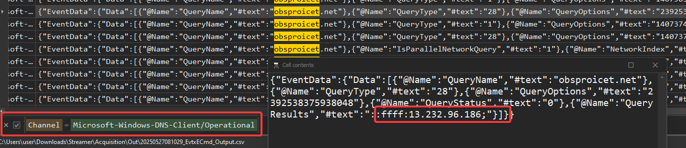
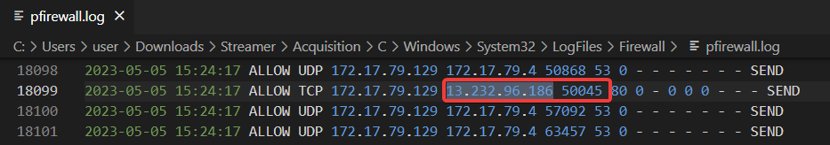
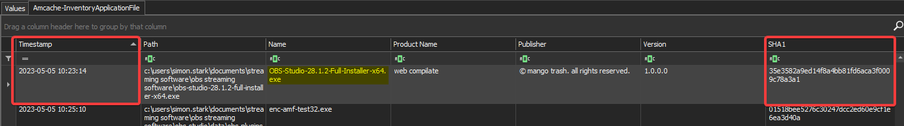
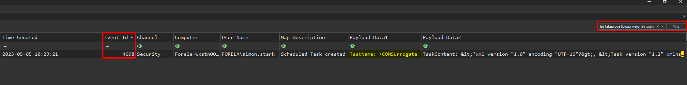
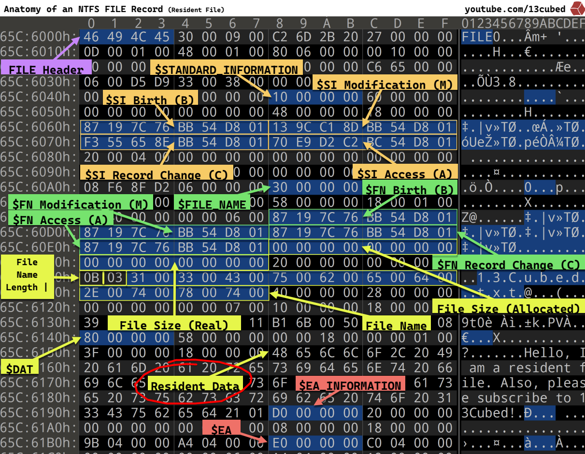
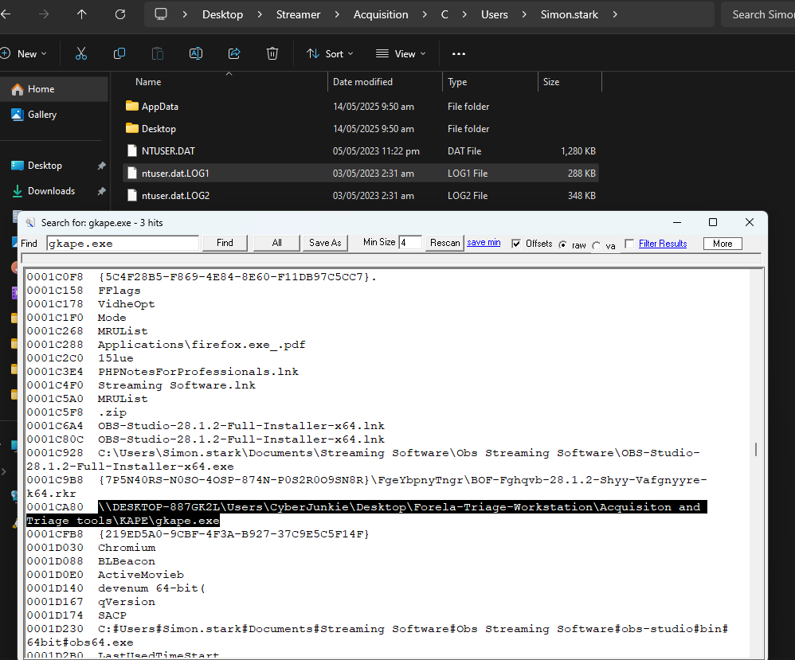

## シナリオ
> Simon Starkはforelaの開発者で、最近同僚と一緒にコーディングセッションをストリーミングしようと計画していて、そのアイデアはCEOや他の同僚からも好評でした。彼はGoogle検索で見つけた有名なストリーミングソフトを何気なくインストールしました。それはGoogle広告で上位に表示されていたURLの一つでした。しかし、残念ながら事態は思わぬ方向へ進み、セキュリティインシデントが発生してしまいました。提供されたトリアージ済みのアーティファクトを分析し、何が起こったのかを正確に突き止めてください。

## 攻撃フロー図 – 概要

*(ネタバレが嫌な場合はスキップしてください。)*


## セットアップ
このSherlockでは以下を使用します：
- Eric Zimmerman氏のツール（Registry Explorer、EvtxECmd、MFTECmd TimeLine Explorer、PECmdなど）
- HxD Hex Editor
- strings

作業を助けるために、以下のチートシートも活用します：
- https://cdn.13cubed.com/downloads/windows_event_log_cheat_sheet.pdf
- https://cdn.13cubed.com/downloads/windows_registry_cheat_sheet.pdf
- https://cdn.13cubed.com/downloads/anatomy_of_an_ntfs_file_record.pdf


## 質問1
> ユーザーが正規のソフトウェアだと思ってダウンロードした悪意のあるZIPファイルの元の名前は何ですか？

回答はユーザーハイブ **NTUSER.DAT** にあります。キー **RecentDocs** はユーザーが最近開いたファイルを一覧表示します。


**回答**： `OBS-Studio-28.1.2-Full-Installer-x64.zip`

---
## 質問2
> Simon StarkはダウンロードしたZIPファイルを別の名前にリネームしました。そのリネームされたファイル名とフルパスは何ですか？

この質問に答えるには、NTFS（Windowsのファイルシステム）上でリネーム操作が行われると、MFTの **$FILE_NAME**（属性0x30）が変更されることを理解する必要があります。

そこで、**MFTECmd** を使って $MFT を解析します：
```powershell
MFTECmd.exe -f "C:\$MFT" --csv "C:\Temp\Out"
```

次に **Timeline Explorer** にインポートします：


**回答**：`C:\Users\Simon.stark\Documents\Streaming Software\Obs Streaming Software.zip`

---
## 質問3
> ファイルがリネームされたタイムスタンプはいつですか？

同じ場所にあります：


**回答**： `2023-05-05 10:22:23`

---
## 質問4
> ソフトウェアがダウンロードされた完全なURLは何ですか？

こちらも同じ場所にあります：


Windowsでファイルをダウンロードすると（EdgeやInternet Explorerのようなブラウザを介して）、NTFS上に**Zone.Identifier**という代替データストリーム（ADS）が自動的に作成されます。

このADS（「代替データストリーム」）はファイル自体と一緒に保存され、特に以下の情報を含みます：
- **ZoneId**：セキュリティゾーン（3 = インターネット）
- **ReferrerUrl**：ダウンロードを開始したページのURL
- **HostUrl**：ダウンロードされたファイルの正確なURL

**回答**： `http://obsproicet.net/download/v28_23/OBS-Studio-28.1.2-Full-Installer-x64.zip`

---
## 質問5
> 深掘りして、悪意あるドメインがホストされていたIPアドレスを見つけてください。

ここでは非常にシンプルです。**EvtxECmd** を使ってイベントログを解析し、ドメイン名を探します：

```powershell
EvtxECmd.exe -d 'C:\Windows\System32\winevt\Logs\' --csv 'C:\Temp\out'
```



**回答**： `13.232.96.186`

---

## 質問6
> マシンが悪意あるウェブサイトに接続してファイルをダウンロードする際に使用された複数のソースポートがありました。その中で、最も高いソースポート番号はいくつですか？

Windowsでは、ファイアウォールが接続ログを記録するように設定されている場合、アクセス試行ごとにドメイン名ではなくターゲットIPとして記録されます。

**pfirewall.log** ファイル（`C:\Windows\System32\LogFiles\Firewall`）には、各パケットの以下の情報が記録されています：
- 日付と時刻
- アクション（例："ALLOW" または "DROP"）
- プロトコル（TCP/UDP）
- ソースIPアドレス
- 宛先IPアドレス
- ソースポートおよび宛先ポート など

今回、このIPへの接続は合計6件しかないので、手動で簡単に確認できます：



**回答**： `50045`

---
## 質問7
> ZIPファイルの中には悪意のあるセットアップファイルが含まれていて、それはマルウェアと正規のOBS Studioを同時にインストールするので、ユーザーは気付かずに感染してしまいます。そのセットアップファイルのハッシュを見つけてください。

この質問に答えるには、まずAmcacheハイブを見てみましょう。Amcacheは、実行・インストール・コピーなどされるすべての実行ファイルを登録しています。各アプリケーションについて、フルパスや出現日時、特にバイナリの**SHA1ハッシュ**などのメタデータを保存しています。

具体的には、ユーザーがZIPを展開して悪意あるセットアップを実行（または単に開いただけでも）すると、Windowsは以下のキーにエントリを追加します：

```r
HKEY_LOCAL_MACHINE\SOFTWARE\Microsoft\Windows\CurrentVersion\AppModel\InventoryApplicationFile
```
（Amcache.hve内のAmcache\InventoryApplicationFileに対応）



もしディスクの完全コピーがあれば、その場でハッシュを計算しても早いですが、それはあまり賢い方法ではありません。

単純にその場でハッシュを計算するのと違い、**Amcache**は最初に実行・展開された時点のSHA1をローカルシステム上に記録し、その後にファイルが改変されたとしても（Amcacheエントリを明示的に編集・削除しない限り）変更前のハッシュを保持し続けます。

たとえユーザーがZIPを削除したりセットアップファイルの名前を変えたりしても、ファイルが再インストールされるかエントリがクリーンアップされるまではAmcacheに痕跡が残ります。

**回答**： `35e3582a9ed14f8a4bb81fd6aca3f0009c78a3a1`

---
## 質問8
> 悪意のあるソフトウェアは被害者のワークステーションにバックドアを自動的にインストールしました。そのバックドアの名前とファイルパスは何ですか？

ここでは再び **$MFT** を参照します。なぜなら、ファイルの作成や**実行**がすべて記録されているからです。

手順としては、まず悪意あるセットアップが実行された時刻と関連付けて調べます：
- 時刻T0（`2023-05-05 10:23:14`）にユーザーが悪意あるセットアップを起動したことがわかっています。
- その数秒後（T0 + 数秒）に新しいタイムラインエントリが現れました：``C:\Program Files\Miloyeki ker konoyogi\lat takewode libigax weloj jihi quimodo datex dob cijoyi mawiropo.exe``
- このパスは以前は存在せず（$MFTにこのパスのエントリがなかった）、悪意のあるセットアップによって新規作成されたことが推測できます。


**回答**: ``C:\Users\Simon.stark\Miloyeki ker konoyogi\lat takewode libigax weloj jihi quimodo datex dob cijoyi mawiropo.exe``

---
## 質問9
> バックドアのプリフェッチハッシュを見つけてください。

Windowsでプログラムを実行すると、システムは **C:\Windows\Prefetch** に拡張子 *.pf* のファイルを保存します。このファイル名は以下の2つを組み合わせたものです：
1. 実行ファイル名（例：`LAT TAKEWODE....exe`）
2. そのファイルのディスク上のフルパスから計算されたハッシュ

このハッシュはランダムではなく、同じ実行ファイルが異なるパスに存在する場合に区別するためにWindowsが生成します。

以下のコマンドでPrefetchフォルダを解析します：

```powershell
.\PECmd.exe -d 'C:\Windows\prefetch' --csv 'C:\Temp\Out'
```


**回答**： `D8A6D943`

---
## 質問10
> バックドアはステルスに環境に溶け込む形で永続化メカニズムとしても利用されています。正当なものに見せかけるためにどの名前を永続化メカニズムとして使用していたのでしょうか？

永続化メカニズムとして一般的によく使われるものには：  
- Run / RunOnce レジストリキー  
- Windowsサービス  
- スケジュールされたタスク  
- スタートアップフォルダー などがあります。

ここでは、**COMSurrogate** システムプロセスを模倣した名前でスケジュールタスクを作成しています。Windowsがスケジュールタスクを作成または変更すると、セキュリティログ（`Security.evtx`）にイベント **ID 4698**（“A scheduled task was created”）が記録されます。

```powershell
 .\EvtxECmd.exe -d 'C:\Windows\System32\winevt\Logs\' --csv 'C:\Temp\Out\'
```




```xml
<?xml version="1.0" encoding="UTF-16"?>
<Task version="1.2" xmlns="http://schemas.microsoft.com/windows/2004/02/mit/task">
  <RegistrationInfo>
    <Date>2023-05-05T15:23:21</Date>
    <Author>FORELA\simon.stark</Author>
    <URI>\COMSurrogate</URI>
  </RegistrationInfo>
  <Triggers>
    <LogonTrigger>
      <StartBoundary>2023-05-05T15:23:00</StartBoundary>
      <Enabled>true</Enabled>
    </LogonTrigger>
  </Triggers>
  <Principals>
    <Principal id="Author">
      <RunLevel>HighestAvailable</RunLevel>
      <UserId>FORELA\simon.stark</UserId>
      <LogonType>InteractiveToken</LogonType>
    </Principal>
  </Principals>
  <Settings>
    <MultipleInstancesPolicy>IgnoreNew</MultipleInstancesPolicy>
    <DisallowStartIfOnBatteries>true</DisallowStartIfOnBatteries>
    <StopIfGoingOnBatteries>true</StopIfGoingOnBatteries>
    <AllowHardTerminate>true</AllowHardTerminate>
    <StartWhenAvailable>false</StartWhenAvailable>
    <RunOnlyIfNetworkAvailable>false</RunOnlyIfNetworkAvailable>
    <IdleSettings>
      <Duration>PT10M</Duration>
      <WaitTimeout>PT1H</WaitTimeout>
      <StopOnIdleEnd>true</StopOnIdleEnd>
      <RestartOnIdle>false</RestartOnIdle>
    </IdleSettings>
    <AllowStartOnDemand>true</AllowStartOnDemand>
    <Enabled>true</Enabled>
    <Hidden>false</Hidden>
    <RunOnlyIfIdle>false</RunOnlyIfIdle>
    <WakeToRun>false</WakeToRun>
    <ExecutionTimeLimit>PT72H</ExecutionTimeLimit>
    <Priority>7</Priority>
  </Settings>
  <Actions Context="Author">
    <Exec>
      <Command>C:\Users\Simon.stark\Miloyeki</Command>
      <Arguments>ker konoyogi\lat takewode libigax weloj jihi quimodo datex dob cijoyi mawiropo.exe</Arguments>
    </Exec>
  </Actions>
</Task>
```

**回答**：`COMSurrogate`

---
## 質問11
> マルウェアが到達しようとした、ランダムに生成された無効なドメイン名は何ですか？

スケジュールタスクが `10:23:21` に作成されたため、その時間付近で **Microsoft-Windows-DNS-Client/Operational** チャネルを調べ、マルウェアが解決を試みた「無効な」ドメインを特定します。


**回答**： `oaueeewy3pdy31g3kpqorpc4e.qopgwwytep`

---
## 質問12
> マルウェアはデータをS3バケットに送信しようとしました。そのS3バケットのURLは何ですか？

同じく、ログを「s3」でフィルタリングして調べます。


**回答**： `bbuseruploads.s3.amazonaws.com`

---
## 質問13
> Week 1でSimonがストリーミングしようとしていたトピックは何ですか？メモかそれに類するものを見つけて、その内容を復元し、答えてください。

ユーザーの「最近使ったファイル」には「Week 1 plan.txt」へのショートカットが含まれています。しかし、問題のフォルダそのもののコピーがないため、ファイル自体の痕跡は見つかりません。


そこで、**$MFT**を解析します。ご存じのように、削除や移動があったファイルでも、MFTには必ずエントリが残っており、レジデントデータを取り出すことができます：



- **Non-resident**: ファイルサイズが十分に大きい場合、NTFSはそのデータを直接MFTに保存しません。`$DATA` フィールドには、実際の内容が格納されているディスク上のクラスターを指す「ラン（ブロック）」が含まれます。
- **Resident**: ファイルが非常に小さい場合（歴史的には1KB未満、またはWindowsのバージョンや属性サイズによって数百バイト程度）、そのデータは**MFTエントリ内に直接**保存され、`​$DATA` ブロックに格納されます。これを**レジデントデータ**と呼びます。

```r
┌───────────────┬─────────────────────────────────┬─────────────────────┐
│ MFT Header    │ Attribut #0  (STANDARD_INFO)    │  ...                │
│ (48 bytes…)   ├─────────────────────────────────┤                     │
│               │ Attribut #1  (FILE_NAME)│       │                     │
│               ├─────────────────────────────────┤                     │
│               │ Attribut #2  (DATA, resident)   │ <—                  │
│               │                                 │                     │
│               └─────────────────────────────────┴─────────────────────┘
│	......                                                              │
└───────────────────────────────────────────────────────────────────────┘
```

https://youtu.be/B4b6Ocf3wYs?si=rUruujZiEIdjgFKD 


**回答**: ``Filesystem Security``

---
## 質問14
> 感染したワークステーションをトリアージしたセキュリティアナリストの名前は何ですか？

この質問はあまり面白くないので、少し「推測」になります。Sherlockをたくさんやっているなら、このCyberJunkieのコツを掴み始めているはずです。  


**回答**: ``CyberJunkie``

---
## 質問15
> 取得ツールが実行されたネットワークパスはどこですか？

まず、使用されたツールを見つける必要があります。これを行うにはいくつかの方法があります：
- LNK & ジャンプリストファイルを確認
- イベントID 4688（新しいプロセスが作成された）
- AmCache（InventoryApplicationFile）
- 上述のように$MFT
- プリフェッチファイル

速度を優先して、プリフェッチファイルを使うことにしました。論理的に、取得ツールはできるだけ最近実行されたはずです：


しかし、パスはありません。

そこで以下を確認しました：
- AppCompatCache：該当なし
- イベントID 4688：該当なし
- $MFT：該当なし

NTUSER.DATを探そうと思いましたが、該当なし・・・それでも、**ntuser.dat.LOG1**と**LOG2**があることがわかります。

これらはユーザーレジストリハイブ（**NTUSER.DAT**）に関連するトランザクションログです。

レジストリキーや値に対して行われたすべての変更（例えば、ネットワークパスがMRUやUserAssistキーに追加される場合など）は、まずこのログに書き込まれ、その後**NTUSER.DAT**自体に統合（「コミット」）されます。具体的には：
- これはユーザーハイブのトランザクションログであり、アプリケーションやWindowsがHKCU（RunMRU、UserAssist、RecentDocsなど）に何かを書き込むたびに、その変更は最初にNTUSER.DAT.LOG1（およびLOG2）に記録され、その後チェックポイントでNTUSER.DATにマージされます
- セッションが突然閉じられたり、まだチェックポイントが行われていない場合、NTUSER.DAT.LOG1にはまだNTUSER.DATに現れていないエントリが含まれている可能性があります

そこで文字列検索を実行し、ビンゴ：



**回答**: ``\\DESKTOP-887GK2L\Users\CyberJunkie\Desktop\Forela-Triage-Workstation\Acquisiton and Triage tools``

---

## IOC Table

| Category              | Field / Type               | Indicator Value                                                                                                                    | Source / Note                                         | Hash (to add)                     |
|-----------------------|----------------------------|------------------------------------------------------------------------------------------------------------------------------------|-------------------------------------------------------|-----------------------------------|
| **Files (origin)**    | Original ZIP               | `OBS-Studio-28.1.2-Full-Installer-x64.zip`                                                                                        | NTUSER.DAT → RecentDocs                               | *(file missing)*                  |
|                       | Malicious setup            | `OBS Studio 28.1.2 Full Installer x64.exe`                                                                                        | Amcache InventoryApplicationFile                      | **SHA-1 = 35e3582a9ed14f8a4bb81fd6aca3f0009c78a3a1** |
|                       | Backdoor EXE               | `C:\Users\Simon.stark\Miloyeki ker konoyogi\lat takewode libigax weloj jihi quimodo datex dob cijoyi mawiropo.exe`               | $MFT                                                  | *(file missing)*           |
| **Network**           | Download domain            | `obsproicet.net`                                                                                                                  | Zone.Identifier ADS                                   | —                                 |
|                       | Exact URL                  | `http://obsproicet.net/download/v28_23/OBS-Studio-28.1.2-Full-Installer-x64.zip`                                                 | Zone.Identifier ADS                                   | —                                 |
|                       | Hosting IP                 | `13.232.96.186`                                                                                                                   | pfirewall.log                                         | —                                 |
|                       | Highest source port        | `50045`                                                                                                                           | pfirewall.log                                         | —                                 |
|                       | Bogus domain               | `oaueeewy3pdy31g3kpqorpc4e.qopgwwytep`                                                                                            | DNS-Client Operational                                | —                                 |
|                       | S3 exfil bucket            | `bbuseruploads.s3.amazonaws.com`                                                                                                  | DNS-Client Operational                                | —                                 |
| **Persistence**       | Scheduled Task name        | `\COMSurrogate`                                                                                                                   | Security.evtx (4698)                                  | —                                 |
|                       | Prefetch hash              | `D8A6D943`                                                                                                                        | Prefetch filename                                     | —                                 |

---

ラボ完了！


https://labs.hackthebox.com/achievement/sherlock/1271052/899